# Automatidata
---------------------------------------------------------------------------------
### Background on the Automatidata Scenario: 

Automatidata works with its clients to transform their unused and stored data into useful solutions, such as performance dashboards, customer-facing tools, strategic business insights, and more. They specialize in identifying a client’s business needs and utilizing their data to meet those business needs. 

Automatidata is consulting for the New York City Taxi and Limousine Commission (TLC). New York City TLC is an agency responsible for licensing and regulating New York City's taxi cabs and for-hire vehicles. The agency has partnered with Automatidata to develop a regression model that helps estimate taxi fares before the ride, based on data that TLC has gathered. 

The TLC data comes from over 200,000 taxi and limousine licensees, making approximately one million combined trips per day. 

### Team members at Automatidata and the New York City TLC
#### Automatidata Team Members

- Udo Bankole, Director of Data Analysis

- Deshawn Washington, Data Analysis Manager

- Luana Rodriquez, Senior Data Analyst

- Uli King, Senior Project Manager

Your teammates at Automatidata have technical experience with data analysis and data science. However, you should always be sure to keep summaries and messages to these team members concise and to the point. 

#### New York City TLC Team Members

- Juliana Soto, Finance and Administration Department Head

- Titus Nelson, Operations Manager

The TLC team members are program managers who oversee operations at the organization. Their roles are not highly technical, so be sure to adjust your language and explanation accordingly.

### Project background

Automatidata is in the earliest stages of the TLC project. The following tasks are needed before the team can begin the data analysis process:

- Build a dataframe for the TLC dataset

- Examine data type of each column

- Gather descriptive statistics

### Your assignment

You will build a dataframe for the TLC data. After the dataframe is complete, you will organize the data for the process of exploratory data analysis, and update the team on your progress and insights.

### Specific project deliverables

With this end-of-course project, you will gain valuable practice and apply your new skills as you complete the following:

- Summarize the column Dtypes

- Communicate important findings to DeShawn and Luana in the form of an executive summary  

Good luck with this project! Automatidata looks forward to seeing how you communicate your creative work and approach problem-solving! 

---------------------------------------------------------------------------------
## Scenario

You are the newest member of Automatidata’s data analytics team. Your team is still in the early stages of their project for the New York City Taxi & Limousine Commission (TLC). 

Previously, you were asked to complete a project proposal by your supervisor, Deshawn Washington. You have received notice that your project proposal has been approved and that TLC has given the Automatidata team access to their data for research purposes. Congratulations! To get clear insights, TLC's data must be analyzed, key variables identified, and the dataset ensured it is ready for analysis.

You discover two new emails in your inbox: one from your supervisor, Deshawn Washington, and one from your teammate, Luana Rodriguez. Review the emails, then follow the provided instructions to complete the PACE strategy document, the code notebook, and the executive summary. 

Note: Team member names used in this workplace scenario are fictional and are not representative of the New York City TLC.

---------------------------------------------------------------------------------
**Email from Deshawn Washington, Data Analysis Manager**

**Subject:** Help with coding notebook?

**From:** “Deshawn Washington,” Deshawn@automatidata.com 

**Cc:** “Luana Rodriquez” Luana@automatidata.com

Good morning team,

I have a couple of updates on the TLC project. The project proposal that you completed previously has been approved. Thanks for all of your great work so far.  Additionally, I just received an email from our Senior Project Manager, Uli King, that TLC has given our team access to their data.

Before we begin the process of Exploratory Data Analysis (EDA), we could really use your help with coding and prepping the data. During your interview you mentioned that you worked with Python during the Google Career Certificate program. That experience sounds applicable here. 

Luana (Cc’d) started a Jupyter notebook with the relevant dataset from TLC (attached). She is busy in the final stages of another project currently. I’m sure she could use your assistance in completing the coding and setting up the notebook for the TLC project. 

Luana, do you mind sharing the details? 

Humblest regards, 

Deshawn Washington

Data Analysis Manager

Automatidata

- –  - – - - - - - — - - - - - - - - - - - - - - - - – - - - - - - - - -  - -

**Email from Luana Rodriquez, Senior Data Analyst**

**Subject:** RE: Help with coding notebook?

**From:**  “Luana Rodriquez” Luana@automatidata

**Cc:** “Deshawn Washington,” Deshawn@automatidata

Nice to meet you (virtually)! 

Hope you have enjoyed your first few weeks! 

The project proposal you helped prepare covered the major points of this project, so I’ll get right to how you can assist the team. There are a number of us making adjustments to the machine learning developed for the last client, so your help is greatly appreciated!

Until we finish the prior project, there is no need to do a full EDA on this data. We will get to that soon. Do you mind reviewing the TLC data we received for the team? It would be fantastic if you could include a summary of the column Dtypes, data value nonnull counts, relevant and irrelevant columns, along with anything else code related you think is worth sharing in the notebook? It would be really helpful if you can create meaningful variables by combining or modifying the structures given. 

Thanks,

Luana Rodriquez

Senior Data Analyst

Automatidata

---------------------------------------------------------------------------------

### Preliminary Data Summary


```python
from IPython.display import Image, display

url = "https://github.com/nushratea/Project-Data/blob/main/Data%20Visualization%20Examples/Python/Automatidata%20Project/Preliminary%20Data%20Summary.png?raw=true"

display(Image(url=url))
```


---------------------------------------------------------------------------------

### Building the DataFrame


```python
import pandas as pd               
import numpy as np                

df = pd.read_csv('https://raw.githubusercontent.com/nushratea/Project-Data/refs/heads/main/Data%20Visualization%20Examples/Python/Automatidata%20Project/2017_Yellow_Taxi_Trip_Data.csv')
print("done")
```

    done


---------------------------------------------------------------------------------

### Understanding the Data - Inspecting the Data

1. df.head(10)
2. df.info()
3. df.describe()


```python
df.head(10)
```


<div>
<style scoped>
    .dataframe tbody tr th:only-of-type {
        vertical-align: middle;
    }

    .dataframe tbody tr th {
        vertical-align: top;
    }

    .dataframe thead th {
        text-align: right;
    }
</style>
<table border="1" class="dataframe">
  <thead>
    <tr style="text-align: right;">
      <th></th>
      <th>Unnamed: 0</th>
      <th>VendorID</th>
      <th>tpep_pickup_datetime</th>
      <th>tpep_dropoff_datetime</th>
      <th>passenger_count</th>
      <th>trip_distance</th>
      <th>RatecodeID</th>
      <th>store_and_fwd_flag</th>
      <th>PULocationID</th>
      <th>DOLocationID</th>
      <th>payment_type</th>
      <th>fare_amount</th>
      <th>extra</th>
      <th>mta_tax</th>
      <th>tip_amount</th>
      <th>tolls_amount</th>
      <th>improvement_surcharge</th>
      <th>total_amount</th>
    </tr>
  </thead>
  <tbody>
    <tr>
      <th>0</th>
      <td>24870114</td>
      <td>2</td>
      <td>03/25/2017 8:55:43 AM</td>
      <td>03/25/2017 9:09:47 AM</td>
      <td>6</td>
      <td>3.34</td>
      <td>1</td>
      <td>N</td>
      <td>100</td>
      <td>231</td>
      <td>1</td>
      <td>13.0</td>
      <td>0.0</td>
      <td>0.5</td>
      <td>2.76</td>
      <td>0.0</td>
      <td>0.3</td>
      <td>16.56</td>
    </tr>
    <tr>
      <th>1</th>
      <td>35634249</td>
      <td>1</td>
      <td>04/11/2017 2:53:28 PM</td>
      <td>04/11/2017 3:19:58 PM</td>
      <td>1</td>
      <td>1.80</td>
      <td>1</td>
      <td>N</td>
      <td>186</td>
      <td>43</td>
      <td>1</td>
      <td>16.0</td>
      <td>0.0</td>
      <td>0.5</td>
      <td>4.00</td>
      <td>0.0</td>
      <td>0.3</td>
      <td>20.80</td>
    </tr>
    <tr>
      <th>2</th>
      <td>106203690</td>
      <td>1</td>
      <td>12/15/2017 7:26:56 AM</td>
      <td>12/15/2017 7:34:08 AM</td>
      <td>1</td>
      <td>1.00</td>
      <td>1</td>
      <td>N</td>
      <td>262</td>
      <td>236</td>
      <td>1</td>
      <td>6.5</td>
      <td>0.0</td>
      <td>0.5</td>
      <td>1.45</td>
      <td>0.0</td>
      <td>0.3</td>
      <td>8.75</td>
    </tr>
    <tr>
      <th>3</th>
      <td>38942136</td>
      <td>2</td>
      <td>05/07/2017 1:17:59 PM</td>
      <td>05/07/2017 1:48:14 PM</td>
      <td>1</td>
      <td>3.70</td>
      <td>1</td>
      <td>N</td>
      <td>188</td>
      <td>97</td>
      <td>1</td>
      <td>20.5</td>
      <td>0.0</td>
      <td>0.5</td>
      <td>6.39</td>
      <td>0.0</td>
      <td>0.3</td>
      <td>27.69</td>
    </tr>
    <tr>
      <th>4</th>
      <td>30841670</td>
      <td>2</td>
      <td>04/15/2017 11:32:20 PM</td>
      <td>04/15/2017 11:49:03 PM</td>
      <td>1</td>
      <td>4.37</td>
      <td>1</td>
      <td>N</td>
      <td>4</td>
      <td>112</td>
      <td>2</td>
      <td>16.5</td>
      <td>0.5</td>
      <td>0.5</td>
      <td>0.00</td>
      <td>0.0</td>
      <td>0.3</td>
      <td>17.80</td>
    </tr>
    <tr>
      <th>5</th>
      <td>23345809</td>
      <td>2</td>
      <td>03/25/2017 8:34:11 PM</td>
      <td>03/25/2017 8:42:11 PM</td>
      <td>6</td>
      <td>2.30</td>
      <td>1</td>
      <td>N</td>
      <td>161</td>
      <td>236</td>
      <td>1</td>
      <td>9.0</td>
      <td>0.5</td>
      <td>0.5</td>
      <td>2.06</td>
      <td>0.0</td>
      <td>0.3</td>
      <td>12.36</td>
    </tr>
    <tr>
      <th>6</th>
      <td>37660487</td>
      <td>2</td>
      <td>05/03/2017 7:04:09 PM</td>
      <td>05/03/2017 8:03:47 PM</td>
      <td>1</td>
      <td>12.83</td>
      <td>1</td>
      <td>N</td>
      <td>79</td>
      <td>241</td>
      <td>1</td>
      <td>47.5</td>
      <td>1.0</td>
      <td>0.5</td>
      <td>9.86</td>
      <td>0.0</td>
      <td>0.3</td>
      <td>59.16</td>
    </tr>
    <tr>
      <th>7</th>
      <td>69059411</td>
      <td>2</td>
      <td>08/15/2017 5:41:06 PM</td>
      <td>08/15/2017 6:03:05 PM</td>
      <td>1</td>
      <td>2.98</td>
      <td>1</td>
      <td>N</td>
      <td>237</td>
      <td>114</td>
      <td>1</td>
      <td>16.0</td>
      <td>1.0</td>
      <td>0.5</td>
      <td>1.78</td>
      <td>0.0</td>
      <td>0.3</td>
      <td>19.58</td>
    </tr>
    <tr>
      <th>8</th>
      <td>8433159</td>
      <td>2</td>
      <td>02/04/2017 4:17:07 PM</td>
      <td>02/04/2017 4:29:14 PM</td>
      <td>1</td>
      <td>1.20</td>
      <td>1</td>
      <td>N</td>
      <td>234</td>
      <td>249</td>
      <td>2</td>
      <td>9.0</td>
      <td>0.0</td>
      <td>0.5</td>
      <td>0.00</td>
      <td>0.0</td>
      <td>0.3</td>
      <td>9.80</td>
    </tr>
    <tr>
      <th>9</th>
      <td>95294817</td>
      <td>1</td>
      <td>11/10/2017 3:20:29 PM</td>
      <td>11/10/2017 3:40:55 PM</td>
      <td>1</td>
      <td>1.60</td>
      <td>1</td>
      <td>N</td>
      <td>239</td>
      <td>237</td>
      <td>1</td>
      <td>13.0</td>
      <td>0.0</td>
      <td>0.5</td>
      <td>2.75</td>
      <td>0.0</td>
      <td>0.3</td>
      <td>16.55</td>
    </tr>
  </tbody>
</table>
</div>


```python
df.info()
```

    <class 'pandas.core.frame.DataFrame'>
    RangeIndex: 22699 entries, 0 to 22698
    Data columns (total 18 columns):
     #   Column                 Non-Null Count  Dtype  
    ---  ------                 --------------  -----  
     0   Unnamed: 0             22699 non-null  int64  
     1   VendorID               22699 non-null  int64  
     2   tpep_pickup_datetime   22699 non-null  object 
     3   tpep_dropoff_datetime  22699 non-null  object 
     4   passenger_count        22699 non-null  int64  
     5   trip_distance          22699 non-null  float64
     6   RatecodeID             22699 non-null  int64  
     7   store_and_fwd_flag     22699 non-null  object 
     8   PULocationID           22699 non-null  int64  
     9   DOLocationID           22699 non-null  int64  
     10  payment_type           22699 non-null  int64  
     11  fare_amount            22699 non-null  float64
     12  extra                  22699 non-null  float64
     13  mta_tax                22699 non-null  float64
     14  tip_amount             22699 non-null  float64
     15  tolls_amount           22699 non-null  float64
     16  improvement_surcharge  22699 non-null  float64
     17  total_amount           22699 non-null  float64
    dtypes: float64(8), int64(7), object(3)
    memory usage: 3.1+ MB


```python
df.size
```


    408582


```python
df.describe()
```


<div>
<style scoped>
    .dataframe tbody tr th:only-of-type {
        vertical-align: middle;
    }

    .dataframe tbody tr th {
        vertical-align: top;
    }

    .dataframe thead th {
        text-align: right;
    }
</style>
<table border="1" class="dataframe">
  <thead>
    <tr style="text-align: right;">
      <th></th>
      <th>Unnamed: 0</th>
      <th>VendorID</th>
      <th>passenger_count</th>
      <th>trip_distance</th>
      <th>RatecodeID</th>
      <th>PULocationID</th>
      <th>DOLocationID</th>
      <th>payment_type</th>
      <th>fare_amount</th>
      <th>extra</th>
      <th>mta_tax</th>
      <th>tip_amount</th>
      <th>tolls_amount</th>
      <th>improvement_surcharge</th>
      <th>total_amount</th>
    </tr>
  </thead>
  <tbody>
    <tr>
      <th>count</th>
      <td>2.269900e+04</td>
      <td>22699.000000</td>
      <td>22699.000000</td>
      <td>22699.000000</td>
      <td>22699.000000</td>
      <td>22699.000000</td>
      <td>22699.000000</td>
      <td>22699.000000</td>
      <td>22699.000000</td>
      <td>22699.000000</td>
      <td>22699.000000</td>
      <td>22699.000000</td>
      <td>22699.000000</td>
      <td>22699.000000</td>
      <td>22699.000000</td>
    </tr>
    <tr>
      <th>mean</th>
      <td>5.675849e+07</td>
      <td>1.556236</td>
      <td>1.642319</td>
      <td>2.913313</td>
      <td>1.043394</td>
      <td>162.412353</td>
      <td>161.527997</td>
      <td>1.336887</td>
      <td>13.026629</td>
      <td>0.333275</td>
      <td>0.497445</td>
      <td>1.835781</td>
      <td>0.312542</td>
      <td>0.299551</td>
      <td>16.310502</td>
    </tr>
    <tr>
      <th>std</th>
      <td>3.274493e+07</td>
      <td>0.496838</td>
      <td>1.285231</td>
      <td>3.653171</td>
      <td>0.708391</td>
      <td>66.633373</td>
      <td>70.139691</td>
      <td>0.496211</td>
      <td>13.243791</td>
      <td>0.463097</td>
      <td>0.039465</td>
      <td>2.800626</td>
      <td>1.399212</td>
      <td>0.015673</td>
      <td>16.097295</td>
    </tr>
    <tr>
      <th>min</th>
      <td>1.212700e+04</td>
      <td>1.000000</td>
      <td>0.000000</td>
      <td>0.000000</td>
      <td>1.000000</td>
      <td>1.000000</td>
      <td>1.000000</td>
      <td>1.000000</td>
      <td>-120.000000</td>
      <td>-1.000000</td>
      <td>-0.500000</td>
      <td>0.000000</td>
      <td>0.000000</td>
      <td>-0.300000</td>
      <td>-120.300000</td>
    </tr>
    <tr>
      <th>25%</th>
      <td>2.852056e+07</td>
      <td>1.000000</td>
      <td>1.000000</td>
      <td>0.990000</td>
      <td>1.000000</td>
      <td>114.000000</td>
      <td>112.000000</td>
      <td>1.000000</td>
      <td>6.500000</td>
      <td>0.000000</td>
      <td>0.500000</td>
      <td>0.000000</td>
      <td>0.000000</td>
      <td>0.300000</td>
      <td>8.750000</td>
    </tr>
    <tr>
      <th>50%</th>
      <td>5.673150e+07</td>
      <td>2.000000</td>
      <td>1.000000</td>
      <td>1.610000</td>
      <td>1.000000</td>
      <td>162.000000</td>
      <td>162.000000</td>
      <td>1.000000</td>
      <td>9.500000</td>
      <td>0.000000</td>
      <td>0.500000</td>
      <td>1.350000</td>
      <td>0.000000</td>
      <td>0.300000</td>
      <td>11.800000</td>
    </tr>
    <tr>
      <th>75%</th>
      <td>8.537452e+07</td>
      <td>2.000000</td>
      <td>2.000000</td>
      <td>3.060000</td>
      <td>1.000000</td>
      <td>233.000000</td>
      <td>233.000000</td>
      <td>2.000000</td>
      <td>14.500000</td>
      <td>0.500000</td>
      <td>0.500000</td>
      <td>2.450000</td>
      <td>0.000000</td>
      <td>0.300000</td>
      <td>17.800000</td>
    </tr>
    <tr>
      <th>max</th>
      <td>1.134863e+08</td>
      <td>2.000000</td>
      <td>6.000000</td>
      <td>33.960000</td>
      <td>99.000000</td>
      <td>265.000000</td>
      <td>265.000000</td>
      <td>4.000000</td>
      <td>999.990000</td>
      <td>4.500000</td>
      <td>0.500000</td>
      <td>200.000000</td>
      <td>19.100000</td>
      <td>0.300000</td>
      <td>1200.290000</td>
    </tr>
  </tbody>
</table>
</div>


### Considering the following two questions: 

**Question 1:** When reviewing the df.info() output, what do you notice about the different variables? Are there any null values? Are all of the variables numeric? Does anything else stand out?

**Ans:** There weren't any null values. All of the Dtypes were non-numeric; two of which were datatime. 

**Question 2:** When reviewing the df.describe() output, what do you notice about the distributions of each variable? Are there any questionable values?

**Ans:** When examining the fare amounts, it’s important to note the distribution. The highest fare is significantly greater at $1000 compared to the interquartile range of values, which falls between the 25th and 75th percentiles. Additionally, the presence of negative fare amounts raises some concerns. As for trip distances, the majority of rides fall within the 1-3 mile range, although there is an outlier with a maximum distance exceeding 33 miles.

---------------------------------------------------------------------------------
### Investigating the Variables

Sort and interpret the data table for two variables: **trip_distance** and **total_amount**.


```python
# Sort the data by trip distance from maximum to minimum value

df_sort = df.sort_values(by=['trip_distance'],ascending=False)
df_sort.head(10)
```


<div>
<style scoped>
    .dataframe tbody tr th:only-of-type {
        vertical-align: middle;
    }

    .dataframe tbody tr th {
        vertical-align: top;
    }

    .dataframe thead th {
        text-align: right;
    }
</style>
<table border="1" class="dataframe">
  <thead>
    <tr style="text-align: right;">
      <th></th>
      <th>Unnamed: 0</th>
      <th>VendorID</th>
      <th>tpep_pickup_datetime</th>
      <th>tpep_dropoff_datetime</th>
      <th>passenger_count</th>
      <th>trip_distance</th>
      <th>RatecodeID</th>
      <th>store_and_fwd_flag</th>
      <th>PULocationID</th>
      <th>DOLocationID</th>
      <th>payment_type</th>
      <th>fare_amount</th>
      <th>extra</th>
      <th>mta_tax</th>
      <th>tip_amount</th>
      <th>tolls_amount</th>
      <th>improvement_surcharge</th>
      <th>total_amount</th>
    </tr>
  </thead>
  <tbody>
    <tr>
      <th>9280</th>
      <td>51810714</td>
      <td>2</td>
      <td>06/18/2017 11:33:25 PM</td>
      <td>06/19/2017 12:12:38 AM</td>
      <td>2</td>
      <td>33.96</td>
      <td>5</td>
      <td>N</td>
      <td>132</td>
      <td>265</td>
      <td>2</td>
      <td>150.00</td>
      <td>0.0</td>
      <td>0.0</td>
      <td>0.00</td>
      <td>0.00</td>
      <td>0.3</td>
      <td>150.30</td>
    </tr>
    <tr>
      <th>13861</th>
      <td>40523668</td>
      <td>2</td>
      <td>05/19/2017 8:20:21 AM</td>
      <td>05/19/2017 9:20:30 AM</td>
      <td>1</td>
      <td>33.92</td>
      <td>5</td>
      <td>N</td>
      <td>229</td>
      <td>265</td>
      <td>1</td>
      <td>200.01</td>
      <td>0.0</td>
      <td>0.5</td>
      <td>51.64</td>
      <td>5.76</td>
      <td>0.3</td>
      <td>258.21</td>
    </tr>
    <tr>
      <th>6064</th>
      <td>49894023</td>
      <td>2</td>
      <td>06/13/2017 12:30:22 PM</td>
      <td>06/13/2017 1:37:51 PM</td>
      <td>1</td>
      <td>32.72</td>
      <td>3</td>
      <td>N</td>
      <td>138</td>
      <td>1</td>
      <td>1</td>
      <td>107.00</td>
      <td>0.0</td>
      <td>0.0</td>
      <td>55.50</td>
      <td>16.26</td>
      <td>0.3</td>
      <td>179.06</td>
    </tr>
    <tr>
      <th>10291</th>
      <td>76319330</td>
      <td>2</td>
      <td>09/11/2017 11:41:04 AM</td>
      <td>09/11/2017 12:18:58 PM</td>
      <td>1</td>
      <td>31.95</td>
      <td>4</td>
      <td>N</td>
      <td>138</td>
      <td>265</td>
      <td>2</td>
      <td>131.00</td>
      <td>0.0</td>
      <td>0.5</td>
      <td>0.00</td>
      <td>0.00</td>
      <td>0.3</td>
      <td>131.80</td>
    </tr>
    <tr>
      <th>29</th>
      <td>94052446</td>
      <td>2</td>
      <td>11/06/2017 8:30:50 PM</td>
      <td>11/07/2017 12:00:00 AM</td>
      <td>1</td>
      <td>30.83</td>
      <td>1</td>
      <td>N</td>
      <td>132</td>
      <td>23</td>
      <td>1</td>
      <td>80.00</td>
      <td>0.5</td>
      <td>0.5</td>
      <td>18.56</td>
      <td>11.52</td>
      <td>0.3</td>
      <td>111.38</td>
    </tr>
    <tr>
      <th>18130</th>
      <td>90375786</td>
      <td>1</td>
      <td>10/26/2017 2:45:01 PM</td>
      <td>10/26/2017 4:12:49 PM</td>
      <td>1</td>
      <td>30.50</td>
      <td>1</td>
      <td>N</td>
      <td>132</td>
      <td>220</td>
      <td>1</td>
      <td>90.50</td>
      <td>0.0</td>
      <td>0.5</td>
      <td>19.85</td>
      <td>8.16</td>
      <td>0.3</td>
      <td>119.31</td>
    </tr>
    <tr>
      <th>5792</th>
      <td>68023798</td>
      <td>2</td>
      <td>08/11/2017 2:14:01 PM</td>
      <td>08/11/2017 3:17:31 PM</td>
      <td>1</td>
      <td>30.33</td>
      <td>2</td>
      <td>N</td>
      <td>132</td>
      <td>158</td>
      <td>1</td>
      <td>52.00</td>
      <td>0.0</td>
      <td>0.5</td>
      <td>14.64</td>
      <td>5.76</td>
      <td>0.3</td>
      <td>73.20</td>
    </tr>
    <tr>
      <th>15350</th>
      <td>77309977</td>
      <td>2</td>
      <td>09/14/2017 1:44:44 PM</td>
      <td>09/14/2017 2:34:29 PM</td>
      <td>1</td>
      <td>28.23</td>
      <td>2</td>
      <td>N</td>
      <td>13</td>
      <td>132</td>
      <td>1</td>
      <td>52.00</td>
      <td>0.0</td>
      <td>0.5</td>
      <td>4.40</td>
      <td>5.76</td>
      <td>0.3</td>
      <td>62.96</td>
    </tr>
    <tr>
      <th>10302</th>
      <td>43431843</td>
      <td>1</td>
      <td>05/15/2017 8:11:34 AM</td>
      <td>05/15/2017 9:03:16 AM</td>
      <td>1</td>
      <td>28.20</td>
      <td>2</td>
      <td>N</td>
      <td>90</td>
      <td>132</td>
      <td>1</td>
      <td>52.00</td>
      <td>0.0</td>
      <td>0.5</td>
      <td>11.71</td>
      <td>5.76</td>
      <td>0.3</td>
      <td>70.27</td>
    </tr>
    <tr>
      <th>2592</th>
      <td>51094874</td>
      <td>2</td>
      <td>06/16/2017 6:51:20 PM</td>
      <td>06/16/2017 7:41:42 PM</td>
      <td>1</td>
      <td>27.97</td>
      <td>2</td>
      <td>N</td>
      <td>261</td>
      <td>132</td>
      <td>2</td>
      <td>52.00</td>
      <td>4.5</td>
      <td>0.5</td>
      <td>0.00</td>
      <td>5.76</td>
      <td>0.3</td>
      <td>63.06</td>
    </tr>
  </tbody>
</table>
</div>


```python
# Sort the data by total amount and print the top 20 values

total_amount_sorted = df.sort_values(
    ['total_amount'], ascending=False)['total_amount']
total_amount_sorted.head(20)
```


    8476     1200.29
    20312     450.30
    13861     258.21
    12511     233.74
    15474     211.80
    6064      179.06
    16379     157.06
    3582      152.30
    11269     151.82
    9280      150.30
    1928      137.80
    10291     131.80
    6708      126.00
    11608     123.30
    908       121.56
    7281      120.96
    18130     119.31
    13621     115.94
    13359     111.95
    29        111.38
    Name: total_amount, dtype: float64


```python
# Sort the data by total amount and print the bottom 20 values

total_amount_sorted.tail(20)
```


    14283      0.31
    19067      0.30
    10506      0.00
    5722       0.00
    4402       0.00
    22566      0.00
    1646      -3.30
    18565     -3.80
    314       -3.80
    5758      -3.80
    5448      -4.30
    4423      -4.30
    10281     -4.30
    8204      -4.80
    20317     -4.80
    11204     -5.30
    14714     -5.30
    17602     -5.80
    20698     -5.80
    12944   -120.30
    Name: total_amount, dtype: float64


```python
# How many of each payment type are represented in the data?

df['payment_type'].value_counts()
```


    payment_type
    1    15265
    2     7267
    3      121
    4       46
    Name: count, dtype: int64


```python
# What is the average tip for trips paid for with credit card?

avg_cc_tip = df[df['payment_type']==1]['tip_amount'].mean()
print('Avg. cc tip:', avg_cc_tip)

# What is the average tip for trips paid for with cash?

avg_cash_tip = df[df['payment_type']==2]['tip_amount'].mean()
print('Avg. cash tip:', avg_cash_tip)
```

    Avg. cc tip: 2.7298001965280054
    Avg. cash tip: 0.0


```python
# How many times is each vendor ID represented in the data?

df['VendorID'].value_counts()
```


    VendorID
    2    12626
    1    10073
    Name: count, dtype: int64


```python
# What is the mean total amount for each vendor?

df.groupby(['VendorID']).mean(numeric_only=True)[['total_amount']]
```


<div>
<style scoped>
    .dataframe tbody tr th:only-of-type {
        vertical-align: middle;
    }

    .dataframe tbody tr th {
        vertical-align: top;
    }

    .dataframe thead th {
        text-align: right;
    }
</style>
<table border="1" class="dataframe">
  <thead>
    <tr style="text-align: right;">
      <th></th>
      <th>total_amount</th>
    </tr>
    <tr>
      <th>VendorID</th>
      <th></th>
    </tr>
  </thead>
  <tbody>
    <tr>
      <th>1</th>
      <td>16.298119</td>
    </tr>
    <tr>
      <th>2</th>
      <td>16.320382</td>
    </tr>
  </tbody>
</table>
</div>


```python
# Filter the data for credit card payments only

credit_card = df[df['payment_type']==1]

# Filter the credit-card-only data for passenger count only

credit_card['passenger_count'].value_counts()
```


    passenger_count
    1    10977
    2     2168
    5      775
    3      600
    6      451
    4      267
    0       27
    Name: count, dtype: int64


```python
# Calculate the average tip amount for each passenger count (credit card payments only)

credit_card.groupby(['passenger_count']).mean(numeric_only=True)[['tip_amount']]
```


<div>
<style scoped>
    .dataframe tbody tr th:only-of-type {
        vertical-align: middle;
    }

    .dataframe tbody tr th {
        vertical-align: top;
    }

    .dataframe thead th {
        text-align: right;
    }
</style>
<table border="1" class="dataframe">
  <thead>
    <tr style="text-align: right;">
      <th></th>
      <th>tip_amount</th>
    </tr>
    <tr>
      <th>passenger_count</th>
      <th></th>
    </tr>
  </thead>
  <tbody>
    <tr>
      <th>0</th>
      <td>2.610370</td>
    </tr>
    <tr>
      <th>1</th>
      <td>2.714681</td>
    </tr>
    <tr>
      <th>2</th>
      <td>2.829949</td>
    </tr>
    <tr>
      <th>3</th>
      <td>2.726800</td>
    </tr>
    <tr>
      <th>4</th>
      <td>2.607753</td>
    </tr>
    <tr>
      <th>5</th>
      <td>2.762645</td>
    </tr>
    <tr>
      <th>6</th>
      <td>2.643326</td>
    </tr>
  </tbody>
</table>
</div>


### Considering the following four questions: 

**Question 1:** Sort your first variable (trip_distance) from maximum to minimum value, do the values seem normal?

**Ans:** The values correspond with our previous data analysis, which revealed that the longest rides are roughly 33 miles.

**Question 2:** Sort by your second variable (total_amount), are any values unusual?

**Ans:** Yes, the first two values are significantly higher than the others.

**Question 3:** Are the resulting rows similar for both sorts? Why or why not?

**Ans:** The most expensive rides are not necessarily the longest ones.

**Question 4:** Which two variables are most helpful for building a predictive model for the client: NYC TLC?

**Ans:** After looking at the dataset, the two variables that are most likely to help build a predictive model for taxi ride fares are **total_amount** and **trip_distance**.

---------------------------------------------------------------------------------

# Visualize a story in Tableau and Python

Select data visualization types that will help you understand and explain the data.

Now that you know which data columns you’ll use, it is time to decide which data visualization makes the most sense for EDA of the TLC dataset. What type of data visualization(s) would be most helpful? 

* Line graph
* Bar chart
* Box plot
* Histogram
* Heat map
* Scatter plot
* A geographic map

As you'll see below, a bar chart, box plot, and scatter plot will be most helpful in your understanding of this data. 

*A box plot will be helpful to determine outliers and where the bulk of the data points reside in terms of `trip_distance`, `duration`, and `total_amount`*

*A scatter plot will be helpful to visualize the trends patterns and outliers of critical variables, such as `trip_distance` and `total_amount`*

*A bar chart will help determine the average number of trips per month, weekday, weekend, etc.*

----------------------------------------------------------
## Boxplots

Perform a check for outliers on relevant columns such as trip distance and duration. Remember, box plots and histograms are some of the best ways to identify the presence of outliers in data. 

**Note:** To derive total trip duration, Remember to convert your date columns to datetime.  


```python
# Convert data columns to datetime
df['tpep_pickup_datetime']=pd.to_datetime(df['tpep_pickup_datetime'])
df['tpep_dropoff_datetime']=pd.to_datetime(df['tpep_dropoff_datetime'])
```

**trip_distance**


```python
# import the libraries as needed
import matplotlib.pyplot as plt
import seaborn as sns

# Create a box plot of trip_distance
plt.figure(figsize=(7,2))
plt.title('trip_distance')
sns.boxplot(data=None, x=df['trip_distance'], fliersize=1);
```


    
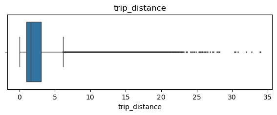
    


```python
# Create histogram of trip_distance
plt.figure(figsize=(10,5))
sns.histplot(df['trip_distance'], bins=range(0,26,1))
plt.title('Trip distance histogram');
```


    
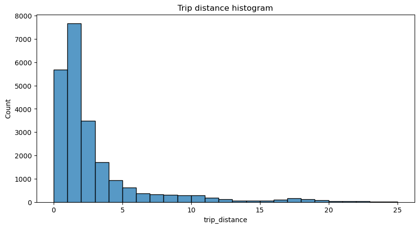
    


**Note:** The majority of trips were journeys of less than two miles. The number of trips falls away steeply as the distance traveled increases beyond two miles.

**total_amount**


```python
# Create box plot of total_amount
plt.figure(figsize=(7,2))
plt.title('total_amount')
sns.boxplot(x=df['total_amount'], fliersize=1);
```


    
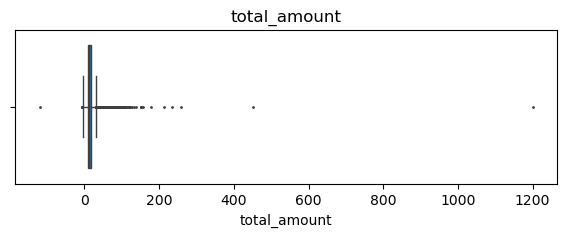
    


```python
# Create histogram of total_amount
plt.figure(figsize=(12,6))
ax = sns.histplot(df['total_amount'], bins=range(-10,101,5))
ax.set_xticks(range(-10,101,5))
ax.set_xticklabels(range(-10,101,5))
plt.title('Total amount histogram');
```


    
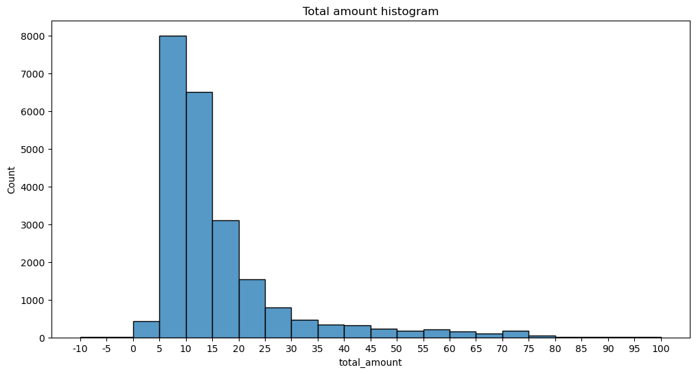
    


**Note:** The total cost of each trip also has a distribution that skews right, with most costs falling in the $5-15 range.

**tip_amount**


```python
# Create box plot of tip_amount
plt.figure(figsize=(7,2))
plt.title('tip_amount')
sns.boxplot(x=df['tip_amount'], fliersize=1);
```


    
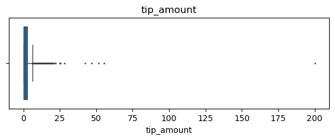
    


```python
# Create histogram of tip_amount
plt.figure(figsize=(12,6))
ax = sns.histplot(df['tip_amount'], bins=range(0,21,1))
ax.set_xticks(range(0,21,2))
ax.set_xticklabels(range(0,21,2))
plt.title('Tip amount histogram');
```


    
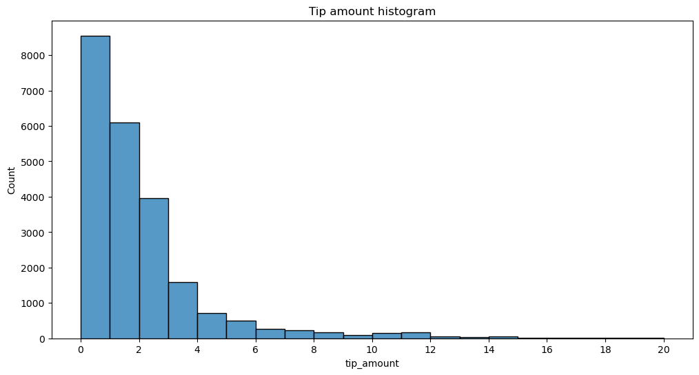
    


**Note:** The distribution for tip amount is right-skewed, with nearly all the tips in the $0-3 range.

**tip_amount by vendor**


```python
# Create histogram of tip_amount by vendor
plt.figure(figsize=(12,7))
ax = sns.histplot(data=df, x='tip_amount', bins=range(0,21,1), 
                  hue='VendorID', 
                  multiple='stack',
                  palette='pastel')
ax.set_xticks(range(0,21,1))
ax.set_xticklabels(range(0,21,1))
plt.title('Tip amount by vendor histogram');
```


    
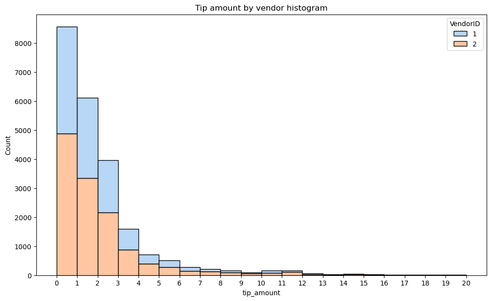
    


**Note:** Separating the tip amount by vendor reveals that there are no noticeable aberrations in the distribution of tips between the two vendors in the dataset. Vendor two has a slightly higher share of the rides, and this proportion is approximately maintained for all tip amounts.

Next, zoom in on the upper end of the range of tips to check whether vendor one gets noticeably more of the most generous tips.


```python
# Create histogram of tip_amount by vendor for tips > $10 
tips_over_ten = df[df['tip_amount'] > 10]
plt.figure(figsize=(12,7))
ax = sns.histplot(data=tips_over_ten, x='tip_amount', bins=range(10,21,1), 
                  hue='VendorID', 
                  multiple='stack',
                  palette='pastel')
ax.set_xticks(range(10,21,1))
ax.set_xticklabels(range(10,21,1))
plt.title('Tip amount by vendor histogram');
```


    
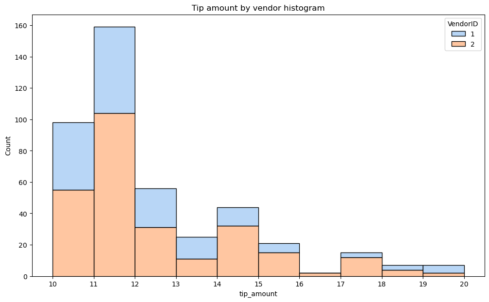
    


**Note:** The proportions are maintained even at these higher tip amounts, with the exception being at highest extremity, but this is not noteworthy due to the low sample size at these tip amounts.

**Mean tips by passenger count**

Examine the unique values in the `passenger_count` column.


```python
df['passenger_count'].value_counts()
```


    passenger_count
    1    16117
    2     3305
    5     1143
    3      953
    6      693
    4      455
    0       33
    Name: count, dtype: int64


**Note:** Nearly two-thirds of the rides were single occupancy, though there were still nearly 700 rides with as many as six passengers. Also, there are 33 rides with an occupancy count of zero, which doesn't make sense. These would likely be dropped unless a reasonable explanation can be found for them.


```python
# Ensure that 'tip_amount' and 'passenger_count' are numeric
df['tip_amount'] = pd.to_numeric(df['tip_amount'], errors='coerce')
df['passenger_count'] = pd.to_numeric(df['passenger_count'], errors='coerce')

# Calculate mean tips by passenger count
mean_tips_by_passenger_count = df.groupby(['passenger_count']).mean(numeric_only=True)[['tip_amount']]

# Display the result
print(mean_tips_by_passenger_count)

```

                     tip_amount
    passenger_count            
    0                  2.135758
    1                  1.848920
    2                  1.856378
    3                  1.716768
    4                  1.530264
    5                  1.873185
    6                  1.720260


```python
import seaborn as sns
import numpy as np
import pandas as pd
import matplotlib.pyplot as plt

# Assuming 'mean_tips_by_passenger_count' is already defined
# Exclude the first row using .iloc[1:]
data = mean_tips_by_passenger_count.iloc[1:]

# Generate the color palette as a list
pal = sns.color_palette("Greens_d", len(data))

# Rank the tip amounts for coloring
rank = data['tip_amount'].argsort().argsort()

# Create the bar plot
plt.figure(figsize=(12, 7))
ax = sns.barplot(x=data.index, 
                 y=data['tip_amount'], 
                 palette=pal[::-1])  # Use the reversed list directly

# Add a horizontal line for the global mean of tip_amount
ax.axhline(df['tip_amount'].mean(), ls='--', color='red', label='Global Mean')

# Add legend
ax.legend()

# Set the title
plt.title('Mean Tip Amount by Passenger Count', fontsize=16)

# Show the plot
plt.tight_layout()
plt.show()

```

    /var/folders/85/xnwj0q613bg10_m1pzt113vc0000gn/T/ipykernel_13271/2389880516.py:18: FutureWarning: 
    
    Passing `palette` without assigning `hue` is deprecated and will be removed in v0.14.0. Assign the `x` variable to `hue` and set `legend=False` for the same effect.
    
      ax = sns.barplot(x=data.index,


    
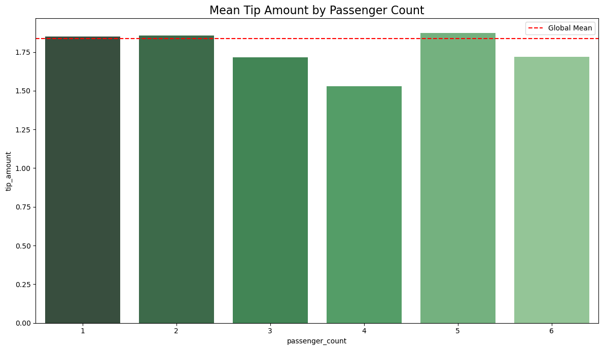
    


**Create month and day columns**


```python
# Create a month column
df['month'] = df['tpep_pickup_datetime'].dt.month_name()
# Create a day column
df['day'] = df['tpep_pickup_datetime'].dt.day_name()
```

**Plot total ride count by month**

Begin by calculating total ride count by month.


```python
# Get total number of rides for each month
monthly_rides = df['month'].value_counts()
monthly_rides
```


    month
    March        2049
    October      2027
    April        2019
    May          2013
    January      1997
    June         1964
    December     1863
    November     1843
    February     1769
    September    1734
    August       1724
    July         1697
    Name: count, dtype: int64


**Note:** The months are out of order.

Reorder the results to put the months in calendar order.


```python
# Reorder the monthly ride list so months go in order
month_order = ['January', 'February', 'March', 'April', 'May', 'June', 'July',
         'August', 'September', 'October', 'November', 'December']

monthly_rides = monthly_rides.reindex(index=month_order)
monthly_rides
```


    month
    January      1997
    February     1769
    March        2049
    April        2019
    May          2013
    June         1964
    July         1697
    August       1724
    September    1734
    October      2027
    November     1843
    December     1863
    Name: count, dtype: int64


```python
# Show the index
monthly_rides.index
```


    Index(['January', 'February', 'March', 'April', 'May', 'June', 'July',
           'August', 'September', 'October', 'November', 'December'],
          dtype='object', name='month')


```python
import seaborn as sns
import matplotlib.pyplot as plt
import numpy as np

# Example data for demonstration (uncomment in your actual code)
# monthly_rides = pd.Series(data=[100, 150, 200, 250, 300, 350, 400, 450, 500, 550, 600, 650])
# month_order = ['January', 'February', 'March', 'April', 'May', 'June', 'July', 'August', 'September', 'October', 'November', 'December']

plt.figure(figsize=(12, 7))

# Define a darker pastel color palette with enough colors for 12 months
darker_pastel = ['#4B8BBE', '#1F8EF1', '#36B9F4', '#5BDFD0', 
                 '#7DF8B8', '#A2F6B2', '#D4FBAA', '#C6E8D7', 
                 '#A4C8E1', '#B07CBA', '#D5B892', '#F2C94C']  # Adjust colors as needed

# Create the bar plot with darker colors
ax = sns.barplot(x=monthly_rides.index, y=monthly_rides, palette=darker_pastel)

# Set the ticks and tick labels
ax.set_xticks(range(len(month_order)))  # Explicitly set the ticks
ax.set_xticklabels(month_order, rotation=45, ha="right")  # Set the labels
# Add the plot title
plt.title('Ride Count by Month', fontsize=16)

# Add axis labels (optional)
plt.xlabel('Month', fontsize=14)
plt.ylabel('Number of Rides', fontsize=14)

# Adjust the layout and show the plot
plt.tight_layout()
plt.show()

```

    /var/folders/85/xnwj0q613bg10_m1pzt113vc0000gn/T/ipykernel_13271/790140316.py:17: FutureWarning: 
    
    Passing `palette` without assigning `hue` is deprecated and will be removed in v0.14.0. Assign the `x` variable to `hue` and set `legend=False` for the same effect.
    
      ax = sns.barplot(x=monthly_rides.index, y=monthly_rides, palette=darker_pastel)


    
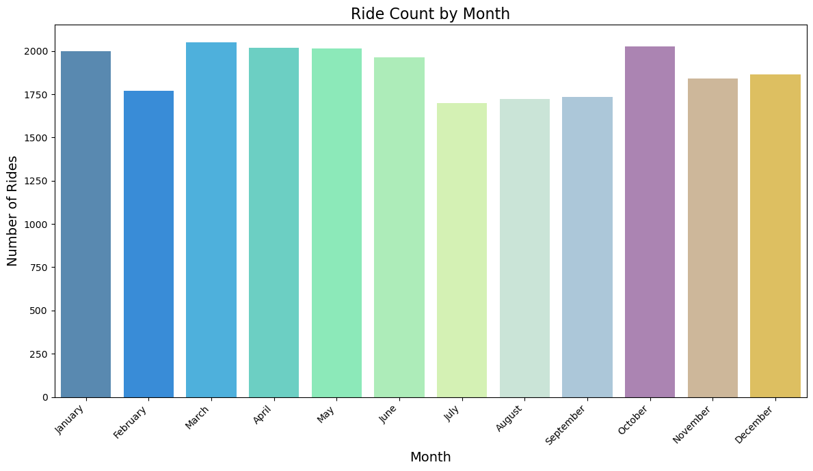
    


**Note:** Monthly rides are fairly consistent, with notable dips in the summer months of July, August, and September, and also in February.

**Plot total ride count by day**

Repeat the above process, but now calculate the total rides by day of the week.


```python
# Repeat the above process, this time for rides by day
daily_rides = df['day'].value_counts()
day_order = ['Monday', 'Tuesday', 'Wednesday', 'Thursday', 'Friday', 'Saturday', 'Sunday']
daily_rides = daily_rides.reindex(index=day_order)
daily_rides
```


    day
    Monday       2931
    Tuesday      3198
    Wednesday    3390
    Thursday     3402
    Friday       3413
    Saturday     3367
    Sunday       2998
    Name: count, dtype: int64


```python
# Example data for demonstration (uncomment in your actual code)
# monthly_rides = pd.Series(data=[100, 150, 200, 250, 300, 350, 400, 450, 500, 550, 600, 650])
# month_order = ['January', 'February', 'March', 'April', 'May', 'June', 'July', 'August', 'September', 'October', 'November', 'December']

plt.figure(figsize=(12, 7))

# Define a darker pastel color palette for the plot
darker_pastel = ['#B07CBA', '#A4C8E1', '#77B8A0', '#C9C7A1', 
                 '#D0A29D', '#F2C94C', '#D5B892']  # Adjust colors as needed

# Create the bar plot with darker colors
ax = sns.barplot(x=daily_rides.index, y=daily_rides, palette=darker_pastel)

# Set the ticks and tick labels
ax.set_xticks(range(len(day_order)))  # Explicitly set the ticks
ax.set_xticklabels(day_order, rotation=45, ha="right")  # Set the labels


# Add the plot title
plt.title('Ride Count by Day', fontsize=16)

# Add axis labels (optional)
plt.xlabel('Day', fontsize=14)
plt.ylabel('Number of Rides', fontsize=14)

# Adjust the layout and show the plot
plt.tight_layout()
plt.show()
```

    /var/folders/85/xnwj0q613bg10_m1pzt113vc0000gn/T/ipykernel_13271/3304594623.py:12: FutureWarning: 
    
    Passing `palette` without assigning `hue` is deprecated and will be removed in v0.14.0. Assign the `x` variable to `hue` and set `legend=False` for the same effect.
    
      ax = sns.barplot(x=daily_rides.index, y=daily_rides, palette=darker_pastel)


    
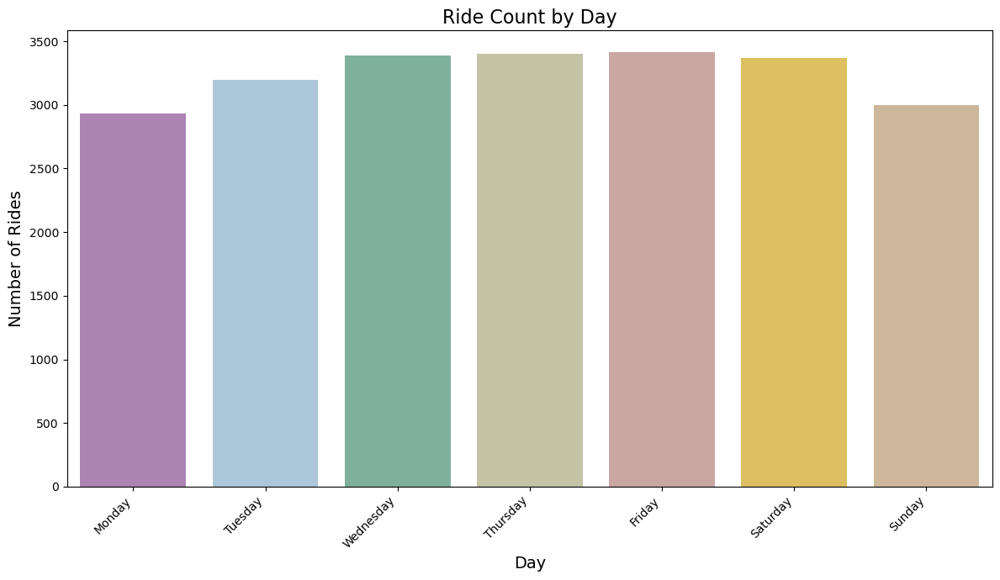
    


**Note:** Suprisingly, Wednesday through Saturday had the highest number of daily rides, while Sunday and Monday had the least.

**Plot total revenue by day of the week**

Repeat the above process, but now calculate the total revenue by day of the week.


```python
# Define the correct order of days
day_order = ['Monday', 'Tuesday', 'Wednesday', 'Thursday', 'Friday', 'Saturday', 'Sunday']

# Calculate total revenue by day
total_amount_day = df.groupby('day')['total_amount'].sum()

# Reindex to ensure days are in the correct order
total_amount_day = total_amount_day.reindex(index=day_order)

# Display the total revenue by day
print(total_amount_day)
```

    day
    Monday       49574.37
    Tuesday      52527.14
    Wednesday    55310.47
    Thursday     57181.91
    Friday       55818.74
    Saturday     51195.40
    Sunday       48624.06
    Name: total_amount, dtype: float64


```python
# Create the bar plot for total revenue by day
plt.figure(figsize=(12, 7))

# Define a darker color palette for the plot
darker_colors = ['#4B8BBE', '#1F8EF1', '#36B9F4', '#5BDFD0', 
                 '#7DF8B8', '#A2F6B2', '#D4FBAA']  # Adjust the colors as needed

# Create the bar plot
ax = sns.barplot(x=total_amount_day.index, y=total_amount_day, palette=darker_colors)

# Set the ticks and tick labels
ax.set_xticks(range(len(day_order)))  # Explicitly set the ticks
ax.set_xticklabels(day_order, rotation=45, ha="right")  # Set the labels

# Add the plot title
plt.title('Total Revenue by Day', fontsize=16)

# Add axis labels (optional)
plt.xlabel('Day', fontsize=14)
plt.ylabel('Total Revenue USD', fontsize=14)

# Adjust the layout and show the plot
plt.tight_layout()
plt.show()
```

    /var/folders/85/xnwj0q613bg10_m1pzt113vc0000gn/T/ipykernel_13271/1783328772.py:9: FutureWarning: 
    
    Passing `palette` without assigning `hue` is deprecated and will be removed in v0.14.0. Assign the `x` variable to `hue` and set `legend=False` for the same effect.
    
      ax = sns.barplot(x=total_amount_day.index, y=total_amount_day, palette=darker_colors)


    
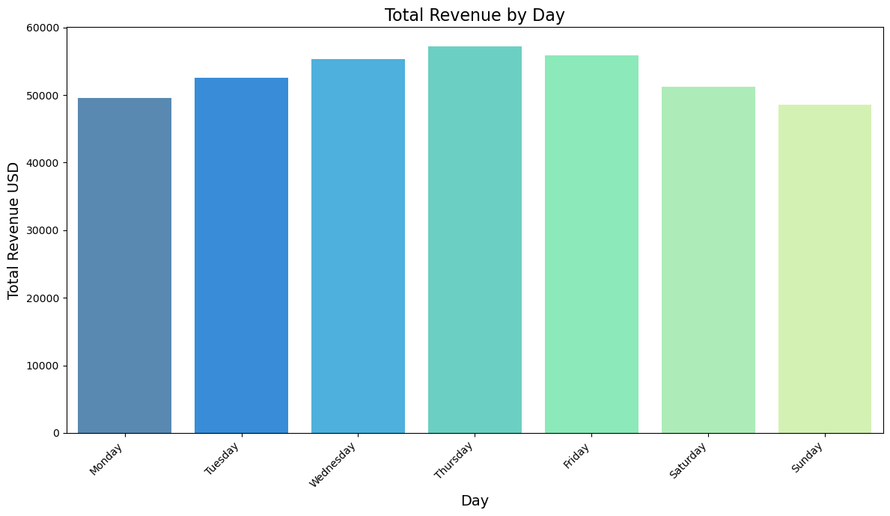
    


**Note:** Thursday had the highest gross revenue of all days, and Sunday and Monday had the least. Interestingly, although Saturday had only 35 fewer rides than Thursday, its gross revenue was ~$6,000 less than Thursday's&mdash;more than a 10% drop.

**Plot total revenue by month**


```python
# Define the correct order of months
month_order = ['January', 'February', 'March', 'April', 'May', 'June', 
               'July', 'August', 'September', 'October', 'November', 'December']

# Calculate total revenue by month
total_amount_month = df.groupby('month')['total_amount'].sum()

# Reindex to ensure months are in the correct order
total_amount_month = total_amount_month.reindex(index=month_order)

# Display the total revenue by month
print(total_amount_month)
```

    month
    January      31735.25
    February     28937.89
    March        33085.89
    April        32012.54
    May          33828.58
    June         32920.52
    July         26617.64
    August       27759.56
    September    28206.38
    October      33065.83
    November     30800.44
    December     31261.57
    Name: total_amount, dtype: float64


```python
# Create the bar plot for total revenue by month
plt.figure(figsize=(12, 7))

# Define a pastel color palette for the plot
dark_pastel_colors = ['#B07CBA', '#A4C8E1', '#77B8A0', '#C9C7A1', 
                      '#D0A29D', '#F2C94C', '#D5B892', '#A6B8C6', 
                      '#7C9C7C', '#D9B06A', '#7E9D91', '#C9C47E']

# Create the bar plot
ax = sns.barplot(x=total_amount_month.index, y=total_amount_month, palette=dark_pastel_colors)

# Set the ticks and tick labels
ax.set_xticks(range(len(month_order)))  # Explicitly set the ticks
ax.set_xticklabels(month_order, rotation=45, ha="right")  # Set the labels

# Add the plot title
plt.title('Total Revenue by Month', fontsize=16)

# Add axis labels (optional)
plt.xlabel('Month', fontsize=14)
plt.ylabel('Total Revenue', fontsize=14)

# Adjust the layout and show the plot
plt.tight_layout()
plt.show()
```

    /var/folders/85/xnwj0q613bg10_m1pzt113vc0000gn/T/ipykernel_13271/851285102.py:10: FutureWarning: 
    
    Passing `palette` without assigning `hue` is deprecated and will be removed in v0.14.0. Assign the `x` variable to `hue` and set `legend=False` for the same effect.
    
      ax = sns.barplot(x=total_amount_month.index, y=total_amount_month, palette=dark_pastel_colors)


    
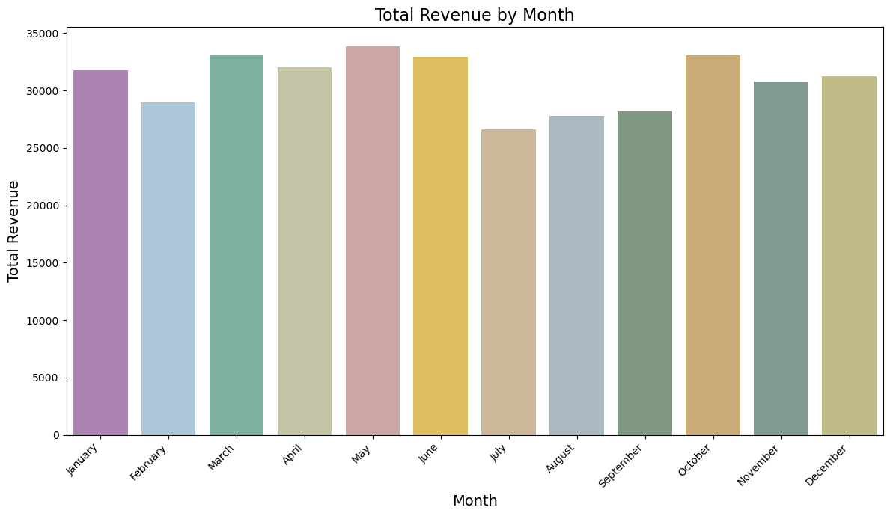
    


**Note:** Monthly revenue generally follows the pattern of monthly rides, with noticeable dips in the summer months of July, August, and September, and also one in February.

**Histogram of rides by drop-off location**


```python
# Check if all drop-off locations are consecutively numbered
df['DOLocationID'].max() - len(set(df['DOLocationID'])) 
```


    49


**Note:** 49 numbers do not represent a drop-off location. 

To eliminate the spaces in the histogram that these missing numbers would create, sort the unique drop-off location values, then convert them to strings. This will make the histplot function display all bars directly next to each other. 


```python
plt.figure(figsize=(16,4))
# DOLocationID column is numeric, so sort in ascending order
sorted_dropoffs = df['DOLocationID'].sort_values()
# Convert to string
sorted_dropoffs = sorted_dropoffs.astype('str')
# Plot
sns.histplot(sorted_dropoffs, bins=range(0, df['DOLocationID'].max()+1, 1))
plt.xticks([])
plt.xlabel('Drop-off locations')
plt.title('Histogram of rides by drop-off location', fontsize=16);
```


    
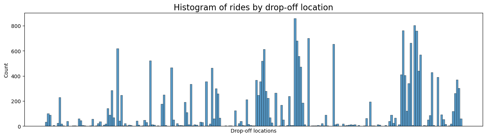
    


**Note:** Notice that out of the 200+ drop-off locations, a disproportionate number of locations receive the majority of the traffic, while all the rest get relatively few trips. It's likely that these high-traffic locations are near popular tourist attractions like the Empire State Building or Times Square, airports, and train and bus terminals. However, it would be helpful to know the location that each ID corresponds with. Unfortunately, this is not in the data.

# Results and evaluation


```python
df['trip_duration'] = (df['tpep_dropoff_datetime']-df['tpep_pickup_datetime'])
```


```python
df.head(10)
```


<div>
<style scoped>
    .dataframe tbody tr th:only-of-type {
        vertical-align: middle;
    }

    .dataframe tbody tr th {
        vertical-align: top;
    }

    .dataframe thead th {
        text-align: right;
    }
</style>
<table border="1" class="dataframe">
  <thead>
    <tr style="text-align: right;">
      <th></th>
      <th>Unnamed: 0</th>
      <th>VendorID</th>
      <th>tpep_pickup_datetime</th>
      <th>tpep_dropoff_datetime</th>
      <th>passenger_count</th>
      <th>trip_distance</th>
      <th>RatecodeID</th>
      <th>store_and_fwd_flag</th>
      <th>PULocationID</th>
      <th>DOLocationID</th>
      <th>...</th>
      <th>fare_amount</th>
      <th>extra</th>
      <th>mta_tax</th>
      <th>tip_amount</th>
      <th>tolls_amount</th>
      <th>improvement_surcharge</th>
      <th>total_amount</th>
      <th>month</th>
      <th>day</th>
      <th>trip_duration</th>
    </tr>
  </thead>
  <tbody>
    <tr>
      <th>0</th>
      <td>24870114</td>
      <td>2</td>
      <td>2017-03-25 08:55:43</td>
      <td>2017-03-25 09:09:47</td>
      <td>6</td>
      <td>3.34</td>
      <td>1</td>
      <td>N</td>
      <td>100</td>
      <td>231</td>
      <td>...</td>
      <td>13.0</td>
      <td>0.0</td>
      <td>0.5</td>
      <td>2.76</td>
      <td>0.0</td>
      <td>0.3</td>
      <td>16.56</td>
      <td>March</td>
      <td>Saturday</td>
      <td>0 days 00:14:04</td>
    </tr>
    <tr>
      <th>1</th>
      <td>35634249</td>
      <td>1</td>
      <td>2017-04-11 14:53:28</td>
      <td>2017-04-11 15:19:58</td>
      <td>1</td>
      <td>1.80</td>
      <td>1</td>
      <td>N</td>
      <td>186</td>
      <td>43</td>
      <td>...</td>
      <td>16.0</td>
      <td>0.0</td>
      <td>0.5</td>
      <td>4.00</td>
      <td>0.0</td>
      <td>0.3</td>
      <td>20.80</td>
      <td>April</td>
      <td>Tuesday</td>
      <td>0 days 00:26:30</td>
    </tr>
    <tr>
      <th>2</th>
      <td>106203690</td>
      <td>1</td>
      <td>2017-12-15 07:26:56</td>
      <td>2017-12-15 07:34:08</td>
      <td>1</td>
      <td>1.00</td>
      <td>1</td>
      <td>N</td>
      <td>262</td>
      <td>236</td>
      <td>...</td>
      <td>6.5</td>
      <td>0.0</td>
      <td>0.5</td>
      <td>1.45</td>
      <td>0.0</td>
      <td>0.3</td>
      <td>8.75</td>
      <td>December</td>
      <td>Friday</td>
      <td>0 days 00:07:12</td>
    </tr>
    <tr>
      <th>3</th>
      <td>38942136</td>
      <td>2</td>
      <td>2017-05-07 13:17:59</td>
      <td>2017-05-07 13:48:14</td>
      <td>1</td>
      <td>3.70</td>
      <td>1</td>
      <td>N</td>
      <td>188</td>
      <td>97</td>
      <td>...</td>
      <td>20.5</td>
      <td>0.0</td>
      <td>0.5</td>
      <td>6.39</td>
      <td>0.0</td>
      <td>0.3</td>
      <td>27.69</td>
      <td>May</td>
      <td>Sunday</td>
      <td>0 days 00:30:15</td>
    </tr>
    <tr>
      <th>4</th>
      <td>30841670</td>
      <td>2</td>
      <td>2017-04-15 23:32:20</td>
      <td>2017-04-15 23:49:03</td>
      <td>1</td>
      <td>4.37</td>
      <td>1</td>
      <td>N</td>
      <td>4</td>
      <td>112</td>
      <td>...</td>
      <td>16.5</td>
      <td>0.5</td>
      <td>0.5</td>
      <td>0.00</td>
      <td>0.0</td>
      <td>0.3</td>
      <td>17.80</td>
      <td>April</td>
      <td>Saturday</td>
      <td>0 days 00:16:43</td>
    </tr>
    <tr>
      <th>5</th>
      <td>23345809</td>
      <td>2</td>
      <td>2017-03-25 20:34:11</td>
      <td>2017-03-25 20:42:11</td>
      <td>6</td>
      <td>2.30</td>
      <td>1</td>
      <td>N</td>
      <td>161</td>
      <td>236</td>
      <td>...</td>
      <td>9.0</td>
      <td>0.5</td>
      <td>0.5</td>
      <td>2.06</td>
      <td>0.0</td>
      <td>0.3</td>
      <td>12.36</td>
      <td>March</td>
      <td>Saturday</td>
      <td>0 days 00:08:00</td>
    </tr>
    <tr>
      <th>6</th>
      <td>37660487</td>
      <td>2</td>
      <td>2017-05-03 19:04:09</td>
      <td>2017-05-03 20:03:47</td>
      <td>1</td>
      <td>12.83</td>
      <td>1</td>
      <td>N</td>
      <td>79</td>
      <td>241</td>
      <td>...</td>
      <td>47.5</td>
      <td>1.0</td>
      <td>0.5</td>
      <td>9.86</td>
      <td>0.0</td>
      <td>0.3</td>
      <td>59.16</td>
      <td>May</td>
      <td>Wednesday</td>
      <td>0 days 00:59:38</td>
    </tr>
    <tr>
      <th>7</th>
      <td>69059411</td>
      <td>2</td>
      <td>2017-08-15 17:41:06</td>
      <td>2017-08-15 18:03:05</td>
      <td>1</td>
      <td>2.98</td>
      <td>1</td>
      <td>N</td>
      <td>237</td>
      <td>114</td>
      <td>...</td>
      <td>16.0</td>
      <td>1.0</td>
      <td>0.5</td>
      <td>1.78</td>
      <td>0.0</td>
      <td>0.3</td>
      <td>19.58</td>
      <td>August</td>
      <td>Tuesday</td>
      <td>0 days 00:21:59</td>
    </tr>
    <tr>
      <th>8</th>
      <td>8433159</td>
      <td>2</td>
      <td>2017-02-04 16:17:07</td>
      <td>2017-02-04 16:29:14</td>
      <td>1</td>
      <td>1.20</td>
      <td>1</td>
      <td>N</td>
      <td>234</td>
      <td>249</td>
      <td>...</td>
      <td>9.0</td>
      <td>0.0</td>
      <td>0.5</td>
      <td>0.00</td>
      <td>0.0</td>
      <td>0.3</td>
      <td>9.80</td>
      <td>February</td>
      <td>Saturday</td>
      <td>0 days 00:12:07</td>
    </tr>
    <tr>
      <th>9</th>
      <td>95294817</td>
      <td>1</td>
      <td>2017-11-10 15:20:29</td>
      <td>2017-11-10 15:40:55</td>
      <td>1</td>
      <td>1.60</td>
      <td>1</td>
      <td>N</td>
      <td>239</td>
      <td>237</td>
      <td>...</td>
      <td>13.0</td>
      <td>0.0</td>
      <td>0.5</td>
      <td>2.75</td>
      <td>0.0</td>
      <td>0.3</td>
      <td>16.55</td>
      <td>November</td>
      <td>Friday</td>
      <td>0 days 00:20:26</td>
    </tr>
  </tbody>
</table>
<p>10 rows × 21 columns</p>
</div>


## Reflection Questions: 

- Why is it important to conduct Exploratory Data Analysis? Why are the data visualizations provided in this notebook useful?

    - An: Exploratory Data Analysis (EDA) is crucial for understanding datasets, identifying patterns, detecting anomalies, and preparing data for analysis. It helps uncover relationships between variables and guides feature engineering, enhancing predictive modeling. Data visualizations simplify complex information, highlight trends, and facilitate comparisons, making insights more accessible to stakeholders. They engage audiences and convey findings effectively, revealing insights that may be missed in raw data. EDA and visualizations drive informed decision-making and effective communication.

---------------------------------------------------------------------------------

# Conduct an A/B test

### Task 1. Imports and data loading


```python
import pandas as pd
from scipy import stats
```


```python
taxi_data = pd.read_csv('https://raw.githubusercontent.com/nushratea/Project-Data/refs/heads/main/Data%20Visualization%20Examples/Python/Automatidata%20Project/2017_Yellow_Taxi_Trip_Data.csv')
print("done")
```

    done


### Task 2. Data exploration

Use descriptive statistics to conduct Exploratory Data Analysis (EDA).

**Note:** In the dataset, `payment_type` is encoded in integers:
*   1: Credit card
*   2: Cash
*   3: No charge
*   4: Dispute
*   5: Unknown


```python
# descriptive stats code for EDA
taxi_data.describe(include='all')
```


<div>
<style scoped>
    .dataframe tbody tr th:only-of-type {
        vertical-align: middle;
    }

    .dataframe tbody tr th {
        vertical-align: top;
    }

    .dataframe thead th {
        text-align: right;
    }
</style>
<table border="1" class="dataframe">
  <thead>
    <tr style="text-align: right;">
      <th></th>
      <th>Unnamed: 0</th>
      <th>VendorID</th>
      <th>tpep_pickup_datetime</th>
      <th>tpep_dropoff_datetime</th>
      <th>passenger_count</th>
      <th>trip_distance</th>
      <th>RatecodeID</th>
      <th>store_and_fwd_flag</th>
      <th>PULocationID</th>
      <th>DOLocationID</th>
      <th>payment_type</th>
      <th>fare_amount</th>
      <th>extra</th>
      <th>mta_tax</th>
      <th>tip_amount</th>
      <th>tolls_amount</th>
      <th>improvement_surcharge</th>
      <th>total_amount</th>
    </tr>
  </thead>
  <tbody>
    <tr>
      <th>count</th>
      <td>2.269900e+04</td>
      <td>22699.000000</td>
      <td>22699</td>
      <td>22699</td>
      <td>22699.000000</td>
      <td>22699.000000</td>
      <td>22699.000000</td>
      <td>22699</td>
      <td>22699.000000</td>
      <td>22699.000000</td>
      <td>22699.000000</td>
      <td>22699.000000</td>
      <td>22699.000000</td>
      <td>22699.000000</td>
      <td>22699.000000</td>
      <td>22699.000000</td>
      <td>22699.000000</td>
      <td>22699.000000</td>
    </tr>
    <tr>
      <th>unique</th>
      <td>NaN</td>
      <td>NaN</td>
      <td>22687</td>
      <td>22688</td>
      <td>NaN</td>
      <td>NaN</td>
      <td>NaN</td>
      <td>2</td>
      <td>NaN</td>
      <td>NaN</td>
      <td>NaN</td>
      <td>NaN</td>
      <td>NaN</td>
      <td>NaN</td>
      <td>NaN</td>
      <td>NaN</td>
      <td>NaN</td>
      <td>NaN</td>
    </tr>
    <tr>
      <th>top</th>
      <td>NaN</td>
      <td>NaN</td>
      <td>07/03/2017 3:45:19 PM</td>
      <td>10/18/2017 8:07:45 PM</td>
      <td>NaN</td>
      <td>NaN</td>
      <td>NaN</td>
      <td>N</td>
      <td>NaN</td>
      <td>NaN</td>
      <td>NaN</td>
      <td>NaN</td>
      <td>NaN</td>
      <td>NaN</td>
      <td>NaN</td>
      <td>NaN</td>
      <td>NaN</td>
      <td>NaN</td>
    </tr>
    <tr>
      <th>freq</th>
      <td>NaN</td>
      <td>NaN</td>
      <td>2</td>
      <td>2</td>
      <td>NaN</td>
      <td>NaN</td>
      <td>NaN</td>
      <td>22600</td>
      <td>NaN</td>
      <td>NaN</td>
      <td>NaN</td>
      <td>NaN</td>
      <td>NaN</td>
      <td>NaN</td>
      <td>NaN</td>
      <td>NaN</td>
      <td>NaN</td>
      <td>NaN</td>
    </tr>
    <tr>
      <th>mean</th>
      <td>5.675849e+07</td>
      <td>1.556236</td>
      <td>NaN</td>
      <td>NaN</td>
      <td>1.642319</td>
      <td>2.913313</td>
      <td>1.043394</td>
      <td>NaN</td>
      <td>162.412353</td>
      <td>161.527997</td>
      <td>1.336887</td>
      <td>13.026629</td>
      <td>0.333275</td>
      <td>0.497445</td>
      <td>1.835781</td>
      <td>0.312542</td>
      <td>0.299551</td>
      <td>16.310502</td>
    </tr>
    <tr>
      <th>std</th>
      <td>3.274493e+07</td>
      <td>0.496838</td>
      <td>NaN</td>
      <td>NaN</td>
      <td>1.285231</td>
      <td>3.653171</td>
      <td>0.708391</td>
      <td>NaN</td>
      <td>66.633373</td>
      <td>70.139691</td>
      <td>0.496211</td>
      <td>13.243791</td>
      <td>0.463097</td>
      <td>0.039465</td>
      <td>2.800626</td>
      <td>1.399212</td>
      <td>0.015673</td>
      <td>16.097295</td>
    </tr>
    <tr>
      <th>min</th>
      <td>1.212700e+04</td>
      <td>1.000000</td>
      <td>NaN</td>
      <td>NaN</td>
      <td>0.000000</td>
      <td>0.000000</td>
      <td>1.000000</td>
      <td>NaN</td>
      <td>1.000000</td>
      <td>1.000000</td>
      <td>1.000000</td>
      <td>-120.000000</td>
      <td>-1.000000</td>
      <td>-0.500000</td>
      <td>0.000000</td>
      <td>0.000000</td>
      <td>-0.300000</td>
      <td>-120.300000</td>
    </tr>
    <tr>
      <th>25%</th>
      <td>2.852056e+07</td>
      <td>1.000000</td>
      <td>NaN</td>
      <td>NaN</td>
      <td>1.000000</td>
      <td>0.990000</td>
      <td>1.000000</td>
      <td>NaN</td>
      <td>114.000000</td>
      <td>112.000000</td>
      <td>1.000000</td>
      <td>6.500000</td>
      <td>0.000000</td>
      <td>0.500000</td>
      <td>0.000000</td>
      <td>0.000000</td>
      <td>0.300000</td>
      <td>8.750000</td>
    </tr>
    <tr>
      <th>50%</th>
      <td>5.673150e+07</td>
      <td>2.000000</td>
      <td>NaN</td>
      <td>NaN</td>
      <td>1.000000</td>
      <td>1.610000</td>
      <td>1.000000</td>
      <td>NaN</td>
      <td>162.000000</td>
      <td>162.000000</td>
      <td>1.000000</td>
      <td>9.500000</td>
      <td>0.000000</td>
      <td>0.500000</td>
      <td>1.350000</td>
      <td>0.000000</td>
      <td>0.300000</td>
      <td>11.800000</td>
    </tr>
    <tr>
      <th>75%</th>
      <td>8.537452e+07</td>
      <td>2.000000</td>
      <td>NaN</td>
      <td>NaN</td>
      <td>2.000000</td>
      <td>3.060000</td>
      <td>1.000000</td>
      <td>NaN</td>
      <td>233.000000</td>
      <td>233.000000</td>
      <td>2.000000</td>
      <td>14.500000</td>
      <td>0.500000</td>
      <td>0.500000</td>
      <td>2.450000</td>
      <td>0.000000</td>
      <td>0.300000</td>
      <td>17.800000</td>
    </tr>
    <tr>
      <th>max</th>
      <td>1.134863e+08</td>
      <td>2.000000</td>
      <td>NaN</td>
      <td>NaN</td>
      <td>6.000000</td>
      <td>33.960000</td>
      <td>99.000000</td>
      <td>NaN</td>
      <td>265.000000</td>
      <td>265.000000</td>
      <td>4.000000</td>
      <td>999.990000</td>
      <td>4.500000</td>
      <td>0.500000</td>
      <td>200.000000</td>
      <td>19.100000</td>
      <td>0.300000</td>
      <td>1200.290000</td>
    </tr>
  </tbody>
</table>
</div>


```python
taxi_data.groupby('payment_type')['fare_amount'].mean()
```


    payment_type
    1    13.429748
    2    12.213546
    3    12.186116
    4     9.913043
    Name: fare_amount, dtype: float64


Based on the averages shown, it appears that customers who pay in credit card tend to pay a larger fare amount than customers who pay in cash. However, this difference might arise from random sampling, rather than being a true difference in fare amount. To assess whether the difference is statistically significant, you conduct a hypothesis test.

### Task 3. Hypothesis testing

Before you conduct your hypothesis test, consider the following questions where applicable to complete your code response:

1. Recall the difference between the null hypothesis and the alternative hypotheses. What are your hypotheses for this data project?

**Response:** 

**Null hypothesis**: There is no difference in average fare between customers who use credit cards and customers who use cash. 

**Alternative hypothesis**: There is a difference in average fare between customers who use credit cards and customers who use cash

The goal in this step is to conduct a two-sample t-test. Recall the steps for conducting a hypothesis test: 


1.   State the null hypothesis and the alternative hypothesis
2.   Choose a signficance level
3.   Find the p-value
4.   Reject or fail to reject the null hypothesis 


**NOTE** A hypothesis test is the main component the your A/B test.

- $H_0$: There is no difference in the average fare amount between customers who use credit cards and customers who use cash.

- $H_A$: There is a difference in the average fare amount between customers who use credit cards and customers who use cash.

Choose 5% as the significance level and proceed with a two-sample t-test.


```python
#hypothesis test, A/B test
#significance level

credit_card = taxi_data[taxi_data['payment_type'] == 1]['fare_amount']
cash = taxi_data[taxi_data['payment_type'] == 2]['fare_amount']
stats.ttest_ind(a=credit_card, b=cash, equal_var=False)
```


    TtestResult(statistic=6.866800855655372, pvalue=6.797387473030518e-12, df=16675.48547403633)


**Response:** Since the p-value is significantly smaller than the significance level of 5%, you reject the null hypothesis. 

*Notice the 'e-12' at the end of the pvalue result.*

You conclude that there is a statistically significant difference in the average fare amount between customers who use credit cards and customers who use cash.

### Task 4. Communicate insights with stakeholders

*In conclusion, ask yourself the following questions:*

1. What business insight(s) can you draw from the result of your hypothesis test?
2. Consider why this A/B test project might not be realistic, and what assumptions had to be made for this educational project.

**Responses:**
1.   The key business insight is that encouraging customers to pay with credit cards can generate more revenue for taxi cab drivers. 

2.   This project requires an assumption that passengers were forced to pay one way or the other, and that once informed of this requirement, they always complied with it. The data was not collected this way; so, an assumption had to be made to randomly group data entries to perform an A/B test. This dataset does not account for other likely explanations. For example, riders might not carry lots of cash, so paying for longer/farther trips with a credit card is easier. In other words, it's far more likely that fare amount determines payment type, rather than vice versa.

-------------------------------------

# Build a multiple linear regression model

### Task 1. Imports and loading
Import the packages.


```python
# Imports
# Packages for numerics + dataframes
import pandas as pd
import numpy as np

# Packages for visualization
import matplotlib.pyplot as plt
import seaborn as sns

# Packages for date conversions for calculating trip durations
from datetime import datetime
from datetime import date
from datetime import timedelta

# Packages for OLS, MLR, confusion matrix
from sklearn.preprocessing import StandardScaler
from sklearn.model_selection import train_test_split
import sklearn.metrics as metrics # For confusion matrix
from sklearn.linear_model import LinearRegression
from sklearn.metrics import mean_absolute_error,r2_score,mean_squared_error
```

**Note:** `Pandas` is used to load the NYC TLC dataset.  As shown in this cell, the dataset has been automatically loaded in for you. You do not need to download the .csv file, or provide more code, in order to access the dataset and proceed with this lab. Please continue with this activity by completing the following instructions.


```python
df0= pd.read_csv('https://raw.githubusercontent.com/nushratea/Project-Data/refs/heads/main/Data%20Visualization%20Examples/Python/Automatidata%20Project/2017_Yellow_Taxi_Trip_Data.csv')
print("done")
```

    done


### Task 2a. Explore data with EDA

Analyze and discover data, looking for correlations, missing data, outliers, and duplicates.


```python
# Start with `.shape` and `.info()`

# Keep `df0` as the original dataframe and create a copy (df) where changes will go
# Can revert `df` to `df0` if needed down the line
df = df0.copy()

# Display the dataset's shape
print(df.shape)

# Display basic info about the dataset
df.info()
```

    (22699, 18)
    <class 'pandas.core.frame.DataFrame'>
    RangeIndex: 22699 entries, 0 to 22698
    Data columns (total 18 columns):
     #   Column                 Non-Null Count  Dtype  
    ---  ------                 --------------  -----  
     0   Unnamed: 0             22699 non-null  int64  
     1   VendorID               22699 non-null  int64  
     2   tpep_pickup_datetime   22699 non-null  object 
     3   tpep_dropoff_datetime  22699 non-null  object 
     4   passenger_count        22699 non-null  int64  
     5   trip_distance          22699 non-null  float64
     6   RatecodeID             22699 non-null  int64  
     7   store_and_fwd_flag     22699 non-null  object 
     8   PULocationID           22699 non-null  int64  
     9   DOLocationID           22699 non-null  int64  
     10  payment_type           22699 non-null  int64  
     11  fare_amount            22699 non-null  float64
     12  extra                  22699 non-null  float64
     13  mta_tax                22699 non-null  float64
     14  tip_amount             22699 non-null  float64
     15  tolls_amount           22699 non-null  float64
     16  improvement_surcharge  22699 non-null  float64
     17  total_amount           22699 non-null  float64
    dtypes: float64(8), int64(7), object(3)
    memory usage: 3.1+ MB


Check for missing data and duplicates using `.isna()` and `.drop_duplicates()`.


```python
# Check for missing data and duplicates using .isna() and .drop_duplicates()
### YOUR CODE HERE ###

# Check for duplicates
print('Shape of dataframe:', df.shape)
print('Shape of dataframe with duplicates dropped:', df.drop_duplicates().shape)

# Check for missing values in dataframe
print('Total count of missing values:', df.isna().sum().sum())

# Display missing values per column in dataframe
print('Missing values per column:')
df.isna().sum()
```

    Shape of dataframe: (22699, 18)
    Shape of dataframe with duplicates dropped: (22699, 18)
    Total count of missing values: 0
    Missing values per column:


    Unnamed: 0               0
    VendorID                 0
    tpep_pickup_datetime     0
    tpep_dropoff_datetime    0
    passenger_count          0
    trip_distance            0
    RatecodeID               0
    store_and_fwd_flag       0
    PULocationID             0
    DOLocationID             0
    payment_type             0
    fare_amount              0
    extra                    0
    mta_tax                  0
    tip_amount               0
    tolls_amount             0
    improvement_surcharge    0
    total_amount             0
    dtype: int64


**Note:** There are no duplicates or missing values in the data.


```python
# Display descriptive stats about the data
df.describe()
```


<div>
<style scoped>
    .dataframe tbody tr th:only-of-type {
        vertical-align: middle;
    }

    .dataframe tbody tr th {
        vertical-align: top;
    }

    .dataframe thead th {
        text-align: right;
    }
</style>
<table border="1" class="dataframe">
  <thead>
    <tr style="text-align: right;">
      <th></th>
      <th>Unnamed: 0</th>
      <th>VendorID</th>
      <th>passenger_count</th>
      <th>trip_distance</th>
      <th>RatecodeID</th>
      <th>PULocationID</th>
      <th>DOLocationID</th>
      <th>payment_type</th>
      <th>fare_amount</th>
      <th>extra</th>
      <th>mta_tax</th>
      <th>tip_amount</th>
      <th>tolls_amount</th>
      <th>improvement_surcharge</th>
      <th>total_amount</th>
    </tr>
  </thead>
  <tbody>
    <tr>
      <th>count</th>
      <td>2.269900e+04</td>
      <td>22699.000000</td>
      <td>22699.000000</td>
      <td>22699.000000</td>
      <td>22699.000000</td>
      <td>22699.000000</td>
      <td>22699.000000</td>
      <td>22699.000000</td>
      <td>22699.000000</td>
      <td>22699.000000</td>
      <td>22699.000000</td>
      <td>22699.000000</td>
      <td>22699.000000</td>
      <td>22699.000000</td>
      <td>22699.000000</td>
    </tr>
    <tr>
      <th>mean</th>
      <td>5.675849e+07</td>
      <td>1.556236</td>
      <td>1.642319</td>
      <td>2.913313</td>
      <td>1.043394</td>
      <td>162.412353</td>
      <td>161.527997</td>
      <td>1.336887</td>
      <td>13.026629</td>
      <td>0.333275</td>
      <td>0.497445</td>
      <td>1.835781</td>
      <td>0.312542</td>
      <td>0.299551</td>
      <td>16.310502</td>
    </tr>
    <tr>
      <th>std</th>
      <td>3.274493e+07</td>
      <td>0.496838</td>
      <td>1.285231</td>
      <td>3.653171</td>
      <td>0.708391</td>
      <td>66.633373</td>
      <td>70.139691</td>
      <td>0.496211</td>
      <td>13.243791</td>
      <td>0.463097</td>
      <td>0.039465</td>
      <td>2.800626</td>
      <td>1.399212</td>
      <td>0.015673</td>
      <td>16.097295</td>
    </tr>
    <tr>
      <th>min</th>
      <td>1.212700e+04</td>
      <td>1.000000</td>
      <td>0.000000</td>
      <td>0.000000</td>
      <td>1.000000</td>
      <td>1.000000</td>
      <td>1.000000</td>
      <td>1.000000</td>
      <td>-120.000000</td>
      <td>-1.000000</td>
      <td>-0.500000</td>
      <td>0.000000</td>
      <td>0.000000</td>
      <td>-0.300000</td>
      <td>-120.300000</td>
    </tr>
    <tr>
      <th>25%</th>
      <td>2.852056e+07</td>
      <td>1.000000</td>
      <td>1.000000</td>
      <td>0.990000</td>
      <td>1.000000</td>
      <td>114.000000</td>
      <td>112.000000</td>
      <td>1.000000</td>
      <td>6.500000</td>
      <td>0.000000</td>
      <td>0.500000</td>
      <td>0.000000</td>
      <td>0.000000</td>
      <td>0.300000</td>
      <td>8.750000</td>
    </tr>
    <tr>
      <th>50%</th>
      <td>5.673150e+07</td>
      <td>2.000000</td>
      <td>1.000000</td>
      <td>1.610000</td>
      <td>1.000000</td>
      <td>162.000000</td>
      <td>162.000000</td>
      <td>1.000000</td>
      <td>9.500000</td>
      <td>0.000000</td>
      <td>0.500000</td>
      <td>1.350000</td>
      <td>0.000000</td>
      <td>0.300000</td>
      <td>11.800000</td>
    </tr>
    <tr>
      <th>75%</th>
      <td>8.537452e+07</td>
      <td>2.000000</td>
      <td>2.000000</td>
      <td>3.060000</td>
      <td>1.000000</td>
      <td>233.000000</td>
      <td>233.000000</td>
      <td>2.000000</td>
      <td>14.500000</td>
      <td>0.500000</td>
      <td>0.500000</td>
      <td>2.450000</td>
      <td>0.000000</td>
      <td>0.300000</td>
      <td>17.800000</td>
    </tr>
    <tr>
      <th>max</th>
      <td>1.134863e+08</td>
      <td>2.000000</td>
      <td>6.000000</td>
      <td>33.960000</td>
      <td>99.000000</td>
      <td>265.000000</td>
      <td>265.000000</td>
      <td>4.000000</td>
      <td>999.990000</td>
      <td>4.500000</td>
      <td>0.500000</td>
      <td>200.000000</td>
      <td>19.100000</td>
      <td>0.300000</td>
      <td>1200.290000</td>
    </tr>
  </tbody>
</table>
</div>


**Note:** Some things stand out from this table of summary statistics. For instance, there are clearly some outliers in several variables, like `tip_amount` (\$200) and `total_amount` (\$1,200). Also, a number of the variables, such as `mta_tax`, seem to be almost constant throughout the data, which would imply that they would not be expected to be very predictive.

### Task 2b. Convert pickup & dropoff columns to datetime


```python
# Check the format of the data
df['tpep_dropoff_datetime'][0]
```


    '03/25/2017 9:09:47 AM'


```python
# Convert datetime columns to datetime
# Display data types of `tpep_pickup_datetime`, `tpep_dropoff_datetime`
print('Data type of tpep_pickup_datetime:', df['tpep_pickup_datetime'].dtype)
print('Data type of tpep_dropoff_datetime:', df['tpep_dropoff_datetime'].dtype)

# Convert `tpep_pickup_datetime` to datetime format
df['tpep_pickup_datetime'] = pd.to_datetime(df['tpep_pickup_datetime'], format='%m/%d/%Y %I:%M:%S %p')

# Convert `tpep_dropoff_datetime` to datetime format
df['tpep_dropoff_datetime'] = pd.to_datetime(df['tpep_dropoff_datetime'], format='%m/%d/%Y %I:%M:%S %p')

# Display data types of `tpep_pickup_datetime`, `tpep_dropoff_datetime`
print('Data type of tpep_pickup_datetime:', df['tpep_pickup_datetime'].dtype)
print('Data type of tpep_dropoff_datetime:', df['tpep_dropoff_datetime'].dtype)

df.head(3)
```

    Data type of tpep_pickup_datetime: object
    Data type of tpep_dropoff_datetime: object
    Data type of tpep_pickup_datetime: datetime64[ns]
    Data type of tpep_dropoff_datetime: datetime64[ns]


<div>
<style scoped>
    .dataframe tbody tr th:only-of-type {
        vertical-align: middle;
    }

    .dataframe tbody tr th {
        vertical-align: top;
    }

    .dataframe thead th {
        text-align: right;
    }
</style>
<table border="1" class="dataframe">
  <thead>
    <tr style="text-align: right;">
      <th></th>
      <th>Unnamed: 0</th>
      <th>VendorID</th>
      <th>tpep_pickup_datetime</th>
      <th>tpep_dropoff_datetime</th>
      <th>passenger_count</th>
      <th>trip_distance</th>
      <th>RatecodeID</th>
      <th>store_and_fwd_flag</th>
      <th>PULocationID</th>
      <th>DOLocationID</th>
      <th>payment_type</th>
      <th>fare_amount</th>
      <th>extra</th>
      <th>mta_tax</th>
      <th>tip_amount</th>
      <th>tolls_amount</th>
      <th>improvement_surcharge</th>
      <th>total_amount</th>
    </tr>
  </thead>
  <tbody>
    <tr>
      <th>0</th>
      <td>24870114</td>
      <td>2</td>
      <td>2017-03-25 08:55:43</td>
      <td>2017-03-25 09:09:47</td>
      <td>6</td>
      <td>3.34</td>
      <td>1</td>
      <td>N</td>
      <td>100</td>
      <td>231</td>
      <td>1</td>
      <td>13.0</td>
      <td>0.0</td>
      <td>0.5</td>
      <td>2.76</td>
      <td>0.0</td>
      <td>0.3</td>
      <td>16.56</td>
    </tr>
    <tr>
      <th>1</th>
      <td>35634249</td>
      <td>1</td>
      <td>2017-04-11 14:53:28</td>
      <td>2017-04-11 15:19:58</td>
      <td>1</td>
      <td>1.80</td>
      <td>1</td>
      <td>N</td>
      <td>186</td>
      <td>43</td>
      <td>1</td>
      <td>16.0</td>
      <td>0.0</td>
      <td>0.5</td>
      <td>4.00</td>
      <td>0.0</td>
      <td>0.3</td>
      <td>20.80</td>
    </tr>
    <tr>
      <th>2</th>
      <td>106203690</td>
      <td>1</td>
      <td>2017-12-15 07:26:56</td>
      <td>2017-12-15 07:34:08</td>
      <td>1</td>
      <td>1.00</td>
      <td>1</td>
      <td>N</td>
      <td>262</td>
      <td>236</td>
      <td>1</td>
      <td>6.5</td>
      <td>0.0</td>
      <td>0.5</td>
      <td>1.45</td>
      <td>0.0</td>
      <td>0.3</td>
      <td>8.75</td>
    </tr>
  </tbody>
</table>
</div>


### Task 2c. Create duration column

Create a new column called `duration` that represents the total number of minutes that each taxi ride took.


```python
# Create `duration` column
df['duration'] = (df['tpep_dropoff_datetime'] - df['tpep_pickup_datetime'])/np.timedelta64(1,'m')
```

### Outliers

Call `df.info()` to inspect the columns and decide which ones to check for outliers.


```python
df.info()
```

    <class 'pandas.core.frame.DataFrame'>
    RangeIndex: 22699 entries, 0 to 22698
    Data columns (total 19 columns):
     #   Column                 Non-Null Count  Dtype         
    ---  ------                 --------------  -----         
     0   Unnamed: 0             22699 non-null  int64         
     1   VendorID               22699 non-null  int64         
     2   tpep_pickup_datetime   22699 non-null  datetime64[ns]
     3   tpep_dropoff_datetime  22699 non-null  datetime64[ns]
     4   passenger_count        22699 non-null  int64         
     5   trip_distance          22699 non-null  float64       
     6   RatecodeID             22699 non-null  int64         
     7   store_and_fwd_flag     22699 non-null  object        
     8   PULocationID           22699 non-null  int64         
     9   DOLocationID           22699 non-null  int64         
     10  payment_type           22699 non-null  int64         
     11  fare_amount            22699 non-null  float64       
     12  extra                  22699 non-null  float64       
     13  mta_tax                22699 non-null  float64       
     14  tip_amount             22699 non-null  float64       
     15  tolls_amount           22699 non-null  float64       
     16  improvement_surcharge  22699 non-null  float64       
     17  total_amount           22699 non-null  float64       
     18  duration               22699 non-null  float64       
    dtypes: datetime64[ns](2), float64(9), int64(7), object(1)
    memory usage: 3.3+ MB


Keeping in mind that many of the features will not be used to fit your model, the most important columns to check for outliers are likely to be:
* `trip_distance`
* `fare_amount`
* `duration`


### Task 2d. Box plots

Plot a box plot for each feature: `trip_distance`, `fare_amount`, `duration`.


```python
fig, axes = plt.subplots(1, 3, figsize=(15, 2))
fig.suptitle('Boxplots for outlier detection')
sns.boxplot(ax=axes[0], x=df['trip_distance'])
sns.boxplot(ax=axes[1], x=df['fare_amount'])
sns.boxplot(ax=axes[2], x=df['duration'])
plt.show();
```


    
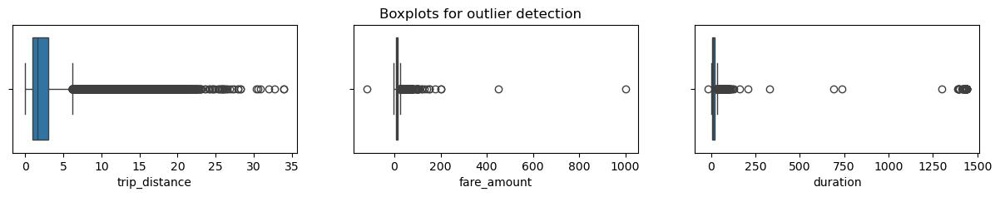
    


**Response:** 
1. All three variables contain outliers. Some are extreme, but others not so much.

2. It's 30 miles from the southern tip of Staten Island to the northern end of Manhattan and that's in a straight line. With this knowledge and the distribution of the values in this column, it's reasonable to leave these values alone and not alter them. However, the values for `fare_amount` and `duration` definitely seem to have problematic outliers on the higher end.

3. Probably not for the latter two, but for `trip_distance` it might be okay.

### Task 2e. Imputations

#### `trip_distance` outliers

You know from the summary statistics that there are trip distances of 0. Are these reflective of erroneous data, or are they very short trips that get rounded down?

To check, sort the column values, eliminate duplicates, and inspect the least 10 values. Are they rounded values or precise values?


```python
# Are trip distances of 0 bad data or very short trips rounded down?
sorted(set(df['trip_distance']))[:10]
```


    [0.0, 0.01, 0.02, 0.03, 0.04, 0.05, 0.06, 0.07, 0.08, 0.09]


The distances are captured with a high degree of precision. However, it might be possible for trips to have distances of zero if a passenger summoned a taxi and then changed their mind. Besides, are there enough zero values in the data to pose a problem?

Calculate the count of rides where the `trip_distance` is zero.


```python
sum(df['trip_distance']==0)
```


    148


**Note:** 148 out of ~23,000 rides is relatively insignificant. You could impute it with a value of 0.01, but it's unlikely to have much of an effect on the model. Therefore, the `trip_distance` column will remain untouched with regard to outliers.

#### `fare_amount` outliers


```python
df['fare_amount'].describe()
```


    count    22699.000000
    mean        13.026629
    std         13.243791
    min       -120.000000
    25%          6.500000
    50%          9.500000
    75%         14.500000
    max        999.990000
    Name: fare_amount, dtype: float64


**Response:**

The range of values in the `fare_amount` column is large and the extremes don't make much sense.

* **Low values:** Negative values are problematic. Values of zero could be legitimate if the taxi logged a trip that was immediately canceled.

* **High values:** The maximum fare amount in this dataset is nearly \\$1,000, which seems very unlikely. High values for this feature can be capped based on intuition and statistics. The interquartile range (IQR) is \\$8. The standard formula of `Q3 + (1.5 * IQR)` yields \$26.50. That doesn't seem appropriate for the maximum fare cap. In this case, we'll use a factor of `6`, which results in a cap of $62.50.

Impute values less than $0 with `0`.


```python
# Impute values less than $0 with 0
df.loc[df['fare_amount'] < 0, 'fare_amount'] = 0
df['fare_amount'].min()
```


    0.0


Now impute the maximum value as `Q3 + (6 * IQR)`.


```python
def outlier_imputer(column_list, iqr_factor):
    '''
    Impute upper-limit values in specified columns based on their interquartile range.

    Arguments:
        column_list: A list of columns to iterate over
        iqr_factor: A number representing x in the formula:
                    Q3 + (x * IQR). Used to determine maximum threshold,
                    beyond which a point is considered an outlier.

    The IQR is computed for each column in column_list and values exceeding
    the upper threshold for each column are imputed with the upper threshold value.
    '''
    for col in column_list:
        # Reassign minimum to zero
        df.loc[df[col] < 0, col] = 0

        # Calculate upper threshold
        q1 = df[col].quantile(0.25)
        q3 = df[col].quantile(0.75)
        iqr = q3 - q1
        upper_threshold = q3 + (iqr_factor * iqr)
        print(col)
        print('q3:', q3)
        print('upper_threshold:', upper_threshold)

        # Reassign values > threshold to threshold
        df.loc[df[col] > upper_threshold, col] = upper_threshold
        print(df[col].describe())
        print()
```


```python
outlier_imputer(['fare_amount'], 6)
```

    fare_amount
    q3: 14.5
    upper_threshold: 62.5
    count    22699.000000
    mean        12.897913
    std         10.541137
    min          0.000000
    25%          6.500000
    50%          9.500000
    75%         14.500000
    max         62.500000
    Name: fare_amount, dtype: float64
    


#### `duration` outliers


```python
df['duration'].describe()
```


    count    22699.000000
    mean        17.013777
    std         61.996482
    min        -16.983333
    25%          6.650000
    50%         11.183333
    75%         18.383333
    max       1439.550000
    Name: duration, dtype: float64


The `duration` column has problematic values at both the lower and upper extremities.

* **Low values:** There should be no values that represent negative time. Impute all negative durations with `0`.

* **High values:** Impute high values the same way you imputed the high-end outliers for fares: `Q3 + (6 * IQR)`.


```python
# Impute a 0 for any negative values
df.loc[df['duration'] < 0, 'duration'] = 0
df['duration'].min()
```


    0.0


```python
# Impute the high outliers
outlier_imputer(['duration'], 6)
```

    duration
    q3: 18.383333333333333
    upper_threshold: 88.78333333333333
    count    22699.000000
    mean        14.460555
    std         11.947043
    min          0.000000
    25%          6.650000
    50%         11.183333
    75%         18.383333
    max         88.783333
    Name: duration, dtype: float64
    


### Task 3a. Feature engineering

#### Create `mean_distance` column

When deployed, the model will not know the duration of a trip until after the trip occurs, so you cannot train a model that uses this feature. However, you can use the statistics of trips you *do* know to generalize about ones you do not know.

In this step, create a column called `mean_distance` that captures the mean distance for each group of trips that share pickup and dropoff points.

For example, if your data were:

|Trip|Start|End|Distance|
|--: |:---:|:-:|    |
| 1  | A   | B | 1  |
| 2  | C   | D | 2  |
| 3  | A   | B |1.5 |
| 4  | D   | C | 3  |

The results should be:
```
A -> B: 1.25 miles
C -> D: 2 miles
D -> C: 3 miles
```

Notice that C -> D is not the same as D -> C. All trips that share a unique pair of start and end points get grouped and averaged.

Then, a new column `mean_distance` will be added where the value at each row is the average for all trips with those pickup and dropoff locations:

|Trip|Start|End|Distance|mean_distance|
|--: |:---:|:-:|  :--   |:--   |
| 1  | A   | B | 1      | 1.25 |
| 2  | C   | D | 2      | 2    |
| 3  | A   | B |1.5     | 1.25 |
| 4  | D   | C | 3      | 3    |


Begin by creating a helper column called `pickup_dropoff`, which contains the unique combination of pickup and dropoff location IDs for each row.

One way to do this is to convert the pickup and dropoff location IDs to strings and join them, separated by a space. The space is to ensure that, for example, a trip with pickup/dropoff points of 12 & 151 gets encoded differently than a trip with points 121 & 51.

So, the new column would look like this:

|Trip|Start|End|pickup_dropoff|
|--: |:---:|:-:|  :--         |
| 1  | A   | B | 'A B'        |
| 2  | C   | D | 'C D'        |
| 3  | A   | B | 'A B'        |
| 4  | D   | C | 'D C'        |


```python
# Create `pickup_dropoff` column
df['pickup_dropoff'] = df['PULocationID'].astype(str) + ' ' + df['DOLocationID'].astype(str)
df['pickup_dropoff'].head(2)
```


    0    100 231
    1     186 43
    Name: pickup_dropoff, dtype: object


Now, use a `groupby()` statement to group each row by the new `pickup_dropoff` column, compute the mean, and capture the values only in the `trip_distance` column. Assign the results to a variable named `grouped`.


```python
grouped = df.groupby('pickup_dropoff').mean(numeric_only=True)[['trip_distance']]
grouped[:5]
```


<div>
<style scoped>
    .dataframe tbody tr th:only-of-type {
        vertical-align: middle;
    }

    .dataframe tbody tr th {
        vertical-align: top;
    }

    .dataframe thead th {
        text-align: right;
    }
</style>
<table border="1" class="dataframe">
  <thead>
    <tr style="text-align: right;">
      <th></th>
      <th>trip_distance</th>
    </tr>
    <tr>
      <th>pickup_dropoff</th>
      <th></th>
    </tr>
  </thead>
  <tbody>
    <tr>
      <th>1 1</th>
      <td>2.433333</td>
    </tr>
    <tr>
      <th>10 148</th>
      <td>15.700000</td>
    </tr>
    <tr>
      <th>100 1</th>
      <td>16.890000</td>
    </tr>
    <tr>
      <th>100 100</th>
      <td>0.253333</td>
    </tr>
    <tr>
      <th>100 107</th>
      <td>1.180000</td>
    </tr>
  </tbody>
</table>
</div>


`grouped` is an object of the `DataFrame` class.

1. Convert it to a dictionary using the [`to_dict()`](https://pandas.pydata.org/docs/reference/api/pandas.DataFrame.to_dict.html) method. Assign the results to a variable called `grouped_dict`. This will result in a dictionary with a key of `trip_distance` whose values are another dictionary. The inner dictionary's keys are pickup/dropoff points and its values are mean distances. This is the information you want.

```
Example:
grouped_dict = {'trip_distance': {'A B': 1.25, 'C D': 2, 'D C': 3}
```

2. Reassign the `grouped_dict` dictionary so it contains only the inner dictionary. In other words, get rid of `trip_distance` as a key, so:

```
Example:
grouped_dict = {'A B': 1.25, 'C D': 2, 'D C': 3}
 ```


```python
# 1. Convert `grouped` to a dictionary
grouped_dict = grouped.to_dict()

# 2. Reassign to only contain the inner dictionary
grouped_dict = grouped_dict['trip_distance']
```

1. Create a `mean_distance` column that is a copy of the `pickup_dropoff` helper column.

2. Use the [`map()`](https://pandas.pydata.org/docs/reference/api/pandas.Series.map.html#pandas-series-map) method on the `mean_distance` series. Pass `grouped_dict` as its argument. Reassign the result back to the `mean_distance` series.
</br></br>
When you pass a dictionary to the `Series.map()` method, it will replace the data in the series where that data matches the dictionary's keys. The values that get imputed are the values of the dictionary.

```
Example:
df['mean_distance']
```

|mean_distance |
|  :-:         |
| 'A B'        |
| 'C D'        |
| 'A B'        |
| 'D C'        |
| 'E F'        |

```
grouped_dict = {'A B': 1.25, 'C D': 2, 'D C': 3}
df['mean_distance`] = df['mean_distance'].map(grouped_dict)
df['mean_distance']
```

|mean_distance |
|  :-:         |
| 1.25         |
| 2            |
| 1.25         |
| 3            |
| NaN          |

When used this way, the `map()` `Series` method is very similar to `replace()`, however, note that `map()` will impute `NaN` for any values in the series that do not have a corresponding key in the mapping dictionary, so be careful.


```python
# 1. Create a mean_distance column that is a copy of the pickup_dropoff helper column
df['mean_distance'] = df['pickup_dropoff']

# 2. Map `grouped_dict` to the `mean_distance` column
df['mean_distance'] = df['mean_distance'].map(grouped_dict)

# Confirm that it worked
df[(df['PULocationID']==100) & (df['DOLocationID']==231)][['mean_distance']]
```


<div>
<style scoped>
    .dataframe tbody tr th:only-of-type {
        vertical-align: middle;
    }

    .dataframe tbody tr th {
        vertical-align: top;
    }

    .dataframe thead th {
        text-align: right;
    }
</style>
<table border="1" class="dataframe">
  <thead>
    <tr style="text-align: right;">
      <th></th>
      <th>mean_distance</th>
    </tr>
  </thead>
  <tbody>
    <tr>
      <th>0</th>
      <td>3.521667</td>
    </tr>
    <tr>
      <th>4909</th>
      <td>3.521667</td>
    </tr>
    <tr>
      <th>16636</th>
      <td>3.521667</td>
    </tr>
    <tr>
      <th>18134</th>
      <td>3.521667</td>
    </tr>
    <tr>
      <th>19761</th>
      <td>3.521667</td>
    </tr>
    <tr>
      <th>20581</th>
      <td>3.521667</td>
    </tr>
  </tbody>
</table>
</div>


#### Create `mean_duration` column

Repeat the process used to create the `mean_distance` column to create a `mean_duration` column.


```python
grouped = df.groupby('pickup_dropoff').mean(numeric_only=True)[['duration']]
grouped

# Create a dictionary where keys are unique pickup_dropoffs and values are
# mean trip duration for all trips with those pickup_dropoff combos
grouped_dict = grouped.to_dict()
grouped_dict = grouped_dict['duration']

df['mean_duration'] = df['pickup_dropoff']
df['mean_duration'] = df['mean_duration'].map(grouped_dict)

# Confirm that it worked
df[(df['PULocationID']==100) & (df['DOLocationID']==231)][['mean_duration']]
```


<div>
<style scoped>
    .dataframe tbody tr th:only-of-type {
        vertical-align: middle;
    }

    .dataframe tbody tr th {
        vertical-align: top;
    }

    .dataframe thead th {
        text-align: right;
    }
</style>
<table border="1" class="dataframe">
  <thead>
    <tr style="text-align: right;">
      <th></th>
      <th>mean_duration</th>
    </tr>
  </thead>
  <tbody>
    <tr>
      <th>0</th>
      <td>22.847222</td>
    </tr>
    <tr>
      <th>4909</th>
      <td>22.847222</td>
    </tr>
    <tr>
      <th>16636</th>
      <td>22.847222</td>
    </tr>
    <tr>
      <th>18134</th>
      <td>22.847222</td>
    </tr>
    <tr>
      <th>19761</th>
      <td>22.847222</td>
    </tr>
    <tr>
      <th>20581</th>
      <td>22.847222</td>
    </tr>
  </tbody>
</table>
</div>


#### Create `day` and `month` columns

Create two new columns, `day` (name of day) and `month` (name of month) by extracting the relevant information from the `tpep_pickup_datetime` column.


```python
# Create 'day' col
df['day'] = df['tpep_pickup_datetime'].dt.day_name().str.lower()

# Create 'month' col
df['month'] = df['tpep_pickup_datetime'].dt.strftime('%b').str.lower()
```

#### Create `rush_hour` column

Define rush hour as:
* Any weekday (not Saturday or Sunday) AND
* Either from 06:00&ndash;10:00 or from 16:00&ndash;20:00

Create a binary `rush_hour` column that contains a 1 if the ride was during rush hour and a 0 if it was not.


```python
# Create 'rush_hour' col
df['rush_hour'] = df['tpep_pickup_datetime'].dt.hour

# If day is Saturday or Sunday, impute 0 in `rush_hour` column
df.loc[df['day'].isin(['saturday', 'sunday']), 'rush_hour'] = 0
```


```python
def rush_hourizer(hour):
    if 6 <= hour['rush_hour'] < 10:
        val = 1
    elif 16 <= hour['rush_hour'] < 20:
        val = 1
    else:
        val = 0
    return val
```


```python
# Apply the `rush_hourizer()` function to the new column
df.loc[(df.day != 'saturday') & (df.day != 'sunday'), 'rush_hour'] = df.apply(rush_hourizer, axis=1)
df.head()
```

    /var/folders/85/xnwj0q613bg10_m1pzt113vc0000gn/T/ipykernel_17396/3278249955.py:2: FutureWarning: Setting an item of incompatible dtype is deprecated and will raise an error in a future version of pandas. Value '[0 1 1 ... 1 0 0]' has dtype incompatible with int32, please explicitly cast to a compatible dtype first.
      df.loc[(df.day != 'saturday') & (df.day != 'sunday'), 'rush_hour'] = df.apply(rush_hourizer, axis=1)


<div>
<style scoped>
    .dataframe tbody tr th:only-of-type {
        vertical-align: middle;
    }

    .dataframe tbody tr th {
        vertical-align: top;
    }

    .dataframe thead th {
        text-align: right;
    }
</style>
<table border="1" class="dataframe">
  <thead>
    <tr style="text-align: right;">
      <th></th>
      <th>Unnamed: 0</th>
      <th>VendorID</th>
      <th>tpep_pickup_datetime</th>
      <th>tpep_dropoff_datetime</th>
      <th>passenger_count</th>
      <th>trip_distance</th>
      <th>RatecodeID</th>
      <th>store_and_fwd_flag</th>
      <th>PULocationID</th>
      <th>DOLocationID</th>
      <th>...</th>
      <th>tolls_amount</th>
      <th>improvement_surcharge</th>
      <th>total_amount</th>
      <th>duration</th>
      <th>pickup_dropoff</th>
      <th>mean_distance</th>
      <th>mean_duration</th>
      <th>day</th>
      <th>month</th>
      <th>rush_hour</th>
    </tr>
  </thead>
  <tbody>
    <tr>
      <th>0</th>
      <td>24870114</td>
      <td>2</td>
      <td>2017-03-25 08:55:43</td>
      <td>2017-03-25 09:09:47</td>
      <td>6</td>
      <td>3.34</td>
      <td>1</td>
      <td>N</td>
      <td>100</td>
      <td>231</td>
      <td>...</td>
      <td>0.0</td>
      <td>0.3</td>
      <td>16.56</td>
      <td>14.066667</td>
      <td>100 231</td>
      <td>3.521667</td>
      <td>22.847222</td>
      <td>saturday</td>
      <td>mar</td>
      <td>0</td>
    </tr>
    <tr>
      <th>1</th>
      <td>35634249</td>
      <td>1</td>
      <td>2017-04-11 14:53:28</td>
      <td>2017-04-11 15:19:58</td>
      <td>1</td>
      <td>1.80</td>
      <td>1</td>
      <td>N</td>
      <td>186</td>
      <td>43</td>
      <td>...</td>
      <td>0.0</td>
      <td>0.3</td>
      <td>20.80</td>
      <td>26.500000</td>
      <td>186 43</td>
      <td>3.108889</td>
      <td>24.470370</td>
      <td>tuesday</td>
      <td>apr</td>
      <td>0</td>
    </tr>
    <tr>
      <th>2</th>
      <td>106203690</td>
      <td>1</td>
      <td>2017-12-15 07:26:56</td>
      <td>2017-12-15 07:34:08</td>
      <td>1</td>
      <td>1.00</td>
      <td>1</td>
      <td>N</td>
      <td>262</td>
      <td>236</td>
      <td>...</td>
      <td>0.0</td>
      <td>0.3</td>
      <td>8.75</td>
      <td>7.200000</td>
      <td>262 236</td>
      <td>0.881429</td>
      <td>7.250000</td>
      <td>friday</td>
      <td>dec</td>
      <td>1</td>
    </tr>
    <tr>
      <th>3</th>
      <td>38942136</td>
      <td>2</td>
      <td>2017-05-07 13:17:59</td>
      <td>2017-05-07 13:48:14</td>
      <td>1</td>
      <td>3.70</td>
      <td>1</td>
      <td>N</td>
      <td>188</td>
      <td>97</td>
      <td>...</td>
      <td>0.0</td>
      <td>0.3</td>
      <td>27.69</td>
      <td>30.250000</td>
      <td>188 97</td>
      <td>3.700000</td>
      <td>30.250000</td>
      <td>sunday</td>
      <td>may</td>
      <td>0</td>
    </tr>
    <tr>
      <th>4</th>
      <td>30841670</td>
      <td>2</td>
      <td>2017-04-15 23:32:20</td>
      <td>2017-04-15 23:49:03</td>
      <td>1</td>
      <td>4.37</td>
      <td>1</td>
      <td>N</td>
      <td>4</td>
      <td>112</td>
      <td>...</td>
      <td>0.0</td>
      <td>0.3</td>
      <td>17.80</td>
      <td>16.716667</td>
      <td>4 112</td>
      <td>4.435000</td>
      <td>14.616667</td>
      <td>saturday</td>
      <td>apr</td>
      <td>0</td>
    </tr>
  </tbody>
</table>
<p>5 rows × 25 columns</p>
</div>


### Task 4. Scatter plot

Create a scatterplot to visualize the relationship between `mean_duration` and `fare_amount`.


```python
# Create a scatter plot of duration and trip_distance, with a line of best fit
sns.set(style='whitegrid')
f = plt.figure()
f.set_figwidth(5)
f.set_figheight(5)
sns.regplot(x=df['mean_duration'], y=df['fare_amount'],
            scatter_kws={'alpha':0.5, 's':5},
            line_kws={'color':'red'})
plt.ylim(0, 70)
plt.xlim(0, 70)
plt.title('Mean duration x fare amount')
plt.show()
```


    
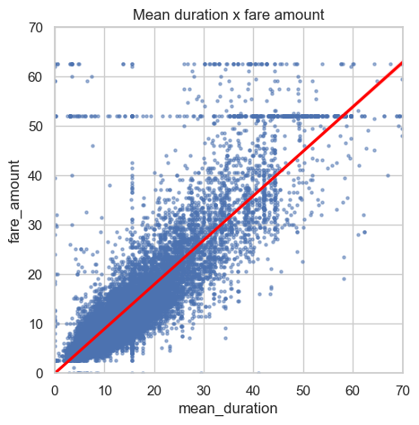
    


The `mean_duration` variable correlates with the target variable. But what are the horizontal lines around fare amounts of 52 dollars and 63 dollars? What are the values and how many are there?

You know what one of the lines represents. 62 dollars and 50 cents is the maximum that was imputed for outliers, so all former outliers will now have fare amounts of \$62.50. What is the other line?

Check the value of the rides in the second horizontal line in the scatter plot.


```python
df[df['fare_amount'] > 50]['fare_amount'].value_counts().head()
```


    fare_amount
    52.0    514
    62.5     84
    59.0      9
    50.5      9
    57.5      8
    Name: count, dtype: int64


**Note:** There are 514 trips whose fares were \$52.

Examine the first 30 of these trips.


```python
# Set pandas to display all columns
pd.set_option('display.max_columns', None)
df[df['fare_amount']==52].head(30)
```


<div>
<style scoped>
    .dataframe tbody tr th:only-of-type {
        vertical-align: middle;
    }

    .dataframe tbody tr th {
        vertical-align: top;
    }

    .dataframe thead th {
        text-align: right;
    }
</style>
<table border="1" class="dataframe">
  <thead>
    <tr style="text-align: right;">
      <th></th>
      <th>Unnamed: 0</th>
      <th>VendorID</th>
      <th>tpep_pickup_datetime</th>
      <th>tpep_dropoff_datetime</th>
      <th>passenger_count</th>
      <th>trip_distance</th>
      <th>RatecodeID</th>
      <th>store_and_fwd_flag</th>
      <th>PULocationID</th>
      <th>DOLocationID</th>
      <th>payment_type</th>
      <th>fare_amount</th>
      <th>extra</th>
      <th>mta_tax</th>
      <th>tip_amount</th>
      <th>tolls_amount</th>
      <th>improvement_surcharge</th>
      <th>total_amount</th>
      <th>duration</th>
      <th>pickup_dropoff</th>
      <th>mean_distance</th>
      <th>mean_duration</th>
      <th>day</th>
      <th>month</th>
      <th>rush_hour</th>
    </tr>
  </thead>
  <tbody>
    <tr>
      <th>11</th>
      <td>18600059</td>
      <td>2</td>
      <td>2017-03-05 19:15:30</td>
      <td>2017-03-05 19:52:18</td>
      <td>2</td>
      <td>18.90</td>
      <td>2</td>
      <td>N</td>
      <td>236</td>
      <td>132</td>
      <td>1</td>
      <td>52.0</td>
      <td>0.0</td>
      <td>0.5</td>
      <td>14.58</td>
      <td>5.54</td>
      <td>0.3</td>
      <td>72.92</td>
      <td>36.800000</td>
      <td>236 132</td>
      <td>19.211667</td>
      <td>40.500000</td>
      <td>sunday</td>
      <td>mar</td>
      <td>0</td>
    </tr>
    <tr>
      <th>110</th>
      <td>47959795</td>
      <td>1</td>
      <td>2017-06-03 14:24:57</td>
      <td>2017-06-03 15:31:48</td>
      <td>1</td>
      <td>18.00</td>
      <td>2</td>
      <td>N</td>
      <td>132</td>
      <td>163</td>
      <td>1</td>
      <td>52.0</td>
      <td>0.0</td>
      <td>0.5</td>
      <td>0.00</td>
      <td>0.00</td>
      <td>0.3</td>
      <td>52.80</td>
      <td>66.850000</td>
      <td>132 163</td>
      <td>19.229000</td>
      <td>52.941667</td>
      <td>saturday</td>
      <td>jun</td>
      <td>0</td>
    </tr>
    <tr>
      <th>161</th>
      <td>95729204</td>
      <td>2</td>
      <td>2017-11-11 20:16:16</td>
      <td>2017-11-11 20:17:14</td>
      <td>1</td>
      <td>0.23</td>
      <td>2</td>
      <td>N</td>
      <td>132</td>
      <td>132</td>
      <td>2</td>
      <td>52.0</td>
      <td>0.0</td>
      <td>0.5</td>
      <td>0.00</td>
      <td>0.00</td>
      <td>0.3</td>
      <td>52.80</td>
      <td>0.966667</td>
      <td>132 132</td>
      <td>2.255862</td>
      <td>3.021839</td>
      <td>saturday</td>
      <td>nov</td>
      <td>0</td>
    </tr>
    <tr>
      <th>247</th>
      <td>103404868</td>
      <td>2</td>
      <td>2017-12-06 23:37:08</td>
      <td>2017-12-07 00:06:19</td>
      <td>1</td>
      <td>18.93</td>
      <td>2</td>
      <td>N</td>
      <td>132</td>
      <td>79</td>
      <td>2</td>
      <td>52.0</td>
      <td>0.0</td>
      <td>0.5</td>
      <td>0.00</td>
      <td>0.00</td>
      <td>0.3</td>
      <td>52.80</td>
      <td>29.183333</td>
      <td>132 79</td>
      <td>19.431667</td>
      <td>47.275000</td>
      <td>wednesday</td>
      <td>dec</td>
      <td>0</td>
    </tr>
    <tr>
      <th>379</th>
      <td>80479432</td>
      <td>2</td>
      <td>2017-09-24 23:45:45</td>
      <td>2017-09-25 00:15:14</td>
      <td>1</td>
      <td>17.99</td>
      <td>2</td>
      <td>N</td>
      <td>132</td>
      <td>234</td>
      <td>1</td>
      <td>52.0</td>
      <td>0.0</td>
      <td>0.5</td>
      <td>14.64</td>
      <td>5.76</td>
      <td>0.3</td>
      <td>73.20</td>
      <td>29.483333</td>
      <td>132 234</td>
      <td>17.654000</td>
      <td>49.833333</td>
      <td>sunday</td>
      <td>sep</td>
      <td>0</td>
    </tr>
    <tr>
      <th>388</th>
      <td>16226157</td>
      <td>1</td>
      <td>2017-02-28 18:30:05</td>
      <td>2017-02-28 19:09:55</td>
      <td>1</td>
      <td>18.40</td>
      <td>2</td>
      <td>N</td>
      <td>132</td>
      <td>48</td>
      <td>2</td>
      <td>52.0</td>
      <td>4.5</td>
      <td>0.5</td>
      <td>0.00</td>
      <td>5.54</td>
      <td>0.3</td>
      <td>62.84</td>
      <td>39.833333</td>
      <td>132 48</td>
      <td>18.761905</td>
      <td>58.246032</td>
      <td>tuesday</td>
      <td>feb</td>
      <td>1</td>
    </tr>
    <tr>
      <th>406</th>
      <td>55253442</td>
      <td>2</td>
      <td>2017-06-05 12:51:58</td>
      <td>2017-06-05 13:07:35</td>
      <td>1</td>
      <td>4.73</td>
      <td>2</td>
      <td>N</td>
      <td>228</td>
      <td>88</td>
      <td>2</td>
      <td>52.0</td>
      <td>0.0</td>
      <td>0.5</td>
      <td>0.00</td>
      <td>5.76</td>
      <td>0.3</td>
      <td>58.56</td>
      <td>15.616667</td>
      <td>228 88</td>
      <td>4.730000</td>
      <td>15.616667</td>
      <td>monday</td>
      <td>jun</td>
      <td>0</td>
    </tr>
    <tr>
      <th>449</th>
      <td>65900029</td>
      <td>2</td>
      <td>2017-08-03 22:47:14</td>
      <td>2017-08-03 23:32:41</td>
      <td>2</td>
      <td>18.21</td>
      <td>2</td>
      <td>N</td>
      <td>132</td>
      <td>48</td>
      <td>2</td>
      <td>52.0</td>
      <td>0.0</td>
      <td>0.5</td>
      <td>0.00</td>
      <td>5.76</td>
      <td>0.3</td>
      <td>58.56</td>
      <td>45.450000</td>
      <td>132 48</td>
      <td>18.761905</td>
      <td>58.246032</td>
      <td>thursday</td>
      <td>aug</td>
      <td>0</td>
    </tr>
    <tr>
      <th>468</th>
      <td>80904240</td>
      <td>2</td>
      <td>2017-09-26 13:48:26</td>
      <td>2017-09-26 14:31:17</td>
      <td>1</td>
      <td>17.27</td>
      <td>2</td>
      <td>N</td>
      <td>186</td>
      <td>132</td>
      <td>2</td>
      <td>52.0</td>
      <td>0.0</td>
      <td>0.5</td>
      <td>0.00</td>
      <td>5.76</td>
      <td>0.3</td>
      <td>58.56</td>
      <td>42.850000</td>
      <td>186 132</td>
      <td>17.096000</td>
      <td>42.920000</td>
      <td>tuesday</td>
      <td>sep</td>
      <td>0</td>
    </tr>
    <tr>
      <th>520</th>
      <td>33706214</td>
      <td>2</td>
      <td>2017-04-23 21:34:48</td>
      <td>2017-04-23 22:46:23</td>
      <td>6</td>
      <td>18.34</td>
      <td>2</td>
      <td>N</td>
      <td>132</td>
      <td>148</td>
      <td>1</td>
      <td>52.0</td>
      <td>0.0</td>
      <td>0.5</td>
      <td>5.00</td>
      <td>0.00</td>
      <td>0.3</td>
      <td>57.80</td>
      <td>71.583333</td>
      <td>132 148</td>
      <td>17.994286</td>
      <td>46.340476</td>
      <td>sunday</td>
      <td>apr</td>
      <td>0</td>
    </tr>
    <tr>
      <th>569</th>
      <td>99259872</td>
      <td>2</td>
      <td>2017-11-22 21:31:32</td>
      <td>2017-11-22 22:00:25</td>
      <td>1</td>
      <td>18.65</td>
      <td>2</td>
      <td>N</td>
      <td>132</td>
      <td>144</td>
      <td>1</td>
      <td>52.0</td>
      <td>0.0</td>
      <td>0.5</td>
      <td>10.56</td>
      <td>0.00</td>
      <td>0.3</td>
      <td>63.36</td>
      <td>28.883333</td>
      <td>132 144</td>
      <td>18.537500</td>
      <td>37.000000</td>
      <td>wednesday</td>
      <td>nov</td>
      <td>0</td>
    </tr>
    <tr>
      <th>572</th>
      <td>61050418</td>
      <td>2</td>
      <td>2017-07-18 13:29:06</td>
      <td>2017-07-18 13:29:19</td>
      <td>1</td>
      <td>0.00</td>
      <td>2</td>
      <td>N</td>
      <td>230</td>
      <td>161</td>
      <td>1</td>
      <td>52.0</td>
      <td>0.0</td>
      <td>0.5</td>
      <td>11.71</td>
      <td>5.76</td>
      <td>0.3</td>
      <td>70.27</td>
      <td>0.216667</td>
      <td>230 161</td>
      <td>0.685484</td>
      <td>7.965591</td>
      <td>tuesday</td>
      <td>jul</td>
      <td>0</td>
    </tr>
    <tr>
      <th>586</th>
      <td>54444647</td>
      <td>2</td>
      <td>2017-06-26 13:39:12</td>
      <td>2017-06-26 14:34:54</td>
      <td>1</td>
      <td>17.76</td>
      <td>2</td>
      <td>N</td>
      <td>211</td>
      <td>132</td>
      <td>1</td>
      <td>52.0</td>
      <td>0.0</td>
      <td>0.5</td>
      <td>11.71</td>
      <td>5.76</td>
      <td>0.3</td>
      <td>70.27</td>
      <td>55.700000</td>
      <td>211 132</td>
      <td>16.580000</td>
      <td>61.691667</td>
      <td>monday</td>
      <td>jun</td>
      <td>0</td>
    </tr>
    <tr>
      <th>692</th>
      <td>94424289</td>
      <td>2</td>
      <td>2017-11-07 22:15:00</td>
      <td>2017-11-07 22:45:32</td>
      <td>2</td>
      <td>16.97</td>
      <td>2</td>
      <td>N</td>
      <td>132</td>
      <td>170</td>
      <td>1</td>
      <td>52.0</td>
      <td>0.0</td>
      <td>0.5</td>
      <td>11.71</td>
      <td>5.76</td>
      <td>0.3</td>
      <td>70.27</td>
      <td>30.533333</td>
      <td>132 170</td>
      <td>17.203000</td>
      <td>37.113333</td>
      <td>tuesday</td>
      <td>nov</td>
      <td>0</td>
    </tr>
    <tr>
      <th>717</th>
      <td>103094220</td>
      <td>1</td>
      <td>2017-12-06 05:19:50</td>
      <td>2017-12-06 05:53:52</td>
      <td>1</td>
      <td>20.80</td>
      <td>2</td>
      <td>N</td>
      <td>132</td>
      <td>239</td>
      <td>1</td>
      <td>52.0</td>
      <td>0.0</td>
      <td>0.5</td>
      <td>5.85</td>
      <td>5.76</td>
      <td>0.3</td>
      <td>64.41</td>
      <td>34.033333</td>
      <td>132 239</td>
      <td>20.901250</td>
      <td>44.862500</td>
      <td>wednesday</td>
      <td>dec</td>
      <td>0</td>
    </tr>
    <tr>
      <th>719</th>
      <td>66115834</td>
      <td>1</td>
      <td>2017-08-04 17:53:34</td>
      <td>2017-08-04 18:50:56</td>
      <td>1</td>
      <td>21.60</td>
      <td>2</td>
      <td>N</td>
      <td>264</td>
      <td>264</td>
      <td>1</td>
      <td>52.0</td>
      <td>4.5</td>
      <td>0.5</td>
      <td>12.60</td>
      <td>5.76</td>
      <td>0.3</td>
      <td>75.66</td>
      <td>57.366667</td>
      <td>264 264</td>
      <td>3.191516</td>
      <td>15.618773</td>
      <td>friday</td>
      <td>aug</td>
      <td>1</td>
    </tr>
    <tr>
      <th>782</th>
      <td>55934137</td>
      <td>2</td>
      <td>2017-06-09 09:31:25</td>
      <td>2017-06-09 10:24:10</td>
      <td>2</td>
      <td>18.81</td>
      <td>2</td>
      <td>N</td>
      <td>163</td>
      <td>132</td>
      <td>1</td>
      <td>52.0</td>
      <td>0.0</td>
      <td>0.5</td>
      <td>13.20</td>
      <td>0.00</td>
      <td>0.3</td>
      <td>66.00</td>
      <td>52.750000</td>
      <td>163 132</td>
      <td>17.275833</td>
      <td>52.338889</td>
      <td>friday</td>
      <td>jun</td>
      <td>1</td>
    </tr>
    <tr>
      <th>816</th>
      <td>13731926</td>
      <td>2</td>
      <td>2017-02-21 06:11:03</td>
      <td>2017-02-21 06:59:39</td>
      <td>5</td>
      <td>16.94</td>
      <td>2</td>
      <td>N</td>
      <td>132</td>
      <td>170</td>
      <td>1</td>
      <td>52.0</td>
      <td>0.0</td>
      <td>0.5</td>
      <td>2.00</td>
      <td>5.54</td>
      <td>0.3</td>
      <td>60.34</td>
      <td>48.600000</td>
      <td>132 170</td>
      <td>17.203000</td>
      <td>37.113333</td>
      <td>tuesday</td>
      <td>feb</td>
      <td>1</td>
    </tr>
    <tr>
      <th>818</th>
      <td>52277743</td>
      <td>2</td>
      <td>2017-06-20 08:15:18</td>
      <td>2017-06-20 10:24:37</td>
      <td>1</td>
      <td>17.77</td>
      <td>2</td>
      <td>N</td>
      <td>132</td>
      <td>246</td>
      <td>1</td>
      <td>52.0</td>
      <td>0.0</td>
      <td>0.5</td>
      <td>11.71</td>
      <td>5.76</td>
      <td>0.3</td>
      <td>70.27</td>
      <td>88.783333</td>
      <td>132 246</td>
      <td>18.515000</td>
      <td>66.316667</td>
      <td>tuesday</td>
      <td>jun</td>
      <td>1</td>
    </tr>
    <tr>
      <th>835</th>
      <td>2684305</td>
      <td>2</td>
      <td>2017-01-10 22:29:47</td>
      <td>2017-01-10 23:06:46</td>
      <td>1</td>
      <td>18.57</td>
      <td>2</td>
      <td>N</td>
      <td>132</td>
      <td>48</td>
      <td>1</td>
      <td>52.0</td>
      <td>0.0</td>
      <td>0.5</td>
      <td>13.20</td>
      <td>0.00</td>
      <td>0.3</td>
      <td>66.00</td>
      <td>36.983333</td>
      <td>132 48</td>
      <td>18.761905</td>
      <td>58.246032</td>
      <td>tuesday</td>
      <td>jan</td>
      <td>0</td>
    </tr>
    <tr>
      <th>840</th>
      <td>90860814</td>
      <td>2</td>
      <td>2017-10-27 21:50:00</td>
      <td>2017-10-27 22:35:04</td>
      <td>1</td>
      <td>22.43</td>
      <td>2</td>
      <td>N</td>
      <td>132</td>
      <td>163</td>
      <td>2</td>
      <td>52.0</td>
      <td>0.0</td>
      <td>0.5</td>
      <td>0.00</td>
      <td>5.76</td>
      <td>0.3</td>
      <td>58.56</td>
      <td>45.066667</td>
      <td>132 163</td>
      <td>19.229000</td>
      <td>52.941667</td>
      <td>friday</td>
      <td>oct</td>
      <td>0</td>
    </tr>
    <tr>
      <th>861</th>
      <td>106575186</td>
      <td>1</td>
      <td>2017-12-16 06:39:59</td>
      <td>2017-12-16 07:07:59</td>
      <td>2</td>
      <td>17.80</td>
      <td>2</td>
      <td>N</td>
      <td>75</td>
      <td>132</td>
      <td>1</td>
      <td>52.0</td>
      <td>0.0</td>
      <td>0.5</td>
      <td>6.00</td>
      <td>5.76</td>
      <td>0.3</td>
      <td>64.56</td>
      <td>28.000000</td>
      <td>75 132</td>
      <td>18.442500</td>
      <td>36.204167</td>
      <td>saturday</td>
      <td>dec</td>
      <td>0</td>
    </tr>
    <tr>
      <th>881</th>
      <td>110495611</td>
      <td>2</td>
      <td>2017-12-30 05:25:29</td>
      <td>2017-12-30 06:01:29</td>
      <td>6</td>
      <td>18.23</td>
      <td>2</td>
      <td>N</td>
      <td>68</td>
      <td>132</td>
      <td>2</td>
      <td>52.0</td>
      <td>0.0</td>
      <td>0.5</td>
      <td>0.00</td>
      <td>0.00</td>
      <td>0.3</td>
      <td>52.80</td>
      <td>36.000000</td>
      <td>68 132</td>
      <td>18.785000</td>
      <td>58.041667</td>
      <td>saturday</td>
      <td>dec</td>
      <td>0</td>
    </tr>
    <tr>
      <th>958</th>
      <td>87017503</td>
      <td>1</td>
      <td>2017-10-15 22:39:12</td>
      <td>2017-10-15 23:14:22</td>
      <td>1</td>
      <td>21.80</td>
      <td>2</td>
      <td>N</td>
      <td>132</td>
      <td>261</td>
      <td>2</td>
      <td>52.0</td>
      <td>0.0</td>
      <td>0.5</td>
      <td>0.00</td>
      <td>0.00</td>
      <td>0.3</td>
      <td>52.80</td>
      <td>35.166667</td>
      <td>132 261</td>
      <td>22.115000</td>
      <td>51.493750</td>
      <td>sunday</td>
      <td>oct</td>
      <td>0</td>
    </tr>
    <tr>
      <th>970</th>
      <td>12762608</td>
      <td>2</td>
      <td>2017-02-17 20:39:42</td>
      <td>2017-02-17 21:13:29</td>
      <td>1</td>
      <td>19.57</td>
      <td>2</td>
      <td>N</td>
      <td>132</td>
      <td>140</td>
      <td>1</td>
      <td>52.0</td>
      <td>0.0</td>
      <td>0.5</td>
      <td>11.67</td>
      <td>5.54</td>
      <td>0.3</td>
      <td>70.01</td>
      <td>33.783333</td>
      <td>132 140</td>
      <td>19.293333</td>
      <td>36.791667</td>
      <td>friday</td>
      <td>feb</td>
      <td>0</td>
    </tr>
    <tr>
      <th>984</th>
      <td>71264442</td>
      <td>1</td>
      <td>2017-08-23 18:23:26</td>
      <td>2017-08-23 19:18:29</td>
      <td>1</td>
      <td>16.70</td>
      <td>2</td>
      <td>N</td>
      <td>132</td>
      <td>230</td>
      <td>1</td>
      <td>52.0</td>
      <td>4.5</td>
      <td>0.5</td>
      <td>42.29</td>
      <td>0.00</td>
      <td>0.3</td>
      <td>99.59</td>
      <td>55.050000</td>
      <td>132 230</td>
      <td>18.571200</td>
      <td>59.598000</td>
      <td>wednesday</td>
      <td>aug</td>
      <td>1</td>
    </tr>
    <tr>
      <th>1082</th>
      <td>11006300</td>
      <td>2</td>
      <td>2017-02-07 17:20:19</td>
      <td>2017-02-07 17:34:41</td>
      <td>1</td>
      <td>1.09</td>
      <td>2</td>
      <td>N</td>
      <td>170</td>
      <td>48</td>
      <td>2</td>
      <td>52.0</td>
      <td>4.5</td>
      <td>0.5</td>
      <td>0.00</td>
      <td>5.54</td>
      <td>0.3</td>
      <td>62.84</td>
      <td>14.366667</td>
      <td>170 48</td>
      <td>1.265789</td>
      <td>14.135965</td>
      <td>tuesday</td>
      <td>feb</td>
      <td>1</td>
    </tr>
    <tr>
      <th>1097</th>
      <td>68882036</td>
      <td>2</td>
      <td>2017-08-14 23:01:15</td>
      <td>2017-08-14 23:03:35</td>
      <td>5</td>
      <td>2.12</td>
      <td>2</td>
      <td>N</td>
      <td>265</td>
      <td>265</td>
      <td>2</td>
      <td>52.0</td>
      <td>0.0</td>
      <td>0.5</td>
      <td>0.00</td>
      <td>0.00</td>
      <td>0.3</td>
      <td>52.80</td>
      <td>2.333333</td>
      <td>265 265</td>
      <td>0.753077</td>
      <td>3.411538</td>
      <td>monday</td>
      <td>aug</td>
      <td>0</td>
    </tr>
    <tr>
      <th>1110</th>
      <td>74720333</td>
      <td>1</td>
      <td>2017-09-06 10:46:17</td>
      <td>2017-09-06 11:44:41</td>
      <td>1</td>
      <td>19.10</td>
      <td>2</td>
      <td>N</td>
      <td>239</td>
      <td>132</td>
      <td>1</td>
      <td>52.0</td>
      <td>0.0</td>
      <td>0.5</td>
      <td>15.80</td>
      <td>0.00</td>
      <td>0.3</td>
      <td>68.60</td>
      <td>58.400000</td>
      <td>239 132</td>
      <td>19.795000</td>
      <td>50.562500</td>
      <td>wednesday</td>
      <td>sep</td>
      <td>0</td>
    </tr>
    <tr>
      <th>1179</th>
      <td>51937907</td>
      <td>2</td>
      <td>2017-06-19 06:23:13</td>
      <td>2017-06-19 07:03:53</td>
      <td>6</td>
      <td>19.77</td>
      <td>2</td>
      <td>N</td>
      <td>238</td>
      <td>132</td>
      <td>1</td>
      <td>52.0</td>
      <td>0.0</td>
      <td>0.5</td>
      <td>17.57</td>
      <td>5.76</td>
      <td>0.3</td>
      <td>76.13</td>
      <td>40.666667</td>
      <td>238 132</td>
      <td>19.470000</td>
      <td>53.861111</td>
      <td>monday</td>
      <td>jun</td>
      <td>1</td>
    </tr>
  </tbody>
</table>
</div>


**Response:** 

It seems that almost all of the trips in the first 30 rows where the fare amount was \$52 either begin or end at location 132, and all of them have a `RatecodeID` of 2.

There is no readily apparent reason why PULocation 132 should have so many fares of 52 dollars. They seem to occur on all different days, at different times, with both vendors, in all months. However, there are many toll amounts of $5.76 and \\$5.54. This would seem to indicate that location 132 is in an area that frequently requires tolls to get to and from. It's likely this is an airport.


The data dictionary says that `RatecodeID` of 2 indicates trips for JFK, which is John F. Kennedy International Airport. A quick Google search for "new york city taxi flat rate \$52" indicates that in 2017 (the year that this data was collected) there was indeed a flat fare for taxi trips between JFK airport (in Queens) and Manhattan.

Because `RatecodeID` is known from the data dictionary, the values for this rate code can be imputed back into the data after the model makes its predictions. This way you know that those data points will always be correct.

### Task 5. Isolate modeling variables

Drop features that are redundant, irrelevant, or that will not be available in a deployed environment.


```python
df.info()
```

    <class 'pandas.core.frame.DataFrame'>
    RangeIndex: 22699 entries, 0 to 22698
    Data columns (total 25 columns):
     #   Column                 Non-Null Count  Dtype         
    ---  ------                 --------------  -----         
     0   Unnamed: 0             22699 non-null  int64         
     1   VendorID               22699 non-null  int64         
     2   tpep_pickup_datetime   22699 non-null  datetime64[ns]
     3   tpep_dropoff_datetime  22699 non-null  datetime64[ns]
     4   passenger_count        22699 non-null  int64         
     5   trip_distance          22699 non-null  float64       
     6   RatecodeID             22699 non-null  int64         
     7   store_and_fwd_flag     22699 non-null  object        
     8   PULocationID           22699 non-null  int64         
     9   DOLocationID           22699 non-null  int64         
     10  payment_type           22699 non-null  int64         
     11  fare_amount            22699 non-null  float64       
     12  extra                  22699 non-null  float64       
     13  mta_tax                22699 non-null  float64       
     14  tip_amount             22699 non-null  float64       
     15  tolls_amount           22699 non-null  float64       
     16  improvement_surcharge  22699 non-null  float64       
     17  total_amount           22699 non-null  float64       
     18  duration               22699 non-null  float64       
     19  pickup_dropoff         22699 non-null  object        
     20  mean_distance          22699 non-null  float64       
     21  mean_duration          22699 non-null  float64       
     22  day                    22699 non-null  object        
     23  month                  22699 non-null  object        
     24  rush_hour              22699 non-null  int64         
    dtypes: datetime64[ns](2), float64(11), int64(8), object(4)
    memory usage: 4.3+ MB


```python
df2 = df.copy()

df2 = df2.drop(['Unnamed: 0', 'tpep_dropoff_datetime', 'tpep_pickup_datetime',
               'trip_distance', 'RatecodeID', 'store_and_fwd_flag', 'PULocationID', 'DOLocationID',
               'payment_type', 'extra', 'mta_tax', 'tip_amount', 'tolls_amount', 'improvement_surcharge',
               'total_amount', 'tpep_dropoff_datetime', 'tpep_pickup_datetime', 'duration',
               'pickup_dropoff', 'day', 'month'
               ], axis=1)

df2.info()
```

    <class 'pandas.core.frame.DataFrame'>
    RangeIndex: 22699 entries, 0 to 22698
    Data columns (total 6 columns):
     #   Column           Non-Null Count  Dtype  
    ---  ------           --------------  -----  
     0   VendorID         22699 non-null  int64  
     1   passenger_count  22699 non-null  int64  
     2   fare_amount      22699 non-null  float64
     3   mean_distance    22699 non-null  float64
     4   mean_duration    22699 non-null  float64
     5   rush_hour        22699 non-null  int64  
    dtypes: float64(3), int64(3)
    memory usage: 1.0 MB


### Task 6. Pair plot

Create a pairplot to visualize pairwise relationships between `fare_amount`, `mean_duration`, and `mean_distance`.


```python
# Create a pairplot to visualize pairwise relationships between variables in the data
### YOUR CODE HERE ###

sns.pairplot(df2[['fare_amount', 'mean_duration', 'mean_distance']],
             plot_kws={'alpha':0.4, 'size':5},
             );
```


    
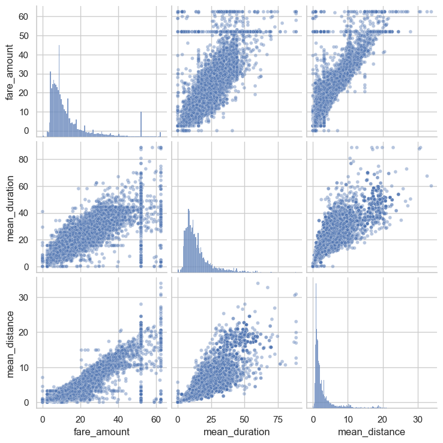
    


These variables all show linear correlation with each other. Investigate this further.

### Task 7. Identify correlations

Next, code a correlation matrix to help determine most correlated variables.


```python
# Create correlation matrix containing pairwise correlation of columns, using pearson correlation coefficient
df2.corr(method='pearson')
```


<div>
<style scoped>
    .dataframe tbody tr th:only-of-type {
        vertical-align: middle;
    }

    .dataframe tbody tr th {
        vertical-align: top;
    }

    .dataframe thead th {
        text-align: right;
    }
</style>
<table border="1" class="dataframe">
  <thead>
    <tr style="text-align: right;">
      <th></th>
      <th>VendorID</th>
      <th>passenger_count</th>
      <th>fare_amount</th>
      <th>mean_distance</th>
      <th>mean_duration</th>
      <th>rush_hour</th>
    </tr>
  </thead>
  <tbody>
    <tr>
      <th>VendorID</th>
      <td>1.000000</td>
      <td>0.266463</td>
      <td>0.001045</td>
      <td>0.004741</td>
      <td>0.001876</td>
      <td>-0.002874</td>
    </tr>
    <tr>
      <th>passenger_count</th>
      <td>0.266463</td>
      <td>1.000000</td>
      <td>0.014942</td>
      <td>0.013428</td>
      <td>0.015852</td>
      <td>-0.022035</td>
    </tr>
    <tr>
      <th>fare_amount</th>
      <td>0.001045</td>
      <td>0.014942</td>
      <td>1.000000</td>
      <td>0.910185</td>
      <td>0.859105</td>
      <td>-0.020075</td>
    </tr>
    <tr>
      <th>mean_distance</th>
      <td>0.004741</td>
      <td>0.013428</td>
      <td>0.910185</td>
      <td>1.000000</td>
      <td>0.874864</td>
      <td>-0.039725</td>
    </tr>
    <tr>
      <th>mean_duration</th>
      <td>0.001876</td>
      <td>0.015852</td>
      <td>0.859105</td>
      <td>0.874864</td>
      <td>1.000000</td>
      <td>-0.021583</td>
    </tr>
    <tr>
      <th>rush_hour</th>
      <td>-0.002874</td>
      <td>-0.022035</td>
      <td>-0.020075</td>
      <td>-0.039725</td>
      <td>-0.021583</td>
      <td>1.000000</td>
    </tr>
  </tbody>
</table>
</div>


Visualize a correlation heatmap of the data.


```python
# Create correlation heatmap

plt.figure(figsize=(6,4))
sns.heatmap(df2.corr(method='pearson'), annot=True, cmap='Reds')
plt.title('Correlation heatmap',
          fontsize=18)
plt.show()
```


    
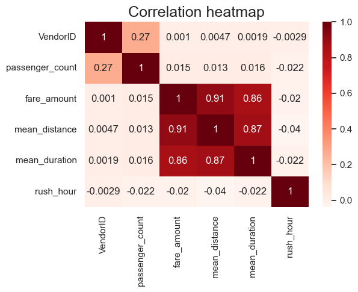
    


**Response:** `mean_duration` and `mean_distance` are both highly correlated with the target variable of `fare_amount` They're also both correlated with each other, with a Pearson correlation of 0.87.

Recall that highly correlated predictor variables can be bad for linear regression models when you want to be able to draw statistical inferences about the data from the model. However, correlated predictor variables can still be used to create an accurate predictor if the prediction itself is more important than using the model as a tool to learn about your data.

This model will predict `fare_amount`, which will be used as a predictor variable in machine learning models. Therefore, try modeling with both variables even though they are correlated.

### Task 8a. Split data into outcome variable and features


```python
df2.info()
```

    <class 'pandas.core.frame.DataFrame'>
    RangeIndex: 22699 entries, 0 to 22698
    Data columns (total 6 columns):
     #   Column           Non-Null Count  Dtype  
    ---  ------           --------------  -----  
     0   VendorID         22699 non-null  int64  
     1   passenger_count  22699 non-null  int64  
     2   fare_amount      22699 non-null  float64
     3   mean_distance    22699 non-null  float64
     4   mean_duration    22699 non-null  float64
     5   rush_hour        22699 non-null  int64  
    dtypes: float64(3), int64(3)
    memory usage: 1.0 MB


Set your X and y variables. X represents the features and y represents the outcome (target) variable.


```python
# Remove the target column from the features
X = df2.drop(columns=['fare_amount'])

# Set y variable
y = df2[['fare_amount']]

# Display first few rows
X.head()
```


<div>
<style scoped>
    .dataframe tbody tr th:only-of-type {
        vertical-align: middle;
    }

    .dataframe tbody tr th {
        vertical-align: top;
    }

    .dataframe thead th {
        text-align: right;
    }
</style>
<table border="1" class="dataframe">
  <thead>
    <tr style="text-align: right;">
      <th></th>
      <th>VendorID</th>
      <th>passenger_count</th>
      <th>mean_distance</th>
      <th>mean_duration</th>
      <th>rush_hour</th>
    </tr>
  </thead>
  <tbody>
    <tr>
      <th>0</th>
      <td>2</td>
      <td>6</td>
      <td>3.521667</td>
      <td>22.847222</td>
      <td>0</td>
    </tr>
    <tr>
      <th>1</th>
      <td>1</td>
      <td>1</td>
      <td>3.108889</td>
      <td>24.470370</td>
      <td>0</td>
    </tr>
    <tr>
      <th>2</th>
      <td>1</td>
      <td>1</td>
      <td>0.881429</td>
      <td>7.250000</td>
      <td>1</td>
    </tr>
    <tr>
      <th>3</th>
      <td>2</td>
      <td>1</td>
      <td>3.700000</td>
      <td>30.250000</td>
      <td>0</td>
    </tr>
    <tr>
      <th>4</th>
      <td>2</td>
      <td>1</td>
      <td>4.435000</td>
      <td>14.616667</td>
      <td>0</td>
    </tr>
  </tbody>
</table>
</div>


### Task 8b. Pre-process data

Dummy encode categorical variables


```python
# Convert VendorID to string
X['VendorID'] = X['VendorID'].astype(str)

# Get dummies
X = pd.get_dummies(X, drop_first=True)
X.head()
```


<div>
<style scoped>
    .dataframe tbody tr th:only-of-type {
        vertical-align: middle;
    }

    .dataframe tbody tr th {
        vertical-align: top;
    }

    .dataframe thead th {
        text-align: right;
    }
</style>
<table border="1" class="dataframe">
  <thead>
    <tr style="text-align: right;">
      <th></th>
      <th>passenger_count</th>
      <th>mean_distance</th>
      <th>mean_duration</th>
      <th>rush_hour</th>
      <th>VendorID_2</th>
    </tr>
  </thead>
  <tbody>
    <tr>
      <th>0</th>
      <td>6</td>
      <td>3.521667</td>
      <td>22.847222</td>
      <td>0</td>
      <td>True</td>
    </tr>
    <tr>
      <th>1</th>
      <td>1</td>
      <td>3.108889</td>
      <td>24.470370</td>
      <td>0</td>
      <td>False</td>
    </tr>
    <tr>
      <th>2</th>
      <td>1</td>
      <td>0.881429</td>
      <td>7.250000</td>
      <td>1</td>
      <td>False</td>
    </tr>
    <tr>
      <th>3</th>
      <td>1</td>
      <td>3.700000</td>
      <td>30.250000</td>
      <td>0</td>
      <td>True</td>
    </tr>
    <tr>
      <th>4</th>
      <td>1</td>
      <td>4.435000</td>
      <td>14.616667</td>
      <td>0</td>
      <td>True</td>
    </tr>
  </tbody>
</table>
</div>


### Split data into training and test sets

Create training and testing sets. The test set should contain 20% of the total samples. Set `random_state=0`.


```python
# Create training and testing sets

X_train, X_test, y_train, y_test = train_test_split(X, y, test_size=0.2, random_state=0)
```

### Standardize the data

Use `StandardScaler()`, `fit()`, and `transform()` to standardize the `X_train` variables. Assign the results to a variable called `X_train_scaled`.


```python
# Standardize the X variables
scaler = StandardScaler().fit(X_train)
X_train_scaled = scaler.transform(X_train)
print('X_train scaled:', X_train_scaled)
```

    X_train scaled: [[-0.50301524  0.8694684   0.17616665 -0.64893329  0.89286563]
     [-0.50301524 -0.60011281 -0.69829589  1.54099045  0.89286563]
     [ 0.27331093 -0.47829156 -0.57301906 -0.64893329 -1.11998936]
     ...
     [-0.50301524 -0.45121122 -0.6788917  -0.64893329 -1.11998936]
     [-0.50301524 -0.58944763 -0.85743597  1.54099045 -1.11998936]
     [ 1.82596329  0.83673851  1.13212101 -0.64893329  0.89286563]]


### Fit the model

Instantiate your model and fit it to the training data.


```python
# Fit your model to the training data
lr=LinearRegression()
lr.fit(X_train_scaled, y_train)
```


<style>#sk-container-id-2 {
  /* Definition of color scheme common for light and dark mode */
  --sklearn-color-text: black;
  --sklearn-color-line: gray;
  /* Definition of color scheme for unfitted estimators */
  --sklearn-color-unfitted-level-0: #fff5e6;
  --sklearn-color-unfitted-level-1: #f6e4d2;
  --sklearn-color-unfitted-level-2: #ffe0b3;
  --sklearn-color-unfitted-level-3: chocolate;
  /* Definition of color scheme for fitted estimators */
  --sklearn-color-fitted-level-0: #f0f8ff;
  --sklearn-color-fitted-level-1: #d4ebff;
  --sklearn-color-fitted-level-2: #b3dbfd;
  --sklearn-color-fitted-level-3: cornflowerblue;

  /* Specific color for light theme */
  --sklearn-color-text-on-default-background: var(--sg-text-color, var(--theme-code-foreground, var(--jp-content-font-color1, black)));
  --sklearn-color-background: var(--sg-background-color, var(--theme-background, var(--jp-layout-color0, white)));
  --sklearn-color-border-box: var(--sg-text-color, var(--theme-code-foreground, var(--jp-content-font-color1, black)));
  --sklearn-color-icon: #696969;

  @media (prefers-color-scheme: dark) {
    /* Redefinition of color scheme for dark theme */
    --sklearn-color-text-on-default-background: var(--sg-text-color, var(--theme-code-foreground, var(--jp-content-font-color1, white)));
    --sklearn-color-background: var(--sg-background-color, var(--theme-background, var(--jp-layout-color0, #111)));
    --sklearn-color-border-box: var(--sg-text-color, var(--theme-code-foreground, var(--jp-content-font-color1, white)));
    --sklearn-color-icon: #878787;
  }
}

#sk-container-id-2 {
  color: var(--sklearn-color-text);
}

#sk-container-id-2 pre {
  padding: 0;
}

#sk-container-id-2 input.sk-hidden--visually {
  border: 0;
  clip: rect(1px 1px 1px 1px);
  clip: rect(1px, 1px, 1px, 1px);
  height: 1px;
  margin: -1px;
  overflow: hidden;
  padding: 0;
  position: absolute;
  width: 1px;
}

#sk-container-id-2 div.sk-dashed-wrapped {
  border: 1px dashed var(--sklearn-color-line);
  margin: 0 0.4em 0.5em 0.4em;
  box-sizing: border-box;
  padding-bottom: 0.4em;
  background-color: var(--sklearn-color-background);
}

#sk-container-id-2 div.sk-container {
  /* jupyter's `normalize.less` sets `[hidden] { display: none; }`
     but bootstrap.min.css set `[hidden] { display: none !important; }`
     so we also need the `!important` here to be able to override the
     default hidden behavior on the sphinx rendered scikit-learn.org.
     See: https://github.com/scikit-learn/scikit-learn/issues/21755 */
  display: inline-block !important;
  position: relative;
}

#sk-container-id-2 div.sk-text-repr-fallback {
  display: none;
}

div.sk-parallel-item,
div.sk-serial,
div.sk-item {
  /* draw centered vertical line to link estimators */
  background-image: linear-gradient(var(--sklearn-color-text-on-default-background), var(--sklearn-color-text-on-default-background));
  background-size: 2px 100%;
  background-repeat: no-repeat;
  background-position: center center;
}

/* Parallel-specific style estimator block */

#sk-container-id-2 div.sk-parallel-item::after {
  content: "";
  width: 100%;
  border-bottom: 2px solid var(--sklearn-color-text-on-default-background);
  flex-grow: 1;
}

#sk-container-id-2 div.sk-parallel {
  display: flex;
  align-items: stretch;
  justify-content: center;
  background-color: var(--sklearn-color-background);
  position: relative;
}

#sk-container-id-2 div.sk-parallel-item {
  display: flex;
  flex-direction: column;
}

#sk-container-id-2 div.sk-parallel-item:first-child::after {
  align-self: flex-end;
  width: 50%;
}

#sk-container-id-2 div.sk-parallel-item:last-child::after {
  align-self: flex-start;
  width: 50%;
}

#sk-container-id-2 div.sk-parallel-item:only-child::after {
  width: 0;
}

/* Serial-specific style estimator block */

#sk-container-id-2 div.sk-serial {
  display: flex;
  flex-direction: column;
  align-items: center;
  background-color: var(--sklearn-color-background);
  padding-right: 1em;
  padding-left: 1em;
}


/* Toggleable style: style used for estimator/Pipeline/ColumnTransformer box that is
clickable and can be expanded/collapsed.
- Pipeline and ColumnTransformer use this feature and define the default style
- Estimators will overwrite some part of the style using the `sk-estimator` class
*/

/* Pipeline and ColumnTransformer style (default) */

#sk-container-id-2 div.sk-toggleable {
  /* Default theme specific background. It is overwritten whether we have a
  specific estimator or a Pipeline/ColumnTransformer */
  background-color: var(--sklearn-color-background);
}

/* Toggleable label */
#sk-container-id-2 label.sk-toggleable__label {
  cursor: pointer;
  display: block;
  width: 100%;
  margin-bottom: 0;
  padding: 0.5em;
  box-sizing: border-box;
  text-align: center;
}

#sk-container-id-2 label.sk-toggleable__label-arrow:before {
  /* Arrow on the left of the label */
  content: "▸";
  float: left;
  margin-right: 0.25em;
  color: var(--sklearn-color-icon);
}

#sk-container-id-2 label.sk-toggleable__label-arrow:hover:before {
  color: var(--sklearn-color-text);
}

/* Toggleable content - dropdown */

#sk-container-id-2 div.sk-toggleable__content {
  max-height: 0;
  max-width: 0;
  overflow: hidden;
  text-align: left;
  /* unfitted */
  background-color: var(--sklearn-color-unfitted-level-0);
}

#sk-container-id-2 div.sk-toggleable__content.fitted {
  /* fitted */
  background-color: var(--sklearn-color-fitted-level-0);
}

#sk-container-id-2 div.sk-toggleable__content pre {
  margin: 0.2em;
  border-radius: 0.25em;
  color: var(--sklearn-color-text);
  /* unfitted */
  background-color: var(--sklearn-color-unfitted-level-0);
}

#sk-container-id-2 div.sk-toggleable__content.fitted pre {
  /* unfitted */
  background-color: var(--sklearn-color-fitted-level-0);
}

#sk-container-id-2 input.sk-toggleable__control:checked~div.sk-toggleable__content {
  /* Expand drop-down */
  max-height: 200px;
  max-width: 100%;
  overflow: auto;
}

#sk-container-id-2 input.sk-toggleable__control:checked~label.sk-toggleable__label-arrow:before {
  content: "▾";
}

/* Pipeline/ColumnTransformer-specific style */

#sk-container-id-2 div.sk-label input.sk-toggleable__control:checked~label.sk-toggleable__label {
  color: var(--sklearn-color-text);
  background-color: var(--sklearn-color-unfitted-level-2);
}

#sk-container-id-2 div.sk-label.fitted input.sk-toggleable__control:checked~label.sk-toggleable__label {
  background-color: var(--sklearn-color-fitted-level-2);
}

/* Estimator-specific style */

/* Colorize estimator box */
#sk-container-id-2 div.sk-estimator input.sk-toggleable__control:checked~label.sk-toggleable__label {
  /* unfitted */
  background-color: var(--sklearn-color-unfitted-level-2);
}

#sk-container-id-2 div.sk-estimator.fitted input.sk-toggleable__control:checked~label.sk-toggleable__label {
  /* fitted */
  background-color: var(--sklearn-color-fitted-level-2);
}

#sk-container-id-2 div.sk-label label.sk-toggleable__label,
#sk-container-id-2 div.sk-label label {
  /* The background is the default theme color */
  color: var(--sklearn-color-text-on-default-background);
}

/* On hover, darken the color of the background */
#sk-container-id-2 div.sk-label:hover label.sk-toggleable__label {
  color: var(--sklearn-color-text);
  background-color: var(--sklearn-color-unfitted-level-2);
}

/* Label box, darken color on hover, fitted */
#sk-container-id-2 div.sk-label.fitted:hover label.sk-toggleable__label.fitted {
  color: var(--sklearn-color-text);
  background-color: var(--sklearn-color-fitted-level-2);
}

/* Estimator label */

#sk-container-id-2 div.sk-label label {
  font-family: monospace;
  font-weight: bold;
  display: inline-block;
  line-height: 1.2em;
}

#sk-container-id-2 div.sk-label-container {
  text-align: center;
}

/* Estimator-specific */
#sk-container-id-2 div.sk-estimator {
  font-family: monospace;
  border: 1px dotted var(--sklearn-color-border-box);
  border-radius: 0.25em;
  box-sizing: border-box;
  margin-bottom: 0.5em;
  /* unfitted */
  background-color: var(--sklearn-color-unfitted-level-0);
}

#sk-container-id-2 div.sk-estimator.fitted {
  /* fitted */
  background-color: var(--sklearn-color-fitted-level-0);
}

/* on hover */
#sk-container-id-2 div.sk-estimator:hover {
  /* unfitted */
  background-color: var(--sklearn-color-unfitted-level-2);
}

#sk-container-id-2 div.sk-estimator.fitted:hover {
  /* fitted */
  background-color: var(--sklearn-color-fitted-level-2);
}

/* Specification for estimator info (e.g. "i" and "?") */

/* Common style for "i" and "?" */

.sk-estimator-doc-link,
a:link.sk-estimator-doc-link,
a:visited.sk-estimator-doc-link {
  float: right;
  font-size: smaller;
  line-height: 1em;
  font-family: monospace;
  background-color: var(--sklearn-color-background);
  border-radius: 1em;
  height: 1em;
  width: 1em;
  text-decoration: none !important;
  margin-left: 1ex;
  /* unfitted */
  border: var(--sklearn-color-unfitted-level-1) 1pt solid;
  color: var(--sklearn-color-unfitted-level-1);
}

.sk-estimator-doc-link.fitted,
a:link.sk-estimator-doc-link.fitted,
a:visited.sk-estimator-doc-link.fitted {
  /* fitted */
  border: var(--sklearn-color-fitted-level-1) 1pt solid;
  color: var(--sklearn-color-fitted-level-1);
}

/* On hover */
div.sk-estimator:hover .sk-estimator-doc-link:hover,
.sk-estimator-doc-link:hover,
div.sk-label-container:hover .sk-estimator-doc-link:hover,
.sk-estimator-doc-link:hover {
  /* unfitted */
  background-color: var(--sklearn-color-unfitted-level-3);
  color: var(--sklearn-color-background);
  text-decoration: none;
}

div.sk-estimator.fitted:hover .sk-estimator-doc-link.fitted:hover,
.sk-estimator-doc-link.fitted:hover,
div.sk-label-container:hover .sk-estimator-doc-link.fitted:hover,
.sk-estimator-doc-link.fitted:hover {
  /* fitted */
  background-color: var(--sklearn-color-fitted-level-3);
  color: var(--sklearn-color-background);
  text-decoration: none;
}

/* Span, style for the box shown on hovering the info icon */
.sk-estimator-doc-link span {
  display: none;
  z-index: 9999;
  position: relative;
  font-weight: normal;
  right: .2ex;
  padding: .5ex;
  margin: .5ex;
  width: min-content;
  min-width: 20ex;
  max-width: 50ex;
  color: var(--sklearn-color-text);
  box-shadow: 2pt 2pt 4pt #999;
  /* unfitted */
  background: var(--sklearn-color-unfitted-level-0);
  border: .5pt solid var(--sklearn-color-unfitted-level-3);
}

.sk-estimator-doc-link.fitted span {
  /* fitted */
  background: var(--sklearn-color-fitted-level-0);
  border: var(--sklearn-color-fitted-level-3);
}

.sk-estimator-doc-link:hover span {
  display: block;
}

/* "?"-specific style due to the `<a>` HTML tag */

#sk-container-id-2 a.estimator_doc_link {
  float: right;
  font-size: 1rem;
  line-height: 1em;
  font-family: monospace;
  background-color: var(--sklearn-color-background);
  border-radius: 1rem;
  height: 1rem;
  width: 1rem;
  text-decoration: none;
  /* unfitted */
  color: var(--sklearn-color-unfitted-level-1);
  border: var(--sklearn-color-unfitted-level-1) 1pt solid;
}

#sk-container-id-2 a.estimator_doc_link.fitted {
  /* fitted */
  border: var(--sklearn-color-fitted-level-1) 1pt solid;
  color: var(--sklearn-color-fitted-level-1);
}

/* On hover */
#sk-container-id-2 a.estimator_doc_link:hover {
  /* unfitted */
  background-color: var(--sklearn-color-unfitted-level-3);
  color: var(--sklearn-color-background);
  text-decoration: none;
}

#sk-container-id-2 a.estimator_doc_link.fitted:hover {
  /* fitted */
  background-color: var(--sklearn-color-fitted-level-3);
}
</style><div id="sk-container-id-2" class="sk-top-container"><div class="sk-text-repr-fallback"><pre>LinearRegression()</pre><b>In a Jupyter environment, please rerun this cell to show the HTML representation or trust the notebook. <br />On GitHub, the HTML representation is unable to render, please try loading this page with nbviewer.org.</b></div><div class="sk-container" hidden><div class="sk-item"><div class="sk-estimator fitted sk-toggleable"><input class="sk-toggleable__control sk-hidden--visually" id="sk-estimator-id-2" type="checkbox" checked><label for="sk-estimator-id-2" class="sk-toggleable__label fitted sk-toggleable__label-arrow fitted">&nbsp;&nbsp;LinearRegression<a class="sk-estimator-doc-link fitted" rel="noreferrer" target="_blank" href="https://scikit-learn.org/1.4/modules/generated/sklearn.linear_model.LinearRegression.html">?<span>Documentation for LinearRegression</span></a><span class="sk-estimator-doc-link fitted">i<span>Fitted</span></span></label><div class="sk-toggleable__content fitted"><pre>LinearRegression()</pre></div> </div></div></div></div>


### Task 8c. Evaluate model

### Train data

Evaluate your model performance by calculating the residual sum of squares and the explained variance score (R^2). Calculate the Mean Absolute Error, Mean Squared Error, and the Root Mean Squared Error.


```python
# Evaluate the model performance on the training data
r_sq = lr.score(X_train_scaled, y_train)
print('Coefficient of determination:', r_sq)
y_pred_train = lr.predict(X_train_scaled)
print('R^2:', r2_score(y_train, y_pred_train))
print('MAE:', mean_absolute_error(y_train, y_pred_train))
print('MSE:', mean_squared_error(y_train, y_pred_train))
print('RMSE:',np.sqrt(mean_squared_error(y_train, y_pred_train)))
```

    Coefficient of determination: 0.8398434585044773
    R^2: 0.8398434585044773
    MAE: 2.1866664167754144
    MSE: 17.88973296349268
    RMSE: 4.229625629236313


### Test data

Calculate the same metrics on the test data. Remember to scale the `X_test` data using the scaler that was fit to the training data. Do not refit the scaler to the testing data, just transform it. Call the results `X_test_scaled`.


```python
# Scale the X_test data
X_test_scaled = scaler.transform(X_test)
```


```python
# Evaluate the model performance on the testing data
r_sq_test = lr.score(X_test_scaled, y_test)
print('Coefficient of determination:', r_sq_test)
y_pred_test = lr.predict(X_test_scaled)
print('R^2:', r2_score(y_test, y_pred_test))
print('MAE:', mean_absolute_error(y_test,y_pred_test))
print('MSE:', mean_squared_error(y_test, y_pred_test))
print('RMSE:',np.sqrt(mean_squared_error(y_test, y_pred_test)))
```

    Coefficient of determination: 0.8682583641795454
    R^2: 0.8682583641795454
    MAE: 2.1336549840593886
    MSE: 14.326454156998954
    RMSE: 3.7850302716093243


**Note:** The model performance is high on both training and test sets, suggesting that there is little bias in the model and that the model is not overfit. In fact, the test scores were even better than the training scores.

For the test data, an R<sup>2</sup> of 0.868 means that 86.8% of the variance in the `fare_amount` variable is described by the model.

The mean absolute error is informative here because, for the purposes of the model, an error of two is not more than twice as bad as an error of one.

### Task 9a. Results

Use the code cell below to get `actual`,`predicted`, and `residual` for the testing set, and store them as columns in a `results` dataframe.


```python
# Create a `results` dataframe
results = pd.DataFrame(data={'actual': y_test['fare_amount'],
                             'predicted': y_pred_test.ravel()})
results['residual'] = results['actual'] - results['predicted']
results.head()### Task 9b. Visualize model results
```


<div>
<style scoped>
    .dataframe tbody tr th:only-of-type {
        vertical-align: middle;
    }

    .dataframe tbody tr th {
        vertical-align: top;
    }

    .dataframe thead th {
        text-align: right;
    }
</style>
<table border="1" class="dataframe">
  <thead>
    <tr style="text-align: right;">
      <th></th>
      <th>actual</th>
      <th>predicted</th>
      <th>residual</th>
    </tr>
  </thead>
  <tbody>
    <tr>
      <th>5818</th>
      <td>14.0</td>
      <td>12.356503</td>
      <td>1.643497</td>
    </tr>
    <tr>
      <th>18134</th>
      <td>28.0</td>
      <td>16.314595</td>
      <td>11.685405</td>
    </tr>
    <tr>
      <th>4655</th>
      <td>5.5</td>
      <td>6.726789</td>
      <td>-1.226789</td>
    </tr>
    <tr>
      <th>7378</th>
      <td>15.5</td>
      <td>16.227206</td>
      <td>-0.727206</td>
    </tr>
    <tr>
      <th>13914</th>
      <td>9.5</td>
      <td>10.536408</td>
      <td>-1.036408</td>
    </tr>
  </tbody>
</table>
</div>


### Task 9b. Visualize model results

Create a scatterplot to visualize `actual` vs. `predicted`.


```python
# Create a scatterplot to visualize `predicted` over `actual`
fig, ax = plt.subplots(figsize=(6, 6))
sns.set(style='whitegrid')
sns.scatterplot(x='actual',
                y='predicted',
                data=results,
                s=20,
                alpha=0.5,
                ax=ax
)
# Draw an x=y line to show what the results would be if the model were perfect
plt.plot([0,60], [0,60], c='red', linewidth=2)
plt.title('Actual vs. predicted');
```


    
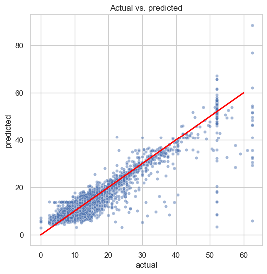
    


Visualize the distribution of the `residuals` using a histogram


```python
# Visualize the distribution of the `residuals`
sns.histplot(results['residual'], bins=np.arange(-15,15.5,0.5))
plt.title('Distribution of the residuals')
plt.xlabel('residual value')
plt.ylabel('count');
```


    
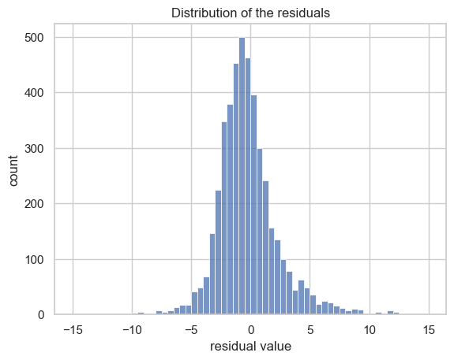
    


```python
results['residual'].mean()
```


    -0.015442621528680972


**Note:** The distribution of the residuals is approximately normal and has a mean of -0.015. The residuals represent the variance in the outcome variable that is not explained by the model. A normal distribution around zero is good, as it demonstrates that the model's errors are evenly distributed and unbiased.

Create a scatterplot of `residuals` over `predicted`.


```python
# Create a scatterplot of `residuals` over `predicted`

sns.scatterplot(x='predicted', y='residual', data=results)
plt.axhline(0, c='red')
plt.title('Scatterplot of residuals over predicted values')
plt.xlabel('predicted value')
plt.ylabel('residual value')
plt.show()
```


    
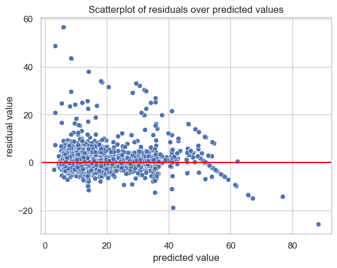
    


### Task 9c. Coefficients

Use the `coef_` attribute to get the model's coefficients. The coefficients are output in the order of the features that were used to train the model.


```python
# Get model coefficients
coefficients = pd.DataFrame(lr.coef_, columns=X.columns)
coefficients
```


<div>
<style scoped>
    .dataframe tbody tr th:only-of-type {
        vertical-align: middle;
    }

    .dataframe tbody tr th {
        vertical-align: top;
    }

    .dataframe thead th {
        text-align: right;
    }
</style>
<table border="1" class="dataframe">
  <thead>
    <tr style="text-align: right;">
      <th></th>
      <th>passenger_count</th>
      <th>mean_distance</th>
      <th>mean_duration</th>
      <th>rush_hour</th>
      <th>VendorID_2</th>
    </tr>
  </thead>
  <tbody>
    <tr>
      <th>0</th>
      <td>0.030825</td>
      <td>7.133867</td>
      <td>2.812115</td>
      <td>0.110233</td>
      <td>-0.054373</td>
    </tr>
  </tbody>
</table>
</div>


The coefficients reveal that `mean_distance` was the feature with the greatest weight in the model's final prediction. Be careful here! A common misinterpretation is that for every mile traveled, the fare amount increases by a mean of \\$7.13. This is incorrect. Remember, the data used to train the model was standardized with `StandardScaler()`. As such, the units are no longer miles. In other words, you cannot say "for every mile traveled...", as stated above. The correct interpretation of this coefficient is: controlling for other variables, *for every +1 change in standard deviation*, the fare amount increases by a mean of \\$7.13. 

Note also that because some highly correlated features were not removed, the confidence interval of this assessment is wider.

So, translate this back to miles instead of standard deviation (i.e., unscale the data). 

1. Calculate the standard deviation of `mean_distance` in the `X_train` data.

2. Divide the coefficient (7.133867) by the result to yield a more intuitive interpretation.


```python
# 1. Calculate SD of `mean_distance` in X_train data
print(X_train['mean_distance'].std())

# 2. Divide the model coefficient by the standard deviation
print(7.133867 / X_train['mean_distance'].std())
```

    3.574812975256415
    1.9955916713344426


Now you can make a more intuitive interpretation: for every 3.57 miles traveled, the fare increased by a mean of \\$7.13. Or, reduced: for every 1 mile traveled, the fare increased by a mean of \\$2.00.

### Task 9d. Conclusion

**Exemplar responses:**
**What are the key takeaways from this notebook?**

* Multiple linear regression is a powerful tool to estimate a dependent continous variable from several independent variables.
* Exploratory data analysis is useful for selecting both numeric and categorical features for multiple linear regression.
* Fitting multiple linear regression models may require trial and error to select variables that fit an accurate model while maintaining model assumptions (or not, depending on your use case).

**What results can be presented from this notebook?**

*  You can discuss meeting linear regression assumptions, and you can present the MAE and RMSE scores obtained from the model.


# BONUS CONTENT

More work must be done to prepare the predictions to be used as inputs into the model for the upcoming course. This work will be broken into the following steps:

1. Get the model's predictions on the full dataset.

2. Impute the constant fare rate of \$52 for all trips with rate codes of `2`.

3. Check the model's performance on the full dataset.

4. Save the final predictions and `mean_duration` and `mean_distance` columns for downstream use.


### 1. Predict on full dataset


```python
X_scaled = scaler.transform(X)
y_preds_full = lr.predict(X_scaled)
```

### 2. Impute ratecode 2 fare

The data dictionary says that the `RatecodeID` column captures the following information:

1 = standard rate  
2 = JFK (airport)  
3 = Newark (airport)  
4 = Nassau or Westchester  
5 = Negotiated fare  
6 = Group ride  

This means that some fares don't need to be predicted. They can simply be imputed based on their rate code. Specifically, all rate codes of `2` can be imputed with \$52, as this is a flat rate for JFK airport.

The other rate codes have some variation (not shown here, but feel free to check for yourself). They are not a fixed rate, so these fares will remain untouched.

Impute `52` at all predictions where `RatecodeID` is `2`.


```python
# Create a new df containing just the RatecodeID col from the whole dataset
final_preds = df[['RatecodeID']].copy()

# Add a column containing all the predictions
final_preds['y_preds_full'] = y_preds_full

# Impute a prediction of 52 at all rows where RatecodeID == 2
final_preds.loc[final_preds['RatecodeID']==2, 'y_preds_full'] = 52

# Check that it worked
final_preds[final_preds['RatecodeID']==2].head()
```


<div>
<style scoped>
    .dataframe tbody tr th:only-of-type {
        vertical-align: middle;
    }

    .dataframe tbody tr th {
        vertical-align: top;
    }

    .dataframe thead th {
        text-align: right;
    }
</style>
<table border="1" class="dataframe">
  <thead>
    <tr style="text-align: right;">
      <th></th>
      <th>RatecodeID</th>
      <th>y_preds_full</th>
    </tr>
  </thead>
  <tbody>
    <tr>
      <th>11</th>
      <td>2</td>
      <td>52.0</td>
    </tr>
    <tr>
      <th>110</th>
      <td>2</td>
      <td>52.0</td>
    </tr>
    <tr>
      <th>161</th>
      <td>2</td>
      <td>52.0</td>
    </tr>
    <tr>
      <th>247</th>
      <td>2</td>
      <td>52.0</td>
    </tr>
    <tr>
      <th>379</th>
      <td>2</td>
      <td>52.0</td>
    </tr>
  </tbody>
</table>
</div>


### Check performance on full dataset


```python
final_preds = final_preds['y_preds_full']
print('R^2:', r2_score(y, final_preds))
print('MAE:', mean_absolute_error(y, final_preds))
print('MSE:', mean_squared_error(y, final_preds))
print('RMSE:',np.sqrt(mean_squared_error(y, final_preds)))
```

    R^2: 0.8910853978683975
    MAE: 1.992506252269976
    MSE: 12.101575504689944
    RMSE: 3.478731881690502


### Save final predictions with `mean_duration` and `mean_distance` columns


```python
# Combine means columns with predictions column
nyc_preds_means = df[['mean_duration', 'mean_distance']].copy()
nyc_preds_means['predicted_fare'] = final_preds

nyc_preds_means.head()
```


<div>
<style scoped>
    .dataframe tbody tr th:only-of-type {
        vertical-align: middle;
    }

    .dataframe tbody tr th {
        vertical-align: top;
    }

    .dataframe thead th {
        text-align: right;
    }
</style>
<table border="1" class="dataframe">
  <thead>
    <tr style="text-align: right;">
      <th></th>
      <th>mean_duration</th>
      <th>mean_distance</th>
      <th>predicted_fare</th>
    </tr>
  </thead>
  <tbody>
    <tr>
      <th>0</th>
      <td>22.847222</td>
      <td>3.521667</td>
      <td>16.434245</td>
    </tr>
    <tr>
      <th>1</th>
      <td>24.470370</td>
      <td>3.108889</td>
      <td>16.052218</td>
    </tr>
    <tr>
      <th>2</th>
      <td>7.250000</td>
      <td>0.881429</td>
      <td>7.053706</td>
    </tr>
    <tr>
      <th>3</th>
      <td>30.250000</td>
      <td>3.700000</td>
      <td>18.731650</td>
    </tr>
    <tr>
      <th>4</th>
      <td>14.616667</td>
      <td>4.435000</td>
      <td>15.845642</td>
    </tr>
  </tbody>
</table>
</div>


Save as a csv file

-------------------------------------------------------------------------
