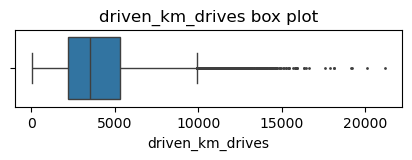
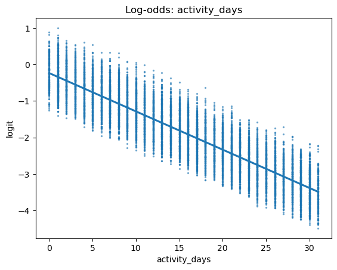

# WAZE
------------------------------------------------------------------------------------
### Background: 

Waze’s free navigation app makes it easier for drivers around the world to get to where they want to go. Waze’s community of map editors, beta testers, translators, partners, and users helps make each drive better and safer. Waze partners with cities, transportation authorities, broadcasters, businesses, and first responders to help as many people as possible travel more efficiently and safely. 

You’ll collaborate with your Waze teammates to analyze and interpret data, generate valuable insights, and help leadership make informed business decisions. Your team is about to start a new project to help prevent user churn on the Waze app. Churn quantifies the number of users who have uninstalled the Waze app or stopped using the app. This project focuses on monthly user churn. 

This project is part of a larger effort at Waze to increase growth. Typically, high retention rates indicate satisfied users who repeatedly use the Waze app over time. Developing a churn prediction model will help prevent churn, improve user retention, and grow Waze’s business. An accurate model can also help identify specific factors that contribute to churn and answer questions such as: 

- Who are the users most likely to churn?

- Why do users churn? 

- When do users churn? 

For example, if Waze can identify a segment of users who are at high risk of churning, Waze can proactively engage these users with special offers to try and retain them. Otherwise, Waze may lose these users without knowing why. 

Your insights will help Waze leadership optimize the company’s retention strategy, enhance user experience, and make data-driven decisions about product development.

### Team members at Waze
#### Data team roles

- Harriet Hadzic - Director of Data Analysis 

- May Santner - Data Analysis Manager 

- Chidi Ga - Senior Data Analyst 

- Sylvester Esperanza - Senior Project Manager 

Data team members have technical experience with data analysis and data science. However, you should always be sure to keep summaries and messages to these team members concise and to the point. 

#### Cross-functional team members

- Emrick Larson - Finance and Administration Department Head 

- Ursula Sayo - Operations Manager 

Your Waze team includes several managers overseeing operations. It is important to adapt your communication to their roles since their responsibilities are less technical.

### Project background

Waze’s data team is in the earliest stages of the churn project. The following tasks are needed before the team can begin the data analysis process:

- Build a dataframe for the churn dataset

- Examine data type of each column

- Gather descriptive statistics

### Your assignment

You will build a dataframe for the churn data. After the dataframe is complete, you will organize the data for the process of exploratory data analysis, and update the team on your progress and insights.

### Specific project deliverables

With this end-of-course project, you will gain valuable practice and apply your new skills as you complete the following:

- Summarize the column Dtypes

- Communicate important findings in the form of an executive summary  

Good luck with this project! Your Waze team members are looking forward to seeing how you communicate your creative work and approach problem-solving!

------------------------------------------------------------------------------------

## Scenario: 

Your team is still in the early stages of their project to develop a machine learning model to predict user churn. 

Previously, you were asked to complete a project proposal by your supervisor, May Santner. You have received notice that your project proposal has been approved and your team has been given access to Waze’s user data. The data must be inspected, organized, and prepared for analysis to get clear insights. 

You discover two new emails in your inbox: one from May Santner, and one from your teammate, Chidi Ga. In the email, May asks for your help reviewing the data and completing a code notebook, and Chidi shares the details of the notebook. Review the emails, then follow the instructions to complete the PACE strategy document, the code notebook, and the executive summary.  

------------------------------------------------------------------------------------
**Email from May Santner, Data Analysis Manager**

**Subject:** Help with coding notebook?

**From:** “May Santner,” May@waze

**Cc:** “Chidi Ga,” Chidi@waze

Good morning!

I have a couple of updates on the user churn project. First off, the project proposal you completed has been approved. Thanks for all your great work so far. Second, I just received an email from our Senior Project Manager, Sylvester Esperanza, that our team has been given access to the Waze user data.

Before we begin the process of exploratory data analysis (EDA), we could really use your help with coding and prepping the data. During your interview, you mentioned that you worked with Python in your Google certificate program. You can draw on your Python skills for this task.

Chidi Ga (cc’d above) started a Jupyter notebook with the relevant dataset (imported). Right now, Chidi is busy finishing up a previous project. I’m sure he could use your assistance in completing the coding and setting up the notebook for the user churn project. 

Chidi, do you mind sharing the details? 

Best, 

May Santner 

Data Analysis Manager

Waze

- –  - – - - - - - — - - - - - - - - - - - - - - - - – - - - - - - - - -  - -

**Email from Chidi Ga, Senior Data Analyst**

**Subject:** RE: Help with coding notebook?

**From:** “Chidi Ga,” Chidi@waze

**Cc:** “May Santner,” May@waze

Nice to meet you (virtually)! 

Hope you’ve enjoyed your first few weeks at Waze! 

The project proposal you helped prepare covered the major points of this project, so I’ll get right to how you can assist the team. Right now, a number of us are busy making adjustments to the machine-learning model for another project, so your help is greatly appreciated!

Until we finish our previous project, there is no need to do a full EDA on our new user data. We’ll get to that soon. Meanwhile, do you mind reviewing the imported data for the team? It would be fantastic if you could include a summary of the data types for each variable, where missing values exist in the data, key descriptive statistics, and anything else code-related you think is worth sharing in the notebook. I haven’t had a chance to explore the data, so I appreciate you getting an early start on this. 

Thanks,

Chidi Ga

Senior Data Analyst

Waze

------------------------------------------------------------------------------------


---------------------------------------------------------------------------------

### Preliminary Data Summary


```python
from IPython.display import Image, display

url = "https://github.com/nushratea/Project-Data/blob/main/Data%20Visualization%20Examples/Python/Waze%20Project/Preliminary%20Data%20Summary.png?raw=true"

display(Image(url=url))
```


---------------------------------------------------------------------------------

### Building the DataFrame


```python
# Import packages for data manipulation
import pandas as pd
import numpy as np

# Load dataset into dataframe
df = pd.read_csv('https://raw.githubusercontent.com/nushratea/Project-Data/refs/heads/main/Data%20Visualization%20Examples/Python/Waze%20Project/waze_dataset.csv')
```

---------------------------------------------------------------------------------

### Understanding the Data - Inspecting the Data

1. df.head(10)
2. df.info()


```python
df.head(10)
```


<div>
<style scoped>
    .dataframe tbody tr th:only-of-type {
        vertical-align: middle;
    }

    .dataframe tbody tr th {
        vertical-align: top;
    }

    .dataframe thead th {
        text-align: right;
    }
</style>
<table border="1" class="dataframe">
  <thead>
    <tr style="text-align: right;">
      <th></th>
      <th>ID</th>
      <th>label</th>
      <th>sessions</th>
      <th>drives</th>
      <th>total_sessions</th>
      <th>n_days_after_onboarding</th>
      <th>total_navigations_fav1</th>
      <th>total_navigations_fav2</th>
      <th>driven_km_drives</th>
      <th>duration_minutes_drives</th>
      <th>activity_days</th>
      <th>driving_days</th>
      <th>device</th>
    </tr>
  </thead>
  <tbody>
    <tr>
      <th>0</th>
      <td>0</td>
      <td>retained</td>
      <td>283</td>
      <td>226</td>
      <td>296.748273</td>
      <td>2276</td>
      <td>208</td>
      <td>0</td>
      <td>2628.845068</td>
      <td>1985.775061</td>
      <td>28</td>
      <td>19</td>
      <td>Android</td>
    </tr>
    <tr>
      <th>1</th>
      <td>1</td>
      <td>retained</td>
      <td>133</td>
      <td>107</td>
      <td>326.896596</td>
      <td>1225</td>
      <td>19</td>
      <td>64</td>
      <td>13715.920550</td>
      <td>3160.472914</td>
      <td>13</td>
      <td>11</td>
      <td>iPhone</td>
    </tr>
    <tr>
      <th>2</th>
      <td>2</td>
      <td>retained</td>
      <td>114</td>
      <td>95</td>
      <td>135.522926</td>
      <td>2651</td>
      <td>0</td>
      <td>0</td>
      <td>3059.148818</td>
      <td>1610.735904</td>
      <td>14</td>
      <td>8</td>
      <td>Android</td>
    </tr>
    <tr>
      <th>3</th>
      <td>3</td>
      <td>retained</td>
      <td>49</td>
      <td>40</td>
      <td>67.589221</td>
      <td>15</td>
      <td>322</td>
      <td>7</td>
      <td>913.591123</td>
      <td>587.196542</td>
      <td>7</td>
      <td>3</td>
      <td>iPhone</td>
    </tr>
    <tr>
      <th>4</th>
      <td>4</td>
      <td>retained</td>
      <td>84</td>
      <td>68</td>
      <td>168.247020</td>
      <td>1562</td>
      <td>166</td>
      <td>5</td>
      <td>3950.202008</td>
      <td>1219.555924</td>
      <td>27</td>
      <td>18</td>
      <td>Android</td>
    </tr>
    <tr>
      <th>5</th>
      <td>5</td>
      <td>retained</td>
      <td>113</td>
      <td>103</td>
      <td>279.544437</td>
      <td>2637</td>
      <td>0</td>
      <td>0</td>
      <td>901.238699</td>
      <td>439.101397</td>
      <td>15</td>
      <td>11</td>
      <td>iPhone</td>
    </tr>
    <tr>
      <th>6</th>
      <td>6</td>
      <td>retained</td>
      <td>3</td>
      <td>2</td>
      <td>236.725314</td>
      <td>360</td>
      <td>185</td>
      <td>18</td>
      <td>5249.172828</td>
      <td>726.577205</td>
      <td>28</td>
      <td>23</td>
      <td>iPhone</td>
    </tr>
    <tr>
      <th>7</th>
      <td>7</td>
      <td>retained</td>
      <td>39</td>
      <td>35</td>
      <td>176.072845</td>
      <td>2999</td>
      <td>0</td>
      <td>0</td>
      <td>7892.052468</td>
      <td>2466.981741</td>
      <td>22</td>
      <td>20</td>
      <td>iPhone</td>
    </tr>
    <tr>
      <th>8</th>
      <td>8</td>
      <td>retained</td>
      <td>57</td>
      <td>46</td>
      <td>183.532018</td>
      <td>424</td>
      <td>0</td>
      <td>26</td>
      <td>2651.709764</td>
      <td>1594.342984</td>
      <td>25</td>
      <td>20</td>
      <td>Android</td>
    </tr>
    <tr>
      <th>9</th>
      <td>9</td>
      <td>churned</td>
      <td>84</td>
      <td>68</td>
      <td>244.802115</td>
      <td>2997</td>
      <td>72</td>
      <td>0</td>
      <td>6043.460295</td>
      <td>2341.838528</td>
      <td>7</td>
      <td>3</td>
      <td>iPhone</td>
    </tr>
  </tbody>
</table>
</div>


```python
df.info()
```

    <class 'pandas.core.frame.DataFrame'>
    RangeIndex: 14999 entries, 0 to 14998
    Data columns (total 13 columns):
     #   Column                   Non-Null Count  Dtype  
    ---  ------                   --------------  -----  
     0   ID                       14999 non-null  int64  
     1   label                    14299 non-null  object 
     2   sessions                 14999 non-null  int64  
     3   drives                   14999 non-null  int64  
     4   total_sessions           14999 non-null  float64
     5   n_days_after_onboarding  14999 non-null  int64  
     6   total_navigations_fav1   14999 non-null  int64  
     7   total_navigations_fav2   14999 non-null  int64  
     8   driven_km_drives         14999 non-null  float64
     9   duration_minutes_drives  14999 non-null  float64
     10  activity_days            14999 non-null  int64  
     11  driving_days             14999 non-null  int64  
     12  device                   14999 non-null  object 
    dtypes: float64(3), int64(8), object(2)
    memory usage: 1.5+ MB


### Considering the following three questions: 

**Question 1:** When reviewing the df.head() output, are there any variables that have missing values?

**Ans:** None of the variables in the first 10 observations have missing values. Note that this does not imply the whole dataset does not have any missing values. 

**Question 2:** When reviewing the df.info() output, what are the data types? How many rows and columns do you have?

**Ans:** The variables **label** and **device** are of type object; **total_sessions**, **driven_km_drives**, and **duration_minutes_drives** are of type float64; the rest of the variables are of type int64. There are 14,999 rows and 13 columns.

**Question 3:** Does the dataset have any missing values?

**Ans:** The dataset has 700 missing values in the **label** column.

---------------------------------------------------------------------------------

### Null Values and Summary Statistics


```python
# Isolate rows with null values
null_df = df[df['label'].isnull()]
# Display summary stats of rows with null values
null_df.describe()
```


<div>
<style scoped>
    .dataframe tbody tr th:only-of-type {
        vertical-align: middle;
    }

    .dataframe tbody tr th {
        vertical-align: top;
    }

    .dataframe thead th {
        text-align: right;
    }
</style>
<table border="1" class="dataframe">
  <thead>
    <tr style="text-align: right;">
      <th></th>
      <th>ID</th>
      <th>sessions</th>
      <th>drives</th>
      <th>total_sessions</th>
      <th>n_days_after_onboarding</th>
      <th>total_navigations_fav1</th>
      <th>total_navigations_fav2</th>
      <th>driven_km_drives</th>
      <th>duration_minutes_drives</th>
      <th>activity_days</th>
      <th>driving_days</th>
    </tr>
  </thead>
  <tbody>
    <tr>
      <th>count</th>
      <td>700.000000</td>
      <td>700.000000</td>
      <td>700.000000</td>
      <td>700.000000</td>
      <td>700.000000</td>
      <td>700.000000</td>
      <td>700.000000</td>
      <td>700.000000</td>
      <td>700.000000</td>
      <td>700.000000</td>
      <td>700.000000</td>
    </tr>
    <tr>
      <th>mean</th>
      <td>7405.584286</td>
      <td>80.837143</td>
      <td>67.798571</td>
      <td>198.483348</td>
      <td>1709.295714</td>
      <td>118.717143</td>
      <td>30.371429</td>
      <td>3935.967029</td>
      <td>1795.123358</td>
      <td>15.382857</td>
      <td>12.125714</td>
    </tr>
    <tr>
      <th>std</th>
      <td>4306.900234</td>
      <td>79.987440</td>
      <td>65.271926</td>
      <td>140.561715</td>
      <td>1005.306562</td>
      <td>156.308140</td>
      <td>46.306984</td>
      <td>2443.107121</td>
      <td>1419.242246</td>
      <td>8.772714</td>
      <td>7.626373</td>
    </tr>
    <tr>
      <th>min</th>
      <td>77.000000</td>
      <td>0.000000</td>
      <td>0.000000</td>
      <td>5.582648</td>
      <td>16.000000</td>
      <td>0.000000</td>
      <td>0.000000</td>
      <td>290.119811</td>
      <td>66.588493</td>
      <td>0.000000</td>
      <td>0.000000</td>
    </tr>
    <tr>
      <th>25%</th>
      <td>3744.500000</td>
      <td>23.000000</td>
      <td>20.000000</td>
      <td>94.056340</td>
      <td>869.000000</td>
      <td>4.000000</td>
      <td>0.000000</td>
      <td>2119.344818</td>
      <td>779.009271</td>
      <td>8.000000</td>
      <td>6.000000</td>
    </tr>
    <tr>
      <th>50%</th>
      <td>7443.000000</td>
      <td>56.000000</td>
      <td>47.500000</td>
      <td>177.255925</td>
      <td>1650.500000</td>
      <td>62.500000</td>
      <td>10.000000</td>
      <td>3421.156721</td>
      <td>1414.966279</td>
      <td>15.000000</td>
      <td>12.000000</td>
    </tr>
    <tr>
      <th>75%</th>
      <td>11007.000000</td>
      <td>112.250000</td>
      <td>94.000000</td>
      <td>266.058022</td>
      <td>2508.750000</td>
      <td>169.250000</td>
      <td>43.000000</td>
      <td>5166.097373</td>
      <td>2443.955404</td>
      <td>23.000000</td>
      <td>18.000000</td>
    </tr>
    <tr>
      <th>max</th>
      <td>14993.000000</td>
      <td>556.000000</td>
      <td>445.000000</td>
      <td>1076.879741</td>
      <td>3498.000000</td>
      <td>1096.000000</td>
      <td>352.000000</td>
      <td>15135.391280</td>
      <td>9746.253023</td>
      <td>31.000000</td>
      <td>30.000000</td>
    </tr>
  </tbody>
</table>
</div>


```python
# Isolate rows without null values
not_null_df = df[~df['label'].isnull()]
# Display summary stats of rows without null values
not_null_df.describe()
```


<div>
<style scoped>
    .dataframe tbody tr th:only-of-type {
        vertical-align: middle;
    }

    .dataframe tbody tr th {
        vertical-align: top;
    }

    .dataframe thead th {
        text-align: right;
    }
</style>
<table border="1" class="dataframe">
  <thead>
    <tr style="text-align: right;">
      <th></th>
      <th>ID</th>
      <th>sessions</th>
      <th>drives</th>
      <th>total_sessions</th>
      <th>n_days_after_onboarding</th>
      <th>total_navigations_fav1</th>
      <th>total_navigations_fav2</th>
      <th>driven_km_drives</th>
      <th>duration_minutes_drives</th>
      <th>activity_days</th>
      <th>driving_days</th>
    </tr>
  </thead>
  <tbody>
    <tr>
      <th>count</th>
      <td>14299.000000</td>
      <td>14299.000000</td>
      <td>14299.000000</td>
      <td>14299.000000</td>
      <td>14299.000000</td>
      <td>14299.000000</td>
      <td>14299.000000</td>
      <td>14299.000000</td>
      <td>14299.000000</td>
      <td>14299.000000</td>
      <td>14299.000000</td>
    </tr>
    <tr>
      <th>mean</th>
      <td>7503.573117</td>
      <td>80.623820</td>
      <td>67.255822</td>
      <td>189.547409</td>
      <td>1751.822505</td>
      <td>121.747395</td>
      <td>29.638296</td>
      <td>4044.401535</td>
      <td>1864.199794</td>
      <td>15.544653</td>
      <td>12.182530</td>
    </tr>
    <tr>
      <th>std</th>
      <td>4331.207621</td>
      <td>80.736502</td>
      <td>65.947295</td>
      <td>136.189764</td>
      <td>1008.663834</td>
      <td>147.713428</td>
      <td>45.350890</td>
      <td>2504.977970</td>
      <td>1448.005047</td>
      <td>9.016088</td>
      <td>7.833835</td>
    </tr>
    <tr>
      <th>min</th>
      <td>0.000000</td>
      <td>0.000000</td>
      <td>0.000000</td>
      <td>0.220211</td>
      <td>4.000000</td>
      <td>0.000000</td>
      <td>0.000000</td>
      <td>60.441250</td>
      <td>18.282082</td>
      <td>0.000000</td>
      <td>0.000000</td>
    </tr>
    <tr>
      <th>25%</th>
      <td>3749.500000</td>
      <td>23.000000</td>
      <td>20.000000</td>
      <td>90.457733</td>
      <td>878.500000</td>
      <td>10.000000</td>
      <td>0.000000</td>
      <td>2217.319909</td>
      <td>840.181344</td>
      <td>8.000000</td>
      <td>5.000000</td>
    </tr>
    <tr>
      <th>50%</th>
      <td>7504.000000</td>
      <td>56.000000</td>
      <td>48.000000</td>
      <td>158.718571</td>
      <td>1749.000000</td>
      <td>71.000000</td>
      <td>9.000000</td>
      <td>3496.545617</td>
      <td>1479.394387</td>
      <td>16.000000</td>
      <td>12.000000</td>
    </tr>
    <tr>
      <th>75%</th>
      <td>11257.500000</td>
      <td>111.000000</td>
      <td>93.000000</td>
      <td>253.540450</td>
      <td>2627.500000</td>
      <td>178.000000</td>
      <td>43.000000</td>
      <td>5299.972162</td>
      <td>2466.928876</td>
      <td>23.000000</td>
      <td>19.000000</td>
    </tr>
    <tr>
      <th>max</th>
      <td>14998.000000</td>
      <td>743.000000</td>
      <td>596.000000</td>
      <td>1216.154633</td>
      <td>3500.000000</td>
      <td>1236.000000</td>
      <td>415.000000</td>
      <td>21183.401890</td>
      <td>15851.727160</td>
      <td>31.000000</td>
      <td>30.000000</td>
    </tr>
  </tbody>
</table>
</div>


### Considering the following question: 

**Question 1:** Is there a discernible difference between the two populations?

**Ans:** Comparing summary statistics of the observations with missing retention labels with those that aren't missing any values reveals nothing remarkable. The means and standard deviations are fairly consistent between the two groups.

---------------------------------------------------------------------------------

### Null Values - Device Counts


```python
# Get count of null values by device
null_df['device'].value_counts()
```


    device
    iPhone     447
    Android    253
    Name: count, dtype: int64


```python
# Calculate % of iPhone nulls and Android nulls
null_df['device'].value_counts(normalize=True)
```


    device
    iPhone     0.638571
    Android    0.361429
    Name: proportion, dtype: float64


```python
# Calculate % of iPhone users and Android users in full dataset
df['device'].value_counts(normalize=True)
```


    device
    iPhone     0.644843
    Android    0.355157
    Name: proportion, dtype: float64


```python
# Calculate counts of churned vs. retained
print(df['label'].value_counts())
print()
print(df['label'].value_counts(normalize=True))
```

    label
    retained    11763
    churned      2536
    Name: count, dtype: int64
    
    label
    retained    0.822645
    churned     0.177355
    Name: proportion, dtype: float64


```python
# Calculate median values of all columns for churned and retained users
df.groupby('label').median(numeric_only=True)
```


<div>
<style scoped>
    .dataframe tbody tr th:only-of-type {
        vertical-align: middle;
    }

    .dataframe tbody tr th {
        vertical-align: top;
    }

    .dataframe thead th {
        text-align: right;
    }
</style>
<table border="1" class="dataframe">
  <thead>
    <tr style="text-align: right;">
      <th></th>
      <th>ID</th>
      <th>sessions</th>
      <th>drives</th>
      <th>total_sessions</th>
      <th>n_days_after_onboarding</th>
      <th>total_navigations_fav1</th>
      <th>total_navigations_fav2</th>
      <th>driven_km_drives</th>
      <th>duration_minutes_drives</th>
      <th>activity_days</th>
      <th>driving_days</th>
    </tr>
    <tr>
      <th>label</th>
      <th></th>
      <th></th>
      <th></th>
      <th></th>
      <th></th>
      <th></th>
      <th></th>
      <th></th>
      <th></th>
      <th></th>
      <th></th>
    </tr>
  </thead>
  <tbody>
    <tr>
      <th>churned</th>
      <td>7477.5</td>
      <td>59.0</td>
      <td>50.0</td>
      <td>164.339042</td>
      <td>1321.0</td>
      <td>84.5</td>
      <td>11.0</td>
      <td>3652.655666</td>
      <td>1607.183785</td>
      <td>8.0</td>
      <td>6.0</td>
    </tr>
    <tr>
      <th>retained</th>
      <td>7509.0</td>
      <td>56.0</td>
      <td>47.0</td>
      <td>157.586756</td>
      <td>1843.0</td>
      <td>68.0</td>
      <td>9.0</td>
      <td>3464.684614</td>
      <td>1458.046141</td>
      <td>17.0</td>
      <td>14.0</td>
    </tr>
  </tbody>
</table>
</div>


```python
# Add a column to df called `km_per_drive`
df['km_per_drive'] = df['driven_km_drives'] / df['drives']

# Group by `label`, calculate the median, and isolate for km per drive
median_km_per_drive = df.groupby('label').median(numeric_only=True)[['km_per_drive']]
median_km_per_drive
```


<div>
<style scoped>
    .dataframe tbody tr th:only-of-type {
        vertical-align: middle;
    }

    .dataframe tbody tr th {
        vertical-align: top;
    }

    .dataframe thead th {
        text-align: right;
    }
</style>
<table border="1" class="dataframe">
  <thead>
    <tr style="text-align: right;">
      <th></th>
      <th>km_per_drive</th>
    </tr>
    <tr>
      <th>label</th>
      <th></th>
    </tr>
  </thead>
  <tbody>
    <tr>
      <th>churned</th>
      <td>74.109416</td>
    </tr>
    <tr>
      <th>retained</th>
      <td>75.014702</td>
    </tr>
  </tbody>
</table>
</div>


```python
# Add a column to df called `km_per_driving_day`
df['km_per_driving_day'] = df['driven_km_drives'] / df['driving_days']

# Group by `label`, calculate the median, and isolate for km per driving day
median_km_per_driving_day = df.groupby('label').median(numeric_only=True)[['km_per_driving_day']]
median_km_per_driving_day
```


<div>
<style scoped>
    .dataframe tbody tr th:only-of-type {
        vertical-align: middle;
    }

    .dataframe tbody tr th {
        vertical-align: top;
    }

    .dataframe thead th {
        text-align: right;
    }
</style>
<table border="1" class="dataframe">
  <thead>
    <tr style="text-align: right;">
      <th></th>
      <th>km_per_driving_day</th>
    </tr>
    <tr>
      <th>label</th>
      <th></th>
    </tr>
  </thead>
  <tbody>
    <tr>
      <th>churned</th>
      <td>697.541999</td>
    </tr>
    <tr>
      <th>retained</th>
      <td>289.549333</td>
    </tr>
  </tbody>
</table>
</div>


```python
# Add a column to df called `drives_per_driving_day`
df['drives_per_driving_day'] = df['drives'] / df['driving_days']

# Group by `label`, calculate the median, and isolate for drives per driving day
median_drives_per_driving_day = df.groupby('label').median(numeric_only=True)[['drives_per_driving_day']]
median_drives_per_driving_day
```


<div>
<style scoped>
    .dataframe tbody tr th:only-of-type {
        vertical-align: middle;
    }

    .dataframe tbody tr th {
        vertical-align: top;
    }

    .dataframe thead th {
        text-align: right;
    }
</style>
<table border="1" class="dataframe">
  <thead>
    <tr style="text-align: right;">
      <th></th>
      <th>drives_per_driving_day</th>
    </tr>
    <tr>
      <th>label</th>
      <th></th>
    </tr>
  </thead>
  <tbody>
    <tr>
      <th>churned</th>
      <td>10.0000</td>
    </tr>
    <tr>
      <th>retained</th>
      <td>4.0625</td>
    </tr>
  </tbody>
</table>
</div>


```python
# For each label, calculate the number of Android users and iPhone users
df.groupby(['label', 'device']).size()
```


    label     device 
    churned   Android     891
              iPhone     1645
    retained  Android    4183
              iPhone     7580
    dtype: int64


```python
# For each label, calculate the percentage of Android users and iPhone users
df.groupby('label')['device'].value_counts(normalize=True)
```


    label     device 
    churned   iPhone     0.648659
              Android    0.351341
    retained  iPhone     0.644393
              Android    0.355607
    Name: proportion, dtype: float64


### Considering the following question: 

**Question 1:** How many iPhone users had null values and how many Android users had null values?

**Ans:** Of the 700 rows with null values, 447 were iPhone users and 253 were Android users.

---------------------------------------------------------------------------------

## Conclusion

Recall that your supervisor, May Santer, asked you to share your findings with the data team in an executive summary. Consider the following questions as you prepare to write your summary. Think about key points you may want to share with the team, and what information is most relevant to the user churn project.

### Considering the following questions:


**Question 1:** Did the data contain any missing values? How many, and which variables were affected? Was there a pattern to the missing data?

**An:** The dataset has 700 missing values in the label column. There was no obvious pattern to the missing values.

**Question 2:** What is the benefit of using the median value of a sample instead of the mean?

**An:** Mean is subject to the influence of outliers, while the median represents the middle value of the distribution regardless of any outlying values.

**Question 3:** Did your investigation give rise to further questions that you would like to explore or ask the Waze team about?

**An:** Yes. For example, the median user who churned drove 698 kilometers each day they drove last month, which is about 240% of the per-drive-day distance of retained users. It would be helpful to know how this data was collected and if it represents a non-random sample of users.

**Question 4:** What percentage of the users in the dataset were Android users and what percentage were iPhone users?

**An:** Android users comprised approximately 36% of the sample, while iPhone users made up about 64%

**Question 5:** What were some distinguishing characteristics of users who churned vs. users who were retained?

**An:** Generally, users who churned drove farther and longer in fewer days than retained users. They also used the app about half as many times as retained users over the same period.

**Question 6:** Was there an appreciable difference in churn rate between iPhone users vs. Android users?

**An:** No. The churn rate for both iPhone and Android users was within one percentage point of each other. There is nothing suggestive of churn being correlated with the device.

---------------------------------------------------------------------------------


# Visualizations 

* Box plots will be helpful to determine outliers and where the bulk of the data points reside in terms of `drives`, `sessions` and all other continuous numeric variables
* Histograms are essential to understand the distribution of variables
* Scatter plots will be helpful to visualize relationships between variables
* Bar charts are useful for communicating levels and quantities, especially for categorical information


#### **`sessions`**

_The number of occurrences of a user opening the app during the month_


```python
# Box plot
plt.figure(figsize=(5,1))
sns.boxplot(x=df['sessions'], fliersize=1)
plt.title('sessions box plot');
```


    

    


```python
# Histogram
plt.figure(figsize=(5,3))
sns.histplot(x=df['sessions'])
median = df['sessions'].median()
plt.axvline(median, color='red', linestyle='--')
plt.text(75,1200, 'median=56.0', color='red')
plt.title('sessions box plot');
```


    

    


The `sessions` variable is a right-skewed distribution with half of the observations having 56 or fewer sessions. However, as indicated by the boxplot, some users have more than 700.

The `sessions` variable is a right-skewed distribution with half of the observations having 56 or fewer sessions. However, as indicated by the boxplot, some users have more than 700.

#### **`drives`**

_An occurrence of driving at least 1 km during the month_


```python
# Box plot
plt.figure(figsize=(5,1))
sns.boxplot(x=df['drives'], fliersize=1)
plt.title('drives box plot');
```


    

    


As you perform EDA, you'll find that many tasks get repeated, such as plotting histograms of features. Remember that whenever you find yourself copy/pasting code, it's worth considering whether a function would help make your work more efficient. Sometimes it's not worth it. Other times, defining a function will help a lot.

The following code block defines a function that helps plot histograms with a particular style/format using this particular dataset. You don't have to do this, but in this case it's helpful.


```python
# Helper function to plot histograms based on the
# format of the `sessions` histogram
def histogrammer(column_str, median_text=True, **kwargs):    # **kwargs = any keyword arguments
                                                             # from the sns.histplot() function
    median=round(df[column_str].median(), 1)
    plt.figure(figsize=(5,3))
    ax = sns.histplot(x=df[column_str], **kwargs)            # Plot the histogram
    plt.axvline(median, color='red', linestyle='--')         # Plot the median line
    if median_text==True:                                    # Add median text unless set to False
        ax.text(0.25, 0.85, f'median={median}', color='red',
            ha='left', va='top', transform=ax.transAxes)
    else:
        print('Median:', median)
    plt.title(f'{column_str} histogram');
```


```python
# Histogram
histogrammer('drives')
```


    

    


The `drives` information follows a distribution similar to the `sessions` variable. It is right-skewed, approximately log-normal, with a median of 48. However, some drivers had over 400 drives in the last month.

#### **`total_sessions`**

_A model estimate of the total number of sessions since a user has onboarded_


```python
# Box plot
plt.figure(figsize=(5,1))
sns.boxplot(x=df['total_sessions'], fliersize=1)
plt.title('total_sessions box plot');
```


    

    


```python
# Histogram
histogrammer('total_sessions')
```


    

    


The `total_sessions` is a right-skewed distribution. The median total number of sessions is 159.6. This is interesting information because, if the median number of sessions in the last month was 56 and the median total sessions was ~160, then it seems that a large proportion of a user's (estimated) total drives might have taken place in the last month. This is something you can examine more closely later.

#### **`n_days_after_onboarding`**

_The number of days since a user signed up for the app_


```python
# Box plot
plt.figure(figsize=(5,1))
sns.boxplot(x=df['n_days_after_onboarding'], fliersize=1)
plt.title('n_days_after_onboarding box plot');
```


    

    


```python
# Histogram
histogrammer('n_days_after_onboarding', median_text=False)
```

    Median: 1741.0


    

    


The total user tenure (i.e., number of days since
onboarding) is a uniform distribution with values ranging from near-zero to \~3,500 (\~9.5 years).

#### **`driven_km_drives`**

_Total kilometers driven during the month_


```python
# Box plot
plt.figure(figsize=(5,1))
sns.boxplot(x=df['driven_km_drives'], fliersize=1)
plt.title('driven_km_drives box plot');

# Histogram
histogrammer('driven_km_drives')
```


    

    


    

    


The number of drives driven in the last month per user is a right-skewed distribution with half the users driving under 3,495 kilometers. As you discovered in the analysis from the previous course, the users in this dataset drive _a lot_. The longest distance driven in the month was over half the circumferene of the earth.

#### **`duration_minutes_drives`**

_Total duration driven in minutes during the month_


```python
# Box plot
plt.figure(figsize=(5,1))
sns.boxplot(x=df['duration_minutes_drives'], fliersize=1)
plt.title('duration_minutes_drives box plot');

# Histogram
histogrammer('duration_minutes_drives')

```


    

    


    

    


The `duration_minutes_drives` variable has a heavily skewed right tail. Half of the users drove less than \~1,478 minutes (\~25 hours), but some users clocked over 250 hours over the month.

#### **`activity_days`**

_Number of days the user opens the app during the month_


```python
# Box plot
plt.figure(figsize=(5,1))
sns.boxplot(x=df['activity_days'], fliersize=1)
plt.title('activity_days box plot');

# Histogram
histogrammer('activity_days', median_text=False, discrete=True)
```

    Median: 16.0


    

    


    

    


Within the last month, users opened the app a median of 16 times. The box plot reveals a centered distribution. The histogram shows a nearly uniform distribution of ~500 people opening the app on each count of days. However, there are ~250 people who didn't open the app at all and ~250 people who opened the app every day of the month.

This distribution is noteworthy because it does not mirror the `sessions` distribution, which you might think would be closely correlated with `activity_days`.

#### **`driving_days`**

_Number of days the user drives (at least 1 km) during the month_


```python
# Box plot
plt.figure(figsize=(5,1))
sns.boxplot(x=df['driving_days'], fliersize=1)
plt.title('driving_days box plot');

# Histogram
histogrammer('driving_days', median_text=False, discrete=True)
```

    Median: 12.0


    

    


    

    


The number of days users drove each month is almost uniform, and it largely correlates with the number of days they opened the app that month, except the `driving_days` distribution tails off on the right.

However, there were almost twice as many users (\~1,000 vs. \~550) who did not drive at all during the month. This might seem counterintuitive when considered together with the information from `activity_days`. That variable had \~500 users opening the app on each of most of the day counts, but there were only \~250 users who did not open the app at all during the month and ~250 users who opened the app every day. Flag this for further investigation later.

#### **`device`**

_The type of device a user starts a session with_

This is a categorical variable, so you do not plot a box plot for it. A good plot for a binary categorical variable is a pie chart.


```python
# Pie chart
fig = plt.figure(figsize=(3,3))
data=df['device'].value_counts()
plt.pie(data,
        labels=[f'{data.index[0]}: {data.values[0]}',
                f'{data.index[1]}: {data.values[1]}'],
        autopct='%1.1f%%'
        )
plt.title('Users by device');
```


    

    


There are nearly twice as many iPhone users as Android users represented in this data.

#### **`label`**

_Binary target variable (“retained” vs “churned”) for if a user has churned anytime during the course of the month_

This is also a categorical variable, and as such would not be plotted as a box plot. Plot a pie chart instead.


```python
# Pie chart
fig = plt.figure(figsize=(3,3))
data=df['label'].value_counts()
plt.pie(data,
        labels=[f'{data.index[0]}: {data.values[0]}',
                f'{data.index[1]}: {data.values[1]}'],
        autopct='%1.1f%%'
        )
plt.title('Count of retained vs. churned');
```


    

    


Less than 18% of the users churned.

#### **`driving_days` vs. `activity_days`**

Because both `driving_days` and `activity_days` represent counts of days over a month and they're also closely related, you can plot them together on a single histogram. This will help to better understand how they relate to each other without having to scroll back and forth comparing histograms in two different places.

Plot a histogram that, for each day, has a bar representing the counts of `driving_days` and `user_days`.


```python
# Histogram
plt.figure(figsize=(12,4))
label=['driving days', 'activity days']
plt.hist([df['driving_days'], df['activity_days']],
         bins=range(0,33),
         label=label)
plt.xlabel('days')
plt.ylabel('count')
plt.legend()
plt.title('driving_days vs. activity_days');
```


    

    


As observed previously, this might seem counterintuitive. After all, why are there _fewer_ people who didn't use the app at all during the month and _more_ people who didn't drive at all during the month?

On the other hand, it could just be illustrative of the fact that, while these variables are related to each other, they're not the same. People probably just open the app more than they use the app to drive&mdash;perhaps to check drive times or route information, to update settings, or even just by mistake.

Nonetheless, it might be worthwile to contact the data team at Waze to get more information about this, especially because it seems that the number of days in the month is not the same between variables.

Confirm the maximum number of days for each variable&mdash;`driving_days` and `activity_days`.


```python
print(df['driving_days'].max())
print(df['activity_days'].max())
```

    30
    31


#### **Retention by device**

Plot a histogram that has four bars&mdash;one for each device-label combination&mdash;to show how many iPhone users were retained/churned and how many Android users were retained/churned.


```python
# Histogram
plt.figure(figsize=(5,4))
sns.histplot(data=df,
             x='device',
             hue='label',
             multiple='dodge',
             shrink=0.9
             )
plt.title('Retention by device histogram');
```


    

    


The proportion of churned users to retained users is consistent between device types.

#### **Retention by kilometers driven per driving day**

In the previous course, you discovered that the median distance driven per driving day last month for users who churned was 697.54 km, versus 289.55 km for people who did not churn. Examine this further.

1. Create a new column in `df` called `km_per_driving_day`, which represents the mean distance driven per driving day for each user.

2. Call the `describe()` method on the new column.


```python
# 1. Create `km_per_driving_day` column
df['km_per_driving_day'] = df['driven_km_drives'] / df['driving_days']

# 2. Call `describe()` on the new column
df['km_per_driving_day'].describe()
```


    count    1.499900e+04
    mean              inf
    std               NaN
    min      3.022063e+00
    25%      1.672804e+02
    50%      3.231459e+02
    75%      7.579257e+02
    max               inf
    Name: km_per_driving_day, dtype: float64


What do you notice? The mean value is infinity, the standard deviation is NaN, and the max value is infinity. Why do you think this is?

This is the result of there being values of zero in the `driving_days` column. Pandas imputes a value of infinity in the corresponding rows of the new column because division by zero is undefined.

1. Convert these values from infinity to zero. You can use `np.inf` to refer to a value of infinity.

2. Call `describe()` on the `km_per_driving_day` column to verify that it worked.


```python
# 1. Convert infinite values to zero
df.loc[df['km_per_driving_day']==np.inf, 'km_per_driving_day'] = 0

# 2. Confirm that it worked
df['km_per_driving_day'].describe()
```


    count    14999.000000
    mean       578.963113
    std       1030.094384
    min          0.000000
    25%        136.238895
    50%        272.889272
    75%        558.686918
    max      15420.234110
    Name: km_per_driving_day, dtype: float64


The maximum value is 15,420 kilometers _per drive day_. This is physically impossible. Driving 100 km/hour for 12 hours is 1,200 km. It's unlikely many people averaged more than this each day they drove, so, for now, disregard rows where the distance in this column is greater than 1,200 km.

Plot a histogram of the new `km_per_driving_day` column, disregarding those users with values greater than 1,200 km. Each bar should be the same length and have two colors, one color representing the percent of the users in that bar that churned and the other representing the percent that were retained. This can be done by setting the `multiple` parameter of seaborn's [`histplot()`](https://seaborn.pydata.org/generated/seaborn.histplot.html) function to `fill`.


```python
# Histogram
plt.figure(figsize=(12,5))
sns.histplot(data=df,
             x='km_per_driving_day',
             bins=range(0,1201,20),
             hue='label',
             multiple='fill')
plt.ylabel('%', rotation=0)
plt.title('Churn rate by mean km per driving day');
```


    

    


The churn rate tends to increase as the mean daily distance driven increases, confirming what was found in the previous course. It would be worth investigating further the reasons for long-distance users to discontinue using the app.

#### **Churn rate per number of driving days**

Create another histogram just like the previous one, only this time it should represent the churn rate for each number of driving days.


```python
# Histogram
plt.figure(figsize=(12,5))
sns.histplot(data=df,
             x='driving_days',
             bins=range(1,32),
             hue='label',
             multiple='fill',
             discrete=True)
plt.ylabel('%', rotation=0)
plt.title('Churn rate per driving day');
```


    

    


The churn rate is highest for people who didn't use Waze much during the last month. The more times they used the app, the less likely they were to churn. While 40% of the users who didn't use the app at all last month churned, nobody who used the app 30 days churned.

This isn't surprising. If people who used the app a lot churned, it would likely indicate dissatisfaction. When people who don't use the app churn, it might be the result of dissatisfaction in the past, or it might be indicative of a lesser need for a navigational app. Maybe they moved to a city with good public transportation and don't need to drive anymore.

#### **Proportion of sessions that occurred in the last month**

Create a new column `percent_sessions_in_last_month` that represents the percentage of each user's total sessions that were logged in their last month of use.


```python
df['percent_sessions_in_last_month'] = df['sessions'] / df['total_sessions']
```

What is the median value of the new column?


```python
df['percent_sessions_in_last_month'].median()
```


    0.42309702992763176


Now, create a histogram depicting the distribution of values in this new column.


```python
# Histogram
histogrammer('percent_sessions_in_last_month',
             hue=df['label'],
             multiple='layer',
             median_text=False)
```

    Median: 0.4


    

    


Check the median value of the `n_days_after_onboarding` variable.


```python
df['n_days_after_onboarding'].median()
```


    1741.0


Half of the people in the dataset had 40% or more of their sessions in just the last month, yet the overall median time since onboarding is almost five years.

Make a histogram of `n_days_after_onboarding` for just the people who had 40% or more of their total sessions in the last month.


```python
# Histogram
data = df.loc[df['percent_sessions_in_last_month']>=0.4]
plt.figure(figsize=(5,3))
sns.histplot(x=data['n_days_after_onboarding'])
plt.title('Num. days after onboarding for users with >=40% sessions in last month');
```


    

    


The number of days since onboarding for users with 40% or more of their total sessions occurring in just the last month is a uniform distribution. This is very strange. It's worth asking Waze why so many long-time users suddenly used the app so much in the last month.

## Handling Outliners

The box plots from the previous section indicated that many of these variables have outliers. These outliers do not seem to be data entry errors; they are present because of the right-skewed distributions.

Depending on what you'll be doing with this data, it may be useful to impute outlying data with more reasonable values. One way of performing this imputation is to set a threshold based on a percentile of the distribution.

To practice this technique, write a function that calculates the 95th percentile of a given column, then imputes values > the 95th percentile with the value at the 95th percentile.  such as the 95th percentile of the distribution.


```python
def outlier_imputer(column_name, percentile):
    # Calculate threshold
    threshold = df[column_name].quantile(percentile)
    # Impute threshold for values > than threshold
    df.loc[df[column_name] > threshold, column_name] = threshold

    print('{:>25} | percentile: {} | threshold: {}'.format(column_name, percentile, threshold))
```

Next, apply that function to the following columns:
* `sessions`
* `drives`
* `total_sessions`
* `driven_km_drives`
* `duration_minutes_drives`


```python
for column in ['sessions', 'drives', 'total_sessions',
               'driven_km_drives', 'duration_minutes_drives']:
               outlier_imputer(column, 0.95)
```

                     sessions | percentile: 0.95 | threshold: 243.0
                       drives | percentile: 0.95 | threshold: 201.0
               total_sessions | percentile: 0.95 | threshold: 454.3632037399997
             driven_km_drives | percentile: 0.95 | threshold: 8889.7942356
      duration_minutes_drives | percentile: 0.95 | threshold: 4668.899348999998


Call `describe()` to see if your change worked.


```python
df.describe()
```


<div>
<style scoped>
    .dataframe tbody tr th:only-of-type {
        vertical-align: middle;
    }

    .dataframe tbody tr th {
        vertical-align: top;
    }

    .dataframe thead th {
        text-align: right;
    }
</style>
<table border="1" class="dataframe">
  <thead>
    <tr style="text-align: right;">
      <th></th>
      <th>ID</th>
      <th>sessions</th>
      <th>drives</th>
      <th>total_sessions</th>
      <th>n_days_after_onboarding</th>
      <th>total_navigations_fav1</th>
      <th>total_navigations_fav2</th>
      <th>driven_km_drives</th>
      <th>duration_minutes_drives</th>
      <th>activity_days</th>
      <th>driving_days</th>
      <th>km_per_drive</th>
      <th>km_per_driving_day</th>
      <th>drives_per_driving_day</th>
      <th>percent_sessions_in_last_month</th>
    </tr>
  </thead>
  <tbody>
    <tr>
      <th>count</th>
      <td>14999.000000</td>
      <td>14999.000000</td>
      <td>14999.000000</td>
      <td>14999.000000</td>
      <td>14999.000000</td>
      <td>14999.000000</td>
      <td>14999.000000</td>
      <td>14999.000000</td>
      <td>14999.000000</td>
      <td>14999.000000</td>
      <td>14999.000000</td>
      <td>1.499900e+04</td>
      <td>14999.000000</td>
      <td>1.499200e+04</td>
      <td>14999.000000</td>
    </tr>
    <tr>
      <th>mean</th>
      <td>7499.000000</td>
      <td>76.568705</td>
      <td>64.058204</td>
      <td>184.031320</td>
      <td>1749.837789</td>
      <td>121.605974</td>
      <td>29.672512</td>
      <td>3939.632764</td>
      <td>1789.647426</td>
      <td>15.537102</td>
      <td>12.179879</td>
      <td>inf</td>
      <td>578.963113</td>
      <td>inf</td>
      <td>0.449255</td>
    </tr>
    <tr>
      <th>std</th>
      <td>4329.982679</td>
      <td>67.297958</td>
      <td>55.306924</td>
      <td>118.600463</td>
      <td>1008.513876</td>
      <td>148.121544</td>
      <td>45.394651</td>
      <td>2216.041510</td>
      <td>1222.705167</td>
      <td>9.004655</td>
      <td>7.824036</td>
      <td>NaN</td>
      <td>1030.094384</td>
      <td>NaN</td>
      <td>0.286919</td>
    </tr>
    <tr>
      <th>min</th>
      <td>0.000000</td>
      <td>0.000000</td>
      <td>0.000000</td>
      <td>0.220211</td>
      <td>4.000000</td>
      <td>0.000000</td>
      <td>0.000000</td>
      <td>60.441250</td>
      <td>18.282082</td>
      <td>0.000000</td>
      <td>0.000000</td>
      <td>1.008775e+00</td>
      <td>0.000000</td>
      <td>0.000000e+00</td>
      <td>0.000000</td>
    </tr>
    <tr>
      <th>25%</th>
      <td>3749.500000</td>
      <td>23.000000</td>
      <td>20.000000</td>
      <td>90.661156</td>
      <td>878.000000</td>
      <td>9.000000</td>
      <td>0.000000</td>
      <td>2212.600607</td>
      <td>835.996260</td>
      <td>8.000000</td>
      <td>5.000000</td>
      <td>3.323065e+01</td>
      <td>136.238895</td>
      <td>1.800000e+00</td>
      <td>0.196221</td>
    </tr>
    <tr>
      <th>50%</th>
      <td>7499.000000</td>
      <td>56.000000</td>
      <td>48.000000</td>
      <td>159.568115</td>
      <td>1741.000000</td>
      <td>71.000000</td>
      <td>9.000000</td>
      <td>3493.858085</td>
      <td>1478.249859</td>
      <td>16.000000</td>
      <td>12.000000</td>
      <td>7.488006e+01</td>
      <td>272.889272</td>
      <td>4.666667e+00</td>
      <td>0.423097</td>
    </tr>
    <tr>
      <th>75%</th>
      <td>11248.500000</td>
      <td>112.000000</td>
      <td>93.000000</td>
      <td>254.192341</td>
      <td>2623.500000</td>
      <td>178.000000</td>
      <td>43.000000</td>
      <td>5289.861262</td>
      <td>2464.362632</td>
      <td>23.000000</td>
      <td>19.000000</td>
      <td>1.854667e+02</td>
      <td>558.686918</td>
      <td>1.216667e+01</td>
      <td>0.687216</td>
    </tr>
    <tr>
      <th>max</th>
      <td>14998.000000</td>
      <td>243.000000</td>
      <td>201.000000</td>
      <td>454.363204</td>
      <td>3500.000000</td>
      <td>1236.000000</td>
      <td>415.000000</td>
      <td>8889.794236</td>
      <td>4668.899349</td>
      <td>31.000000</td>
      <td>30.000000</td>
      <td>inf</td>
      <td>15420.234110</td>
      <td>inf</td>
      <td>1.530637</td>
    </tr>
  </tbody>
</table>
</div>


#### **Conclusion**

Analysis revealed that the overall churn rate is \~17%, and that this rate is consistent between iPhone users and Android users.

Perhaps you feel that the more deeply you explore the data, the more questions arise. This is not uncommon! In this case, it's worth asking the Waze data team why so many users used the app so much in just the last month.

Also, EDA has revealed that users who drive very long distances on their driving days are _more_ likely to churn, but users who drive more often are _less_ likely to churn. The reason for this discrepancy is an opportunity for further investigation, and it would be something else to ask the Waze data team about.


# Results

I have learned ....

* There is missing data in the user churn label, so we might need  further data processing before further analysis.
* There are many outlying observations for drives, so we might consider a variable transformation to stabilize the variation.
* The number of drives and the number of sessions are both strongly correlated, so they might provide redundant information when we incorporate both in a model.
* On average, retained users have fewer drives than churned users.

My other questions are ....

* How does the missingness in the user churn label arise?
* Who are the users with an extremely large number of drives? Are they ridesharing drivers or commercial drivers?
* Why do retained users have fewer drives than churned users? Is it because churned users have a longer history of using the Waze app?
* What is the user demographic for retained users and churned users?

My client would likely want to know ...

* What are the key variables associated with user churn?
* Can we implement policies to reduce user churn?


```python
df['monthly_drives_per_session_ratio'] = (df['drives']/df['sessions'])
```


```python
df.head(10)
```


<div>
<style scoped>
    .dataframe tbody tr th:only-of-type {
        vertical-align: middle;
    }

    .dataframe tbody tr th {
        vertical-align: top;
    }

    .dataframe thead th {
        text-align: right;
    }
</style>
<table border="1" class="dataframe">
  <thead>
    <tr style="text-align: right;">
      <th></th>
      <th>ID</th>
      <th>label</th>
      <th>sessions</th>
      <th>drives</th>
      <th>total_sessions</th>
      <th>n_days_after_onboarding</th>
      <th>total_navigations_fav1</th>
      <th>total_navigations_fav2</th>
      <th>driven_km_drives</th>
      <th>duration_minutes_drives</th>
      <th>activity_days</th>
      <th>driving_days</th>
      <th>device</th>
      <th>km_per_drive</th>
      <th>km_per_driving_day</th>
      <th>drives_per_driving_day</th>
      <th>percent_sessions_in_last_month</th>
      <th>monthly_drives_per_session_ratio</th>
    </tr>
  </thead>
  <tbody>
    <tr>
      <th>0</th>
      <td>0</td>
      <td>retained</td>
      <td>243</td>
      <td>201</td>
      <td>296.748273</td>
      <td>2276</td>
      <td>208</td>
      <td>0</td>
      <td>2628.845068</td>
      <td>1985.775061</td>
      <td>28</td>
      <td>19</td>
      <td>Android</td>
      <td>11.632058</td>
      <td>138.360267</td>
      <td>11.894737</td>
      <td>0.953670</td>
      <td>0.827160</td>
    </tr>
    <tr>
      <th>1</th>
      <td>1</td>
      <td>retained</td>
      <td>133</td>
      <td>107</td>
      <td>326.896596</td>
      <td>1225</td>
      <td>19</td>
      <td>64</td>
      <td>8889.794236</td>
      <td>3160.472914</td>
      <td>13</td>
      <td>11</td>
      <td>iPhone</td>
      <td>128.186173</td>
      <td>1246.901868</td>
      <td>9.727273</td>
      <td>0.406856</td>
      <td>0.804511</td>
    </tr>
    <tr>
      <th>2</th>
      <td>2</td>
      <td>retained</td>
      <td>114</td>
      <td>95</td>
      <td>135.522926</td>
      <td>2651</td>
      <td>0</td>
      <td>0</td>
      <td>3059.148818</td>
      <td>1610.735904</td>
      <td>14</td>
      <td>8</td>
      <td>Android</td>
      <td>32.201567</td>
      <td>382.393602</td>
      <td>11.875000</td>
      <td>0.841186</td>
      <td>0.833333</td>
    </tr>
    <tr>
      <th>3</th>
      <td>3</td>
      <td>retained</td>
      <td>49</td>
      <td>40</td>
      <td>67.589221</td>
      <td>15</td>
      <td>322</td>
      <td>7</td>
      <td>913.591123</td>
      <td>587.196542</td>
      <td>7</td>
      <td>3</td>
      <td>iPhone</td>
      <td>22.839778</td>
      <td>304.530374</td>
      <td>13.333333</td>
      <td>0.724968</td>
      <td>0.816327</td>
    </tr>
    <tr>
      <th>4</th>
      <td>4</td>
      <td>retained</td>
      <td>84</td>
      <td>68</td>
      <td>168.247020</td>
      <td>1562</td>
      <td>166</td>
      <td>5</td>
      <td>3950.202008</td>
      <td>1219.555924</td>
      <td>27</td>
      <td>18</td>
      <td>Android</td>
      <td>58.091206</td>
      <td>219.455667</td>
      <td>3.777778</td>
      <td>0.499266</td>
      <td>0.809524</td>
    </tr>
    <tr>
      <th>5</th>
      <td>5</td>
      <td>retained</td>
      <td>113</td>
      <td>103</td>
      <td>279.544437</td>
      <td>2637</td>
      <td>0</td>
      <td>0</td>
      <td>901.238699</td>
      <td>439.101397</td>
      <td>15</td>
      <td>11</td>
      <td>iPhone</td>
      <td>8.749890</td>
      <td>81.930791</td>
      <td>9.363636</td>
      <td>0.404229</td>
      <td>0.911504</td>
    </tr>
    <tr>
      <th>6</th>
      <td>6</td>
      <td>retained</td>
      <td>3</td>
      <td>2</td>
      <td>236.725314</td>
      <td>360</td>
      <td>185</td>
      <td>18</td>
      <td>5249.172828</td>
      <td>726.577205</td>
      <td>28</td>
      <td>23</td>
      <td>iPhone</td>
      <td>2624.586414</td>
      <td>228.224906</td>
      <td>0.086957</td>
      <td>0.012673</td>
      <td>0.666667</td>
    </tr>
    <tr>
      <th>7</th>
      <td>7</td>
      <td>retained</td>
      <td>39</td>
      <td>35</td>
      <td>176.072845</td>
      <td>2999</td>
      <td>0</td>
      <td>0</td>
      <td>7892.052468</td>
      <td>2466.981741</td>
      <td>22</td>
      <td>20</td>
      <td>iPhone</td>
      <td>225.487213</td>
      <td>394.602623</td>
      <td>1.750000</td>
      <td>0.221499</td>
      <td>0.897436</td>
    </tr>
    <tr>
      <th>8</th>
      <td>8</td>
      <td>retained</td>
      <td>57</td>
      <td>46</td>
      <td>183.532018</td>
      <td>424</td>
      <td>0</td>
      <td>26</td>
      <td>2651.709764</td>
      <td>1594.342984</td>
      <td>25</td>
      <td>20</td>
      <td>Android</td>
      <td>57.645864</td>
      <td>132.585488</td>
      <td>2.300000</td>
      <td>0.310573</td>
      <td>0.807018</td>
    </tr>
    <tr>
      <th>9</th>
      <td>9</td>
      <td>churned</td>
      <td>84</td>
      <td>68</td>
      <td>244.802115</td>
      <td>2997</td>
      <td>72</td>
      <td>0</td>
      <td>6043.460295</td>
      <td>2341.838528</td>
      <td>7</td>
      <td>3</td>
      <td>iPhone</td>
      <td>88.874416</td>
      <td>2014.486765</td>
      <td>22.666667</td>
      <td>0.343134</td>
      <td>0.809524</td>
    </tr>
  </tbody>
</table>
</div>


# Final Reflection Questions: 

1. What types of distributions did you notice in the variables? What did this tell you about the data?

> *Nearly all the variables were either very right-skewed or uniformly distributed. For the right-skewed distributions, this means that most users had values in the lower end of the range for that variable. For the uniform distributions, this means that users were generally equally likely to have values anywhere within the range for that variable.*

2. Was there anything that led you to believe the data was erroneous or problematic in any way?

> *Most of the data was not problematic, and there was no indication that any single variable was completely wrong. However, several variables had highly improbable or perhaps even impossible outlying values, such as `driven_km_drives`. Some of the monthly variables also might be problematic, such as `activity_days` and `driving_days`, because one has a max value of 31 while the other has a max value of 30, indicating that data collection might not have occurred in the same month for both of these variables.*

3. Did your investigation give rise to further questions that you would like to explore or ask the Waze team about?

> *Yes. I'd want to ask the Waze data team to confirm that the monthly variables were collected during the same month, given the fact that some have max values of 30 days while others have 31 days. I'd also want to learn why so many long-time users suddenly started using the app so much in just the last month. Was there anything that changed in the last month that might prompt this kind of behavior?*

4. What percentage of users churned and what percentage were retained?

> *Less than 18% of users churned, and \~82% were retained.*

5. What factors correlated with user churn? How?

> *Distance driven per driving day had a positive correlation with user churn. The farther a user drove on each driving day, the more likely they were to churn. On the other hand, number of driving days had a negative correlation with churn. Users who drove more days of the last month were less likely to churn.*

6. Did newer uses have greater representation in this dataset than users with longer tenure? How do you know?

> *No. Users of all tenures from brand new to \~10 years were relatively evenly represented in the data. This is borne out by the histogram for `n_days_after_onboarding`, which reveals a uniform distribution for this variable.*

---------------------------------------------

# **Data exploration and hypothesis testing**

### **Task 1. Imports and data loading**


```python
# Import any relevant packages or libraries
import pandas as pd
from scipy import stats
```


```python
# Load dataset into dataframe
df = pd.read_csv('https://raw.githubusercontent.com/nushratea/Project-Data/refs/heads/main/Data%20Visualization%20Examples/Python/Waze%20Project/waze_dataset.csv')
print('done')
```

    done


### **Task 2. Data exploration**

Use descriptive statistics to conduct exploratory eata analysis (EDA).


**Note:** In the dataset, `device` is a categorical variable with the labels `iPhone` and `Android`.

In order to perform this analysis, you must turn each label into an integer.  The following code assigns a `1` for an `iPhone` user and a `2` for `Android`.  It assigns this label back to the variable `device_type`.

**Note:** Creating a new variable is ideal so that you don't overwrite original data.


1. Create a dictionary called `map_dictionary` that contains the class labels (`'Android'` and `'iPhone'`) for keys and the values you want to convert them to (`2` and `1`) as values.

2. Create a new column called `device_type` that is a copy of the `device` column.

3. Use the [`map()`](https://pandas.pydata.org/docs/reference/api/pandas.Series.map.html#pandas-series-map) method on the `device_type` series. Pass `map_dictionary` as its argument. Reassign the result back to the `device_type` series.
</br></br>
When you pass a dictionary to the `Series.map()` method, it will replace the data in the series where that data matches the dictionary's keys. The values that get imputed are the values of the dictionary.

```
Example:
df['column']
```

|column |
|  :-:       |
| A     |
| B     |
| A     |
| B     |

```
map_dictionary = {'A': 2, 'B': 1}
df['column'] = df['column'].map(map_dictionary)
df['column']
```

|column |
|  :-: |
| 2    |
| 1    |
| 2    |
| 1    |


```python
# 1. Create `map_dictionary`
map_dictionary = {'Android': 2, 'iPhone': 1}

# 2. Create new `device_type` column
df['device_type'] = df['device']

# 3. Map the new column to the dictionary
df['device_type'] = df['device_type'].map(map_dictionary)

df['device_type'].head()
```


    0    2
    1    1
    2    2
    3    1
    4    2
    Name: device_type, dtype: int64


```python
df.groupby('device_type')['drives'].mean()
```


    device_type
    1    67.859078
    2    66.231838
    Name: drives, dtype: float64


Based on the averages shown, it appears that drivers who use an iPhone device to interact with the application have a higher number of drives on average. However, this difference might arise from random sampling, rather than being a true difference in the number of drives. To assess whether the difference is statistically significant, you can conduct a hypothesis test.

### **Task 3. Hypothesis testing**

**The goal is to conduct a two-sample t-test. Recall the steps for conducting a hypothesis test:


1.   State the null hypothesis and the alternative hypothesis
2.   Choose a signficance level
3.   Find the p-value
4.   Reject or fail to reject the null hypothesis

**Note:** This is a t-test for two independent samples. This is the appropriate test since the two groups are independent (Android users vs. iPhone users).

Recall the difference between the null hypothesis ($H_0$) and the alternative hypothesis ($H_A$).

**Question:** What are hypotheses for this data project?

**Hypotheses:**

- $H_0$: There is no difference in average number of drives between drivers who use iPhone devices and drivers who use Androids.

- $H_A$: There is a difference in average number of drives between drivers who use iPhone devices and drivers who use Androids.

**NOTE** choose 5% as the significance level and proceed with a two-sample t-test.

use the `stats.ttest_ind()` function to perform the test.


**Technical note**: The default for the argument `equal_var` in `stats.ttest_ind()` is `True`, which assumes population variances are equal. This equal variance assumption might not hold in practice (that is, there is no strong reason to assume that the two groups have the same variance); you can relax this assumption by setting `equal_var` to `False`, and `stats.ttest_ind()` will perform the unequal variances $t$-test (known as Welch's `t`-test). Refer to the [scipy t-test documentation](https://docs.scipy.org/doc/scipy/reference/generated/scipy.stats.ttest_ind.html) for more information.


1. Isolate the `drives` column for iPhone users.
2. Isolate the `drives` column for Android users.
3. Perform the t-test


```python
# 1. Isolate the `drives` column for iPhone users.
iPhone = df[df['device_type'] == 1]['drives']

# 2. Isolate the `drives` column for Android users.
Android = df[df['device_type'] == 2]['drives']

# 3. Perform the t-test
stats.ttest_ind(a=iPhone, b=Android, equal_var=False)
```


    TtestResult(statistic=1.463523206885235, pvalue=0.143351972680206, df=11345.066049381952)


### **Task 4: Communicate insights with stakeholders**

* What business insight(s) can you draw from the result of your hypothesis test?

> *The key business insight is that drivers who use iPhone devices on average have a similar number of drives as those who use Androids.*

> *One potential next step is to explore what other factors influence the variation in the number of drives, and run additonal hypothesis tests to learn more about user behavior. Further, temporary changes in marketing or user interface for the Waze app may provide more data to investigate churn.*

--------------------------------

# **Build a regression model**

### **Task 1. Imports and data loading**
Import the data and packages.


```python
# Packages for numerics + dataframes
import pandas as pd
import numpy as np

# Packages for visualization
import matplotlib.pyplot as plt
import seaborn as sns

# Packages for Logistic Regression & Confusion Matrix
from sklearn.preprocessing import StandardScaler, OneHotEncoder
from sklearn.model_selection import train_test_split
from sklearn.metrics import classification_report, accuracy_score, precision_score, \
recall_score, f1_score, confusion_matrix, ConfusionMatrixDisplay
from sklearn.linear_model import LogisticRegression

```

Import the dataset.


```python
# Load the dataset by running this cell

df = pd.read_csv('https://raw.githubusercontent.com/nushratea/Project-Data/refs/heads/main/Data%20Visualization%20Examples/Python/Waze%20Project/waze_dataset.csv')
print('done')
```

    done


### **Task 2a. Explore data with EDA**

Analyze and discover data, looking for correlations, missing data, potential outliers, and/or duplicates.

Start with `shape` and `info()`.


```python
print(df.shape)

df.info()
```

    (14999, 13)
    <class 'pandas.core.frame.DataFrame'>
    RangeIndex: 14999 entries, 0 to 14998
    Data columns (total 13 columns):
     #   Column                   Non-Null Count  Dtype  
    ---  ------                   --------------  -----  
     0   ID                       14999 non-null  int64  
     1   label                    14299 non-null  object 
     2   sessions                 14999 non-null  int64  
     3   drives                   14999 non-null  int64  
     4   total_sessions           14999 non-null  float64
     5   n_days_after_onboarding  14999 non-null  int64  
     6   total_navigations_fav1   14999 non-null  int64  
     7   total_navigations_fav2   14999 non-null  int64  
     8   driven_km_drives         14999 non-null  float64
     9   duration_minutes_drives  14999 non-null  float64
     10  activity_days            14999 non-null  int64  
     11  driving_days             14999 non-null  int64  
     12  device                   14999 non-null  object 
    dtypes: float64(3), int64(8), object(2)
    memory usage: 1.5+ MB


**Question:** Are there any missing values in your data?

> *Yes, the `label` column is missing 700 values.*


```python
df.head()
```


<div>
<style scoped>
    .dataframe tbody tr th:only-of-type {
        vertical-align: middle;
    }

    .dataframe tbody tr th {
        vertical-align: top;
    }

    .dataframe thead th {
        text-align: right;
    }
</style>
<table border="1" class="dataframe">
  <thead>
    <tr style="text-align: right;">
      <th></th>
      <th>label</th>
      <th>sessions</th>
      <th>drives</th>
      <th>total_sessions</th>
      <th>n_days_after_onboarding</th>
      <th>total_navigations_fav1</th>
      <th>total_navigations_fav2</th>
      <th>driven_km_drives</th>
      <th>duration_minutes_drives</th>
      <th>activity_days</th>
      <th>driving_days</th>
      <th>device</th>
    </tr>
  </thead>
  <tbody>
    <tr>
      <th>0</th>
      <td>retained</td>
      <td>283</td>
      <td>226</td>
      <td>296.748273</td>
      <td>2276</td>
      <td>208</td>
      <td>0</td>
      <td>2628.845068</td>
      <td>1985.775061</td>
      <td>28</td>
      <td>19</td>
      <td>Android</td>
    </tr>
    <tr>
      <th>1</th>
      <td>retained</td>
      <td>133</td>
      <td>107</td>
      <td>326.896596</td>
      <td>1225</td>
      <td>19</td>
      <td>64</td>
      <td>13715.920550</td>
      <td>3160.472914</td>
      <td>13</td>
      <td>11</td>
      <td>iPhone</td>
    </tr>
    <tr>
      <th>2</th>
      <td>retained</td>
      <td>114</td>
      <td>95</td>
      <td>135.522926</td>
      <td>2651</td>
      <td>0</td>
      <td>0</td>
      <td>3059.148818</td>
      <td>1610.735904</td>
      <td>14</td>
      <td>8</td>
      <td>Android</td>
    </tr>
    <tr>
      <th>3</th>
      <td>retained</td>
      <td>49</td>
      <td>40</td>
      <td>67.589221</td>
      <td>15</td>
      <td>322</td>
      <td>7</td>
      <td>913.591123</td>
      <td>587.196542</td>
      <td>7</td>
      <td>3</td>
      <td>iPhone</td>
    </tr>
    <tr>
      <th>4</th>
      <td>retained</td>
      <td>84</td>
      <td>68</td>
      <td>168.247020</td>
      <td>1562</td>
      <td>166</td>
      <td>5</td>
      <td>3950.202008</td>
      <td>1219.555924</td>
      <td>27</td>
      <td>18</td>
      <td>Android</td>
    </tr>
  </tbody>
</table>
</div>


Use the `drop()` method to remove the ID column since you don't need this information for your analysis.

Now, check the class balance of the dependent (target) variable, `label`.


```python
df['label'].value_counts(normalize=True)
```


    label
    retained    0.822645
    churned     0.177355
    Name: proportion, dtype: float64


```python
df.describe()
```


<div>
<style scoped>
    .dataframe tbody tr th:only-of-type {
        vertical-align: middle;
    }

    .dataframe tbody tr th {
        vertical-align: top;
    }

    .dataframe thead th {
        text-align: right;
    }
</style>
<table border="1" class="dataframe">
  <thead>
    <tr style="text-align: right;">
      <th></th>
      <th>sessions</th>
      <th>drives</th>
      <th>total_sessions</th>
      <th>n_days_after_onboarding</th>
      <th>total_navigations_fav1</th>
      <th>total_navigations_fav2</th>
      <th>driven_km_drives</th>
      <th>duration_minutes_drives</th>
      <th>activity_days</th>
      <th>driving_days</th>
    </tr>
  </thead>
  <tbody>
    <tr>
      <th>count</th>
      <td>14999.000000</td>
      <td>14999.000000</td>
      <td>14999.000000</td>
      <td>14999.000000</td>
      <td>14999.000000</td>
      <td>14999.000000</td>
      <td>14999.000000</td>
      <td>14999.000000</td>
      <td>14999.000000</td>
      <td>14999.000000</td>
    </tr>
    <tr>
      <th>mean</th>
      <td>80.633776</td>
      <td>67.281152</td>
      <td>189.964447</td>
      <td>1749.837789</td>
      <td>121.605974</td>
      <td>29.672512</td>
      <td>4039.340921</td>
      <td>1860.976012</td>
      <td>15.537102</td>
      <td>12.179879</td>
    </tr>
    <tr>
      <th>std</th>
      <td>80.699065</td>
      <td>65.913872</td>
      <td>136.405128</td>
      <td>1008.513876</td>
      <td>148.121544</td>
      <td>45.394651</td>
      <td>2502.149334</td>
      <td>1446.702288</td>
      <td>9.004655</td>
      <td>7.824036</td>
    </tr>
    <tr>
      <th>min</th>
      <td>0.000000</td>
      <td>0.000000</td>
      <td>0.220211</td>
      <td>4.000000</td>
      <td>0.000000</td>
      <td>0.000000</td>
      <td>60.441250</td>
      <td>18.282082</td>
      <td>0.000000</td>
      <td>0.000000</td>
    </tr>
    <tr>
      <th>25%</th>
      <td>23.000000</td>
      <td>20.000000</td>
      <td>90.661156</td>
      <td>878.000000</td>
      <td>9.000000</td>
      <td>0.000000</td>
      <td>2212.600607</td>
      <td>835.996260</td>
      <td>8.000000</td>
      <td>5.000000</td>
    </tr>
    <tr>
      <th>50%</th>
      <td>56.000000</td>
      <td>48.000000</td>
      <td>159.568115</td>
      <td>1741.000000</td>
      <td>71.000000</td>
      <td>9.000000</td>
      <td>3493.858085</td>
      <td>1478.249859</td>
      <td>16.000000</td>
      <td>12.000000</td>
    </tr>
    <tr>
      <th>75%</th>
      <td>112.000000</td>
      <td>93.000000</td>
      <td>254.192341</td>
      <td>2623.500000</td>
      <td>178.000000</td>
      <td>43.000000</td>
      <td>5289.861262</td>
      <td>2464.362632</td>
      <td>23.000000</td>
      <td>19.000000</td>
    </tr>
    <tr>
      <th>max</th>
      <td>743.000000</td>
      <td>596.000000</td>
      <td>1216.154633</td>
      <td>3500.000000</td>
      <td>1236.000000</td>
      <td>415.000000</td>
      <td>21183.401890</td>
      <td>15851.727160</td>
      <td>31.000000</td>
      <td>30.000000</td>
    </tr>
  </tbody>
</table>
</div>


**Question:** Are there any variables that could potentially have outliers just by assessing at the quartile values, standard deviation, and max values?

> *Yes, the following columns all seem to have outliers:*
<br>
* `sessions`
* `drives`
* `total_sessions`
* `total_navigations_fav1`
* `total_navigations_fav2`
* `driven_km_drives`
* `duration_minutes_drives`


> *All of these columns have max values that are multiple standard deviations above the 75th percentile. This could indicate outliers in these variables.*

### **Task 2b. Create features**

Create features that may be of interest to the stakeholder and/or that are needed to address the business scenario/problem.

#### **`km_per_driving_day`**

You know from earlier EDA that churn rate correlates with distance driven per driving day in the last month. It might be helpful to engineer a feature that captures this information.

1. Create a new column in `df` called `km_per_driving_day`, which represents the mean distance driven per driving day for each user.

2. Call the `describe()` method on the new column.


```python
# 1. Create `km_per_driving_day` column
df['km_per_driving_day'] = df['driven_km_drives'] / df['driving_days']

# 2. Call `describe()` on the new column
df['km_per_driving_day'].describe()
```


    count    1.499900e+04
    mean              inf
    std               NaN
    min      3.022063e+00
    25%      1.672804e+02
    50%      3.231459e+02
    75%      7.579257e+02
    max               inf
    Name: km_per_driving_day, dtype: float64


Note that some values are infinite. This is the result of there being values of zero in the `driving_days` column. Pandas imputes a value of infinity in the corresponding rows of the new column because division by zero is undefined.

1. Convert these values from infinity to zero. You can use `np.inf` to refer to a value of infinity.

2. Call `describe()` on the `km_per_driving_day` column to verify that it worked.


```python
# 1. Convert infinite values to zero
df.loc[df['km_per_driving_day']==np.inf, 'km_per_driving_day'] = 0

# 2. Confirm that it worked
df['km_per_driving_day'].describe()
```


    count    14999.000000
    mean       578.963113
    std       1030.094384
    min          0.000000
    25%        136.238895
    50%        272.889272
    75%        558.686918
    max      15420.234110
    Name: km_per_driving_day, dtype: float64


#### **`professional_driver`**

Create a new, binary feature called `professional_driver` that is a 1 for users who had 60 or more drives <u>**and**</u> drove on 15+ days in the last month.

**Note:** The objective is to create a new feature that separates professional drivers from other drivers. In this scenario, domain knowledge and intuition are used to determine these deciding thresholds, but ultimately they are arbitrary.

To create this column, use the [`np.where()`](https://numpy.org/doc/stable/reference/generated/numpy.where.html) function. This function accepts as arguments:
1. A condition
2. What to return when the condition is true
3. What to return when the condition is false

```
Example:
x = [1, 2, 3]
x = np.where(x > 2, 100, 0)
x
array([  0,   0, 100])
```


```python
# Create `professional_driver` column
df['professional_driver'] = np.where((df['drives'] >= 60) & (df['driving_days'] >= 15), 1, 0)
```

Perform a quick inspection of the new variable.

1. Check the count of professional drivers and non-professionals

2. Within each class (professional and non-professional) calculate the churn rate


```python
# 1. Check count of professionals and non-professionals
print(df['professional_driver'].value_counts())

# 2. Check in-class churn rate
df.groupby(['professional_driver'])['label'].value_counts(normalize=True)
```

    professional_driver
    0    12405
    1     2594
    Name: count, dtype: int64


    professional_driver  label   
    0                    retained    0.801202
                         churned     0.198798
    1                    retained    0.924437
                         churned     0.075563
    Name: proportion, dtype: float64


### **Task 3a. Preparing variables**


```python
df.info()
```

    <class 'pandas.core.frame.DataFrame'>
    RangeIndex: 14999 entries, 0 to 14998
    Data columns (total 14 columns):
     #   Column                   Non-Null Count  Dtype  
    ---  ------                   --------------  -----  
     0   label                    14299 non-null  object 
     1   sessions                 14999 non-null  int64  
     2   drives                   14999 non-null  int64  
     3   total_sessions           14999 non-null  float64
     4   n_days_after_onboarding  14999 non-null  int64  
     5   total_navigations_fav1   14999 non-null  int64  
     6   total_navigations_fav2   14999 non-null  int64  
     7   driven_km_drives         14999 non-null  float64
     8   duration_minutes_drives  14999 non-null  float64
     9   activity_days            14999 non-null  int64  
     10  driving_days             14999 non-null  int64  
     11  device                   14999 non-null  object 
     12  km_per_driving_day       14999 non-null  float64
     13  professional_driver      14999 non-null  int64  
    dtypes: float64(4), int64(8), object(2)
    memory usage: 1.6+ MB


Because you know from previous EDA that there is no evidence of a non-random cause of the 700 missing values in the `label` column, and because these observations comprise less than 5% of the data, use the `dropna()` method to drop the rows that are missing this data.


```python
# Drop rows with missing data in `label` column
df = df.dropna(subset=['label'])
```

#### **Impute outliers**

You rarely want to drop outliers, and generally will not do so unless there is a clear reason for it (e.g., typographic errors).

At times outliers can be changed to the **median, mean, 95th percentile, etc.**

Previously, you determined that seven of the variables had clear signs of containing outliers:

* `sessions`
* `drives`
* `total_sessions`
* `total_navigations_fav1`
* `total_navigations_fav2`
* `driven_km_drives`
* `duration_minutes_drives`

For this analysis, impute the outlying values for these columns. Calculate the **95th percentile** of each column and change to this value any value in the column that exceeds it.


```python
# Impute outliers
for column in ['sessions', 'drives', 'total_sessions', 'total_navigations_fav1',
               'total_navigations_fav2', 'driven_km_drives', 'duration_minutes_drives']:
    threshold = df[column].quantile(0.95)
    df.loc[df[column] > threshold, column] = threshold
```


```python
df.describe()
```


<div>
<style scoped>
    .dataframe tbody tr th:only-of-type {
        vertical-align: middle;
    }

    .dataframe tbody tr th {
        vertical-align: top;
    }

    .dataframe thead th {
        text-align: right;
    }
</style>
<table border="1" class="dataframe">
  <thead>
    <tr style="text-align: right;">
      <th></th>
      <th>sessions</th>
      <th>drives</th>
      <th>total_sessions</th>
      <th>n_days_after_onboarding</th>
      <th>total_navigations_fav1</th>
      <th>total_navigations_fav2</th>
      <th>driven_km_drives</th>
      <th>duration_minutes_drives</th>
      <th>activity_days</th>
      <th>driving_days</th>
      <th>km_per_driving_day</th>
      <th>professional_driver</th>
    </tr>
  </thead>
  <tbody>
    <tr>
      <th>count</th>
      <td>14299.000000</td>
      <td>14299.000000</td>
      <td>14299.000000</td>
      <td>14299.000000</td>
      <td>14299.000000</td>
      <td>14299.000000</td>
      <td>14299.000000</td>
      <td>14299.000000</td>
      <td>14299.000000</td>
      <td>14299.000000</td>
      <td>14299.000000</td>
      <td>14299.000000</td>
    </tr>
    <tr>
      <th>mean</th>
      <td>76.539688</td>
      <td>63.964683</td>
      <td>183.717304</td>
      <td>1751.822505</td>
      <td>114.562767</td>
      <td>27.187216</td>
      <td>3944.558631</td>
      <td>1792.911210</td>
      <td>15.544653</td>
      <td>12.182530</td>
      <td>581.942399</td>
      <td>0.173998</td>
    </tr>
    <tr>
      <th>std</th>
      <td>67.243178</td>
      <td>55.127927</td>
      <td>118.720520</td>
      <td>1008.663834</td>
      <td>124.378550</td>
      <td>36.715302</td>
      <td>2218.358258</td>
      <td>1224.329759</td>
      <td>9.016088</td>
      <td>7.833835</td>
      <td>1038.254509</td>
      <td>0.379121</td>
    </tr>
    <tr>
      <th>min</th>
      <td>0.000000</td>
      <td>0.000000</td>
      <td>0.220211</td>
      <td>4.000000</td>
      <td>0.000000</td>
      <td>0.000000</td>
      <td>60.441250</td>
      <td>18.282082</td>
      <td>0.000000</td>
      <td>0.000000</td>
      <td>0.000000</td>
      <td>0.000000</td>
    </tr>
    <tr>
      <th>25%</th>
      <td>23.000000</td>
      <td>20.000000</td>
      <td>90.457733</td>
      <td>878.500000</td>
      <td>10.000000</td>
      <td>0.000000</td>
      <td>2217.319909</td>
      <td>840.181344</td>
      <td>8.000000</td>
      <td>5.000000</td>
      <td>136.168003</td>
      <td>0.000000</td>
    </tr>
    <tr>
      <th>50%</th>
      <td>56.000000</td>
      <td>48.000000</td>
      <td>158.718571</td>
      <td>1749.000000</td>
      <td>71.000000</td>
      <td>9.000000</td>
      <td>3496.545617</td>
      <td>1479.394387</td>
      <td>16.000000</td>
      <td>12.000000</td>
      <td>273.301012</td>
      <td>0.000000</td>
    </tr>
    <tr>
      <th>75%</th>
      <td>111.000000</td>
      <td>93.000000</td>
      <td>253.540450</td>
      <td>2627.500000</td>
      <td>178.000000</td>
      <td>43.000000</td>
      <td>5299.972162</td>
      <td>2466.928876</td>
      <td>23.000000</td>
      <td>19.000000</td>
      <td>558.018761</td>
      <td>0.000000</td>
    </tr>
    <tr>
      <th>max</th>
      <td>243.000000</td>
      <td>200.000000</td>
      <td>455.439492</td>
      <td>3500.000000</td>
      <td>422.000000</td>
      <td>124.000000</td>
      <td>8898.716275</td>
      <td>4668.180092</td>
      <td>31.000000</td>
      <td>30.000000</td>
      <td>15420.234110</td>
      <td>1.000000</td>
    </tr>
  </tbody>
</table>
</div>


#### **Encode categorical variables**

Change the data type of the `label` column to be binary. This change is needed to train a logistic regression model.

Assign a `0` for all `retained` users.

Assign a `1` for all `churned` users.

Save this variable as `label2` as to not overwrite the original `label` variable.

**Note:** There are many ways to do this. Consider using `np.where()` as you did earlier in this notebook.


```python
# Create binary `label2` column
df['label2'] = np.where(df['label']=='churned', 1, 0)
df[['label', 'label2']].tail()
```

    /var/folders/85/xnwj0q613bg10_m1pzt113vc0000gn/T/ipykernel_18838/3416127613.py:2: SettingWithCopyWarning: 
    A value is trying to be set on a copy of a slice from a DataFrame.
    Try using .loc[row_indexer,col_indexer] = value instead
    
    See the caveats in the documentation: https://pandas.pydata.org/pandas-docs/stable/user_guide/indexing.html#returning-a-view-versus-a-copy
      df['label2'] = np.where(df['label']=='churned', 1, 0)


<div>
<style scoped>
    .dataframe tbody tr th:only-of-type {
        vertical-align: middle;
    }

    .dataframe tbody tr th {
        vertical-align: top;
    }

    .dataframe thead th {
        text-align: right;
    }
</style>
<table border="1" class="dataframe">
  <thead>
    <tr style="text-align: right;">
      <th></th>
      <th>label</th>
      <th>label2</th>
    </tr>
  </thead>
  <tbody>
    <tr>
      <th>14994</th>
      <td>retained</td>
      <td>0</td>
    </tr>
    <tr>
      <th>14995</th>
      <td>retained</td>
      <td>0</td>
    </tr>
    <tr>
      <th>14996</th>
      <td>retained</td>
      <td>0</td>
    </tr>
    <tr>
      <th>14997</th>
      <td>churned</td>
      <td>1</td>
    </tr>
    <tr>
      <th>14998</th>
      <td>retained</td>
      <td>0</td>
    </tr>
  </tbody>
</table>
</div>


### **Task 3b. Determine whether assumptions have been met**

The following are the assumptions for logistic regression:

* Independent observations (This refers to how the data was collected.)

* No extreme outliers

* Little to no multicollinearity among X predictors

* Linear relationship between X and the **logit** of y

For the first assumption, you can assume that observations are independent for this project.

The second assumption has already been addressed.

The last assumption will be verified after modeling.

**Note:** In practice, modeling assumptions are often violated, and depending on the specifics of your use case and the severity of the violation, it might not affect your model much at all or it will result in a failed model.

#### **Collinearity**

Check the correlation among predictor variables. First, generate a correlation matrix.


```python
# Select only numeric columns
numeric_df = df.select_dtypes(include=['float64', 'int64'])

# Generate the correlation matrix
correlation_matrix = numeric_df.corr(method='pearson')
correlation_matrix

```


<div>
<style scoped>
    .dataframe tbody tr th:only-of-type {
        vertical-align: middle;
    }

    .dataframe tbody tr th {
        vertical-align: top;
    }

    .dataframe thead th {
        text-align: right;
    }
</style>
<table border="1" class="dataframe">
  <thead>
    <tr style="text-align: right;">
      <th></th>
      <th>sessions</th>
      <th>drives</th>
      <th>total_sessions</th>
      <th>n_days_after_onboarding</th>
      <th>total_navigations_fav1</th>
      <th>total_navigations_fav2</th>
      <th>driven_km_drives</th>
      <th>duration_minutes_drives</th>
      <th>activity_days</th>
      <th>driving_days</th>
      <th>km_per_driving_day</th>
      <th>professional_driver</th>
      <th>label2</th>
    </tr>
  </thead>
  <tbody>
    <tr>
      <th>sessions</th>
      <td>1.000000</td>
      <td>0.996942</td>
      <td>0.597189</td>
      <td>0.007101</td>
      <td>0.001858</td>
      <td>0.008536</td>
      <td>0.002996</td>
      <td>-0.004545</td>
      <td>0.025113</td>
      <td>0.020294</td>
      <td>-0.011569</td>
      <td>0.443654</td>
      <td>0.034911</td>
    </tr>
    <tr>
      <th>drives</th>
      <td>0.996942</td>
      <td>1.000000</td>
      <td>0.595285</td>
      <td>0.006940</td>
      <td>0.001058</td>
      <td>0.009505</td>
      <td>0.003445</td>
      <td>-0.003889</td>
      <td>0.024357</td>
      <td>0.019608</td>
      <td>-0.010989</td>
      <td>0.444425</td>
      <td>0.035865</td>
    </tr>
    <tr>
      <th>total_sessions</th>
      <td>0.597189</td>
      <td>0.595285</td>
      <td>1.000000</td>
      <td>0.006596</td>
      <td>0.000187</td>
      <td>0.010371</td>
      <td>0.001016</td>
      <td>-0.000338</td>
      <td>0.015755</td>
      <td>0.012953</td>
      <td>-0.016167</td>
      <td>0.254433</td>
      <td>0.024568</td>
    </tr>
    <tr>
      <th>n_days_after_onboarding</th>
      <td>0.007101</td>
      <td>0.006940</td>
      <td>0.006596</td>
      <td>1.000000</td>
      <td>-0.002450</td>
      <td>-0.004968</td>
      <td>-0.004652</td>
      <td>-0.010167</td>
      <td>-0.009418</td>
      <td>-0.007321</td>
      <td>0.011764</td>
      <td>0.003770</td>
      <td>-0.129263</td>
    </tr>
    <tr>
      <th>total_navigations_fav1</th>
      <td>0.001858</td>
      <td>0.001058</td>
      <td>0.000187</td>
      <td>-0.002450</td>
      <td>1.000000</td>
      <td>0.002866</td>
      <td>-0.007368</td>
      <td>0.005646</td>
      <td>0.010902</td>
      <td>0.010419</td>
      <td>-0.000197</td>
      <td>-0.000224</td>
      <td>0.052322</td>
    </tr>
    <tr>
      <th>total_navigations_fav2</th>
      <td>0.008536</td>
      <td>0.009505</td>
      <td>0.010371</td>
      <td>-0.004968</td>
      <td>0.002866</td>
      <td>1.000000</td>
      <td>0.003559</td>
      <td>-0.003009</td>
      <td>-0.004425</td>
      <td>0.002000</td>
      <td>0.006751</td>
      <td>0.007126</td>
      <td>0.015032</td>
    </tr>
    <tr>
      <th>driven_km_drives</th>
      <td>0.002996</td>
      <td>0.003445</td>
      <td>0.001016</td>
      <td>-0.004652</td>
      <td>-0.007368</td>
      <td>0.003559</td>
      <td>1.000000</td>
      <td>0.690515</td>
      <td>-0.007441</td>
      <td>-0.009549</td>
      <td>0.344811</td>
      <td>-0.000904</td>
      <td>0.019767</td>
    </tr>
    <tr>
      <th>duration_minutes_drives</th>
      <td>-0.004545</td>
      <td>-0.003889</td>
      <td>-0.000338</td>
      <td>-0.010167</td>
      <td>0.005646</td>
      <td>-0.003009</td>
      <td>0.690515</td>
      <td>1.000000</td>
      <td>-0.007895</td>
      <td>-0.009425</td>
      <td>0.239627</td>
      <td>-0.012128</td>
      <td>0.040407</td>
    </tr>
    <tr>
      <th>activity_days</th>
      <td>0.025113</td>
      <td>0.024357</td>
      <td>0.015755</td>
      <td>-0.009418</td>
      <td>0.010902</td>
      <td>-0.004425</td>
      <td>-0.007441</td>
      <td>-0.007895</td>
      <td>1.000000</td>
      <td>0.947687</td>
      <td>-0.397433</td>
      <td>0.453825</td>
      <td>-0.303851</td>
    </tr>
    <tr>
      <th>driving_days</th>
      <td>0.020294</td>
      <td>0.019608</td>
      <td>0.012953</td>
      <td>-0.007321</td>
      <td>0.010419</td>
      <td>0.002000</td>
      <td>-0.009549</td>
      <td>-0.009425</td>
      <td>0.947687</td>
      <td>1.000000</td>
      <td>-0.407917</td>
      <td>0.469776</td>
      <td>-0.294259</td>
    </tr>
    <tr>
      <th>km_per_driving_day</th>
      <td>-0.011569</td>
      <td>-0.010989</td>
      <td>-0.016167</td>
      <td>0.011764</td>
      <td>-0.000197</td>
      <td>0.006751</td>
      <td>0.344811</td>
      <td>0.239627</td>
      <td>-0.397433</td>
      <td>-0.407917</td>
      <td>1.000000</td>
      <td>-0.165966</td>
      <td>0.148583</td>
    </tr>
    <tr>
      <th>professional_driver</th>
      <td>0.443654</td>
      <td>0.444425</td>
      <td>0.254433</td>
      <td>0.003770</td>
      <td>-0.000224</td>
      <td>0.007126</td>
      <td>-0.000904</td>
      <td>-0.012128</td>
      <td>0.453825</td>
      <td>0.469776</td>
      <td>-0.165966</td>
      <td>1.000000</td>
      <td>-0.122312</td>
    </tr>
    <tr>
      <th>label2</th>
      <td>0.034911</td>
      <td>0.035865</td>
      <td>0.024568</td>
      <td>-0.129263</td>
      <td>0.052322</td>
      <td>0.015032</td>
      <td>0.019767</td>
      <td>0.040407</td>
      <td>-0.303851</td>
      <td>-0.294259</td>
      <td>0.148583</td>
      <td>-0.122312</td>
      <td>1.000000</td>
    </tr>
  </tbody>
</table>
</div>


```python
Now, plot a correlation heatmap.
```


```python
# Select only numeric columns for correlation matrix
numeric_df = df.select_dtypes(include=['float64', 'int64'])

# Plot correlation heatmap
plt.figure(figsize=(15, 10))
sns.heatmap(numeric_df.corr(method='pearson'), vmin=-1, vmax=1, annot=True, cmap='coolwarm')
plt.title('Correlation heatmap indicates many low correlated variables', fontsize=18)
plt.show()

```


    

    


If there are predictor variables that have a Pearson correlation coefficient value greater than the **absolute value of 0.7**, these variables are strongly multicollinear. Therefore, only one of these variables should be used in your model.

**Note:** 0.7 is an arbitrary threshold. Some industries may use 0.6, 0.8, etc.

**Question:** Which variables are multicollinear with each other?

> * *`sessions` and `drives`: 1.0*
<br>
> * *`driving_days` and `activity_days`: 0.95*

### **Task 3c. Create dummies (if necessary)**

If you have selected `device` as an X variable, you will need to create dummy variables since this variable is categorical.

In cases with many categorical variables, you can use pandas built-in [`pd.get_dummies()`](https://pandas.pydata.org/docs/reference/api/pandas.get_dummies.html), or you can use scikit-learn's [`OneHotEncoder()`](https://scikit-learn.org/stable/modules/generated/sklearn.preprocessing.OneHotEncoder.html) function.

**Note:** Variables with many categories should only be dummied if absolutely necessary. Each category will result in a coefficient for your model which can lead to overfitting.

Because this dataset only has one remaining categorical feature (`device`), it's not necessary to use one of these special functions. You can just implement the transformation directly.

Create a new, binary column called `device2` that encodes user devices as follows:

* `Android` -> `0`
* `iPhone` -> `1`


```python
# Create new `device2` variable
df['device2'] = np.where(df['device']=='Android', 0, 1)
df[['device', 'device2']].tail()
```


<div>
<style scoped>
    .dataframe tbody tr th:only-of-type {
        vertical-align: middle;
    }

    .dataframe tbody tr th {
        vertical-align: top;
    }

    .dataframe thead th {
        text-align: right;
    }
</style>
<table border="1" class="dataframe">
  <thead>
    <tr style="text-align: right;">
      <th></th>
      <th>device</th>
      <th>device2</th>
    </tr>
  </thead>
  <tbody>
    <tr>
      <th>14994</th>
      <td>iPhone</td>
      <td>1</td>
    </tr>
    <tr>
      <th>14995</th>
      <td>Android</td>
      <td>0</td>
    </tr>
    <tr>
      <th>14996</th>
      <td>iPhone</td>
      <td>1</td>
    </tr>
    <tr>
      <th>14997</th>
      <td>iPhone</td>
      <td>1</td>
    </tr>
    <tr>
      <th>14998</th>
      <td>iPhone</td>
      <td>1</td>
    </tr>
  </tbody>
</table>
</div>


### **Task 3d. Model building**

#### **Assign predictor variables and target**

To build your model you need to determine what X variables you want to include in your model to predict your target&mdash;`label2`.

Drop the following variables and assign the results to `X`:

* `label` (this is the target)
* `label2` (this is the target)
* `device` (this is the non-binary-encoded categorical variable)
* `sessions` (this had high multicollinearity)
* `driving_days` (this had high multicollinearity)

**Note:** Notice that `sessions` and `driving_days` were selected to be dropped, rather than `drives` and `activity_days`. The reason for this is that the features that were kept for modeling had slightly stronger correlations with the target variable than the features that were dropped.


```python
# Isolate predictor variables
X = df.drop(columns = ['label', 'label2', 'device', 'sessions', 'driving_days'])
```


```python
# Isolate target variable
y = df['label2']
```

#### **Split the data**

Use scikit-learn's [`train_test_split()`](https://scikit-learn.org/stable/modules/generated/sklearn.model_selection.train_test_split.html) function to perform a train/test split on your data using the X and y variables you assigned above.

**Note 1:** It is important to do a train test to obtain accurate predictions.  You always want to fit your model on your training set and evaluate your model on your test set to avoid data leakage.

**Note 2:** Because the target class is imbalanced (82% retained vs. 18% churned), you want to make sure that you don't get an unlucky split that over- or under-represents the frequency of the minority class. Set the function's `stratify` parameter to `y` to ensure that the minority class appears in both train and test sets in the same proportion that it does in the overall dataset.


```python
# Perform the train-test split
X_train, X_test, y_train, y_test = train_test_split(X, y, stratify=y, random_state=42)
```


```python
# Use .head()
X_train.head()
```


<div>
<style scoped>
    .dataframe tbody tr th:only-of-type {
        vertical-align: middle;
    }

    .dataframe tbody tr th {
        vertical-align: top;
    }

    .dataframe thead th {
        text-align: right;
    }
</style>
<table border="1" class="dataframe">
  <thead>
    <tr style="text-align: right;">
      <th></th>
      <th>drives</th>
      <th>total_sessions</th>
      <th>n_days_after_onboarding</th>
      <th>total_navigations_fav1</th>
      <th>total_navigations_fav2</th>
      <th>driven_km_drives</th>
      <th>duration_minutes_drives</th>
      <th>activity_days</th>
      <th>km_per_driving_day</th>
      <th>professional_driver</th>
      <th>device2</th>
    </tr>
  </thead>
  <tbody>
    <tr>
      <th>152</th>
      <td>108</td>
      <td>186.192746</td>
      <td>3116</td>
      <td>243</td>
      <td>124</td>
      <td>8898.716275</td>
      <td>4668.180092</td>
      <td>24</td>
      <td>612.305861</td>
      <td>1</td>
      <td>1</td>
    </tr>
    <tr>
      <th>11899</th>
      <td>2</td>
      <td>3.487590</td>
      <td>794</td>
      <td>114</td>
      <td>18</td>
      <td>3286.545691</td>
      <td>1780.902733</td>
      <td>5</td>
      <td>3286.545691</td>
      <td>0</td>
      <td>1</td>
    </tr>
    <tr>
      <th>10937</th>
      <td>139</td>
      <td>347.106403</td>
      <td>331</td>
      <td>4</td>
      <td>7</td>
      <td>7400.838975</td>
      <td>2349.305267</td>
      <td>15</td>
      <td>616.736581</td>
      <td>0</td>
      <td>0</td>
    </tr>
    <tr>
      <th>669</th>
      <td>108</td>
      <td>455.439492</td>
      <td>2320</td>
      <td>11</td>
      <td>4</td>
      <td>6566.424830</td>
      <td>4558.459870</td>
      <td>18</td>
      <td>410.401552</td>
      <td>1</td>
      <td>1</td>
    </tr>
    <tr>
      <th>8406</th>
      <td>10</td>
      <td>89.475821</td>
      <td>2478</td>
      <td>135</td>
      <td>0</td>
      <td>1271.248661</td>
      <td>938.711572</td>
      <td>27</td>
      <td>74.779333</td>
      <td>0</td>
      <td>1</td>
    </tr>
  </tbody>
</table>
</div>


Use scikit-learn to instantiate a logistic regression model. Add the argument `penalty = None`.

It is important to add `penalty = 'none'` since your predictors are unscaled.

Refer to scikit-learn's [logistic regression](https://scikit-learn.org/stable/modules/generated/sklearn.linear_model.LogisticRegression.html) documentation for more information.

Fit the model on `X_train` and `y_train`.


```python
from sklearn.preprocessing import StandardScaler

scaler = StandardScaler()
X_train_scaled = scaler.fit_transform(X_train)
X_test_scaled = scaler.transform(X_test)

model = LogisticRegression(penalty=None, max_iter=400)
model.fit(X_train_scaled, y_train)

```


<style>#sk-container-id-2 {
  /* Definition of color scheme common for light and dark mode */
  --sklearn-color-text: black;
  --sklearn-color-line: gray;
  /* Definition of color scheme for unfitted estimators */
  --sklearn-color-unfitted-level-0: #fff5e6;
  --sklearn-color-unfitted-level-1: #f6e4d2;
  --sklearn-color-unfitted-level-2: #ffe0b3;
  --sklearn-color-unfitted-level-3: chocolate;
  /* Definition of color scheme for fitted estimators */
  --sklearn-color-fitted-level-0: #f0f8ff;
  --sklearn-color-fitted-level-1: #d4ebff;
  --sklearn-color-fitted-level-2: #b3dbfd;
  --sklearn-color-fitted-level-3: cornflowerblue;

  /* Specific color for light theme */
  --sklearn-color-text-on-default-background: var(--sg-text-color, var(--theme-code-foreground, var(--jp-content-font-color1, black)));
  --sklearn-color-background: var(--sg-background-color, var(--theme-background, var(--jp-layout-color0, white)));
  --sklearn-color-border-box: var(--sg-text-color, var(--theme-code-foreground, var(--jp-content-font-color1, black)));
  --sklearn-color-icon: #696969;

  @media (prefers-color-scheme: dark) {
    /* Redefinition of color scheme for dark theme */
    --sklearn-color-text-on-default-background: var(--sg-text-color, var(--theme-code-foreground, var(--jp-content-font-color1, white)));
    --sklearn-color-background: var(--sg-background-color, var(--theme-background, var(--jp-layout-color0, #111)));
    --sklearn-color-border-box: var(--sg-text-color, var(--theme-code-foreground, var(--jp-content-font-color1, white)));
    --sklearn-color-icon: #878787;
  }
}

#sk-container-id-2 {
  color: var(--sklearn-color-text);
}

#sk-container-id-2 pre {
  padding: 0;
}

#sk-container-id-2 input.sk-hidden--visually {
  border: 0;
  clip: rect(1px 1px 1px 1px);
  clip: rect(1px, 1px, 1px, 1px);
  height: 1px;
  margin: -1px;
  overflow: hidden;
  padding: 0;
  position: absolute;
  width: 1px;
}

#sk-container-id-2 div.sk-dashed-wrapped {
  border: 1px dashed var(--sklearn-color-line);
  margin: 0 0.4em 0.5em 0.4em;
  box-sizing: border-box;
  padding-bottom: 0.4em;
  background-color: var(--sklearn-color-background);
}

#sk-container-id-2 div.sk-container {
  /* jupyter's `normalize.less` sets `[hidden] { display: none; }`
     but bootstrap.min.css set `[hidden] { display: none !important; }`
     so we also need the `!important` here to be able to override the
     default hidden behavior on the sphinx rendered scikit-learn.org.
     See: https://github.com/scikit-learn/scikit-learn/issues/21755 */
  display: inline-block !important;
  position: relative;
}

#sk-container-id-2 div.sk-text-repr-fallback {
  display: none;
}

div.sk-parallel-item,
div.sk-serial,
div.sk-item {
  /* draw centered vertical line to link estimators */
  background-image: linear-gradient(var(--sklearn-color-text-on-default-background), var(--sklearn-color-text-on-default-background));
  background-size: 2px 100%;
  background-repeat: no-repeat;
  background-position: center center;
}

/* Parallel-specific style estimator block */

#sk-container-id-2 div.sk-parallel-item::after {
  content: "";
  width: 100%;
  border-bottom: 2px solid var(--sklearn-color-text-on-default-background);
  flex-grow: 1;
}

#sk-container-id-2 div.sk-parallel {
  display: flex;
  align-items: stretch;
  justify-content: center;
  background-color: var(--sklearn-color-background);
  position: relative;
}

#sk-container-id-2 div.sk-parallel-item {
  display: flex;
  flex-direction: column;
}

#sk-container-id-2 div.sk-parallel-item:first-child::after {
  align-self: flex-end;
  width: 50%;
}

#sk-container-id-2 div.sk-parallel-item:last-child::after {
  align-self: flex-start;
  width: 50%;
}

#sk-container-id-2 div.sk-parallel-item:only-child::after {
  width: 0;
}

/* Serial-specific style estimator block */

#sk-container-id-2 div.sk-serial {
  display: flex;
  flex-direction: column;
  align-items: center;
  background-color: var(--sklearn-color-background);
  padding-right: 1em;
  padding-left: 1em;
}


/* Toggleable style: style used for estimator/Pipeline/ColumnTransformer box that is
clickable and can be expanded/collapsed.
- Pipeline and ColumnTransformer use this feature and define the default style
- Estimators will overwrite some part of the style using the `sk-estimator` class
*/

/* Pipeline and ColumnTransformer style (default) */

#sk-container-id-2 div.sk-toggleable {
  /* Default theme specific background. It is overwritten whether we have a
  specific estimator or a Pipeline/ColumnTransformer */
  background-color: var(--sklearn-color-background);
}

/* Toggleable label */
#sk-container-id-2 label.sk-toggleable__label {
  cursor: pointer;
  display: block;
  width: 100%;
  margin-bottom: 0;
  padding: 0.5em;
  box-sizing: border-box;
  text-align: center;
}

#sk-container-id-2 label.sk-toggleable__label-arrow:before {
  /* Arrow on the left of the label */
  content: "▸";
  float: left;
  margin-right: 0.25em;
  color: var(--sklearn-color-icon);
}

#sk-container-id-2 label.sk-toggleable__label-arrow:hover:before {
  color: var(--sklearn-color-text);
}

/* Toggleable content - dropdown */

#sk-container-id-2 div.sk-toggleable__content {
  max-height: 0;
  max-width: 0;
  overflow: hidden;
  text-align: left;
  /* unfitted */
  background-color: var(--sklearn-color-unfitted-level-0);
}

#sk-container-id-2 div.sk-toggleable__content.fitted {
  /* fitted */
  background-color: var(--sklearn-color-fitted-level-0);
}

#sk-container-id-2 div.sk-toggleable__content pre {
  margin: 0.2em;
  border-radius: 0.25em;
  color: var(--sklearn-color-text);
  /* unfitted */
  background-color: var(--sklearn-color-unfitted-level-0);
}

#sk-container-id-2 div.sk-toggleable__content.fitted pre {
  /* unfitted */
  background-color: var(--sklearn-color-fitted-level-0);
}

#sk-container-id-2 input.sk-toggleable__control:checked~div.sk-toggleable__content {
  /* Expand drop-down */
  max-height: 200px;
  max-width: 100%;
  overflow: auto;
}

#sk-container-id-2 input.sk-toggleable__control:checked~label.sk-toggleable__label-arrow:before {
  content: "▾";
}

/* Pipeline/ColumnTransformer-specific style */

#sk-container-id-2 div.sk-label input.sk-toggleable__control:checked~label.sk-toggleable__label {
  color: var(--sklearn-color-text);
  background-color: var(--sklearn-color-unfitted-level-2);
}

#sk-container-id-2 div.sk-label.fitted input.sk-toggleable__control:checked~label.sk-toggleable__label {
  background-color: var(--sklearn-color-fitted-level-2);
}

/* Estimator-specific style */

/* Colorize estimator box */
#sk-container-id-2 div.sk-estimator input.sk-toggleable__control:checked~label.sk-toggleable__label {
  /* unfitted */
  background-color: var(--sklearn-color-unfitted-level-2);
}

#sk-container-id-2 div.sk-estimator.fitted input.sk-toggleable__control:checked~label.sk-toggleable__label {
  /* fitted */
  background-color: var(--sklearn-color-fitted-level-2);
}

#sk-container-id-2 div.sk-label label.sk-toggleable__label,
#sk-container-id-2 div.sk-label label {
  /* The background is the default theme color */
  color: var(--sklearn-color-text-on-default-background);
}

/* On hover, darken the color of the background */
#sk-container-id-2 div.sk-label:hover label.sk-toggleable__label {
  color: var(--sklearn-color-text);
  background-color: var(--sklearn-color-unfitted-level-2);
}

/* Label box, darken color on hover, fitted */
#sk-container-id-2 div.sk-label.fitted:hover label.sk-toggleable__label.fitted {
  color: var(--sklearn-color-text);
  background-color: var(--sklearn-color-fitted-level-2);
}

/* Estimator label */

#sk-container-id-2 div.sk-label label {
  font-family: monospace;
  font-weight: bold;
  display: inline-block;
  line-height: 1.2em;
}

#sk-container-id-2 div.sk-label-container {
  text-align: center;
}

/* Estimator-specific */
#sk-container-id-2 div.sk-estimator {
  font-family: monospace;
  border: 1px dotted var(--sklearn-color-border-box);
  border-radius: 0.25em;
  box-sizing: border-box;
  margin-bottom: 0.5em;
  /* unfitted */
  background-color: var(--sklearn-color-unfitted-level-0);
}

#sk-container-id-2 div.sk-estimator.fitted {
  /* fitted */
  background-color: var(--sklearn-color-fitted-level-0);
}

/* on hover */
#sk-container-id-2 div.sk-estimator:hover {
  /* unfitted */
  background-color: var(--sklearn-color-unfitted-level-2);
}

#sk-container-id-2 div.sk-estimator.fitted:hover {
  /* fitted */
  background-color: var(--sklearn-color-fitted-level-2);
}

/* Specification for estimator info (e.g. "i" and "?") */

/* Common style for "i" and "?" */

.sk-estimator-doc-link,
a:link.sk-estimator-doc-link,
a:visited.sk-estimator-doc-link {
  float: right;
  font-size: smaller;
  line-height: 1em;
  font-family: monospace;
  background-color: var(--sklearn-color-background);
  border-radius: 1em;
  height: 1em;
  width: 1em;
  text-decoration: none !important;
  margin-left: 1ex;
  /* unfitted */
  border: var(--sklearn-color-unfitted-level-1) 1pt solid;
  color: var(--sklearn-color-unfitted-level-1);
}

.sk-estimator-doc-link.fitted,
a:link.sk-estimator-doc-link.fitted,
a:visited.sk-estimator-doc-link.fitted {
  /* fitted */
  border: var(--sklearn-color-fitted-level-1) 1pt solid;
  color: var(--sklearn-color-fitted-level-1);
}

/* On hover */
div.sk-estimator:hover .sk-estimator-doc-link:hover,
.sk-estimator-doc-link:hover,
div.sk-label-container:hover .sk-estimator-doc-link:hover,
.sk-estimator-doc-link:hover {
  /* unfitted */
  background-color: var(--sklearn-color-unfitted-level-3);
  color: var(--sklearn-color-background);
  text-decoration: none;
}

div.sk-estimator.fitted:hover .sk-estimator-doc-link.fitted:hover,
.sk-estimator-doc-link.fitted:hover,
div.sk-label-container:hover .sk-estimator-doc-link.fitted:hover,
.sk-estimator-doc-link.fitted:hover {
  /* fitted */
  background-color: var(--sklearn-color-fitted-level-3);
  color: var(--sklearn-color-background);
  text-decoration: none;
}

/* Span, style for the box shown on hovering the info icon */
.sk-estimator-doc-link span {
  display: none;
  z-index: 9999;
  position: relative;
  font-weight: normal;
  right: .2ex;
  padding: .5ex;
  margin: .5ex;
  width: min-content;
  min-width: 20ex;
  max-width: 50ex;
  color: var(--sklearn-color-text);
  box-shadow: 2pt 2pt 4pt #999;
  /* unfitted */
  background: var(--sklearn-color-unfitted-level-0);
  border: .5pt solid var(--sklearn-color-unfitted-level-3);
}

.sk-estimator-doc-link.fitted span {
  /* fitted */
  background: var(--sklearn-color-fitted-level-0);
  border: var(--sklearn-color-fitted-level-3);
}

.sk-estimator-doc-link:hover span {
  display: block;
}

/* "?"-specific style due to the `<a>` HTML tag */

#sk-container-id-2 a.estimator_doc_link {
  float: right;
  font-size: 1rem;
  line-height: 1em;
  font-family: monospace;
  background-color: var(--sklearn-color-background);
  border-radius: 1rem;
  height: 1rem;
  width: 1rem;
  text-decoration: none;
  /* unfitted */
  color: var(--sklearn-color-unfitted-level-1);
  border: var(--sklearn-color-unfitted-level-1) 1pt solid;
}

#sk-container-id-2 a.estimator_doc_link.fitted {
  /* fitted */
  border: var(--sklearn-color-fitted-level-1) 1pt solid;
  color: var(--sklearn-color-fitted-level-1);
}

/* On hover */
#sk-container-id-2 a.estimator_doc_link:hover {
  /* unfitted */
  background-color: var(--sklearn-color-unfitted-level-3);
  color: var(--sklearn-color-background);
  text-decoration: none;
}

#sk-container-id-2 a.estimator_doc_link.fitted:hover {
  /* fitted */
  background-color: var(--sklearn-color-fitted-level-3);
}
</style><div id="sk-container-id-2" class="sk-top-container"><div class="sk-text-repr-fallback"><pre>LogisticRegression(max_iter=400, penalty=None)</pre><b>In a Jupyter environment, please rerun this cell to show the HTML representation or trust the notebook. <br />On GitHub, the HTML representation is unable to render, please try loading this page with nbviewer.org.</b></div><div class="sk-container" hidden><div class="sk-item"><div class="sk-estimator fitted sk-toggleable"><input class="sk-toggleable__control sk-hidden--visually" id="sk-estimator-id-2" type="checkbox" checked><label for="sk-estimator-id-2" class="sk-toggleable__label fitted sk-toggleable__label-arrow fitted">&nbsp;&nbsp;LogisticRegression<a class="sk-estimator-doc-link fitted" rel="noreferrer" target="_blank" href="https://scikit-learn.org/1.4/modules/generated/sklearn.linear_model.LogisticRegression.html">?<span>Documentation for LogisticRegression</span></a><span class="sk-estimator-doc-link fitted">i<span>Fitted</span></span></label><div class="sk-toggleable__content fitted"><pre>LogisticRegression(max_iter=400, penalty=None)</pre></div> </div></div></div></div>


Call the `.coef_` attribute on the model to get the coefficients of each variable.  The coefficients are in order of how the variables are listed in the dataset.  Remember that the coefficients represent the change in the **log odds** of the target variable for **every one unit increase in X**.

If you want, create a series whose index is the column names and whose values are the coefficients in `model.coef_`.


```python
pd.Series(model.coef_[0], index=X.columns)
```


    drives                     0.108718
    total_sessions             0.042678
    n_days_after_onboarding   -0.404728
    total_navigations_fav1     0.156253
    total_navigations_fav2     0.036830
    driven_km_drives          -0.027821
    duration_minutes_drives    0.134843
    activity_days             -0.946581
    km_per_driving_day         0.020463
    professional_driver       -0.007879
    device2                    0.008110
    dtype: float64


```python
model.intercept_
```


    array([-1.86463713])


#### **Check final assumption**

Verify the linear relationship between X and the estimated log odds (known as logits) by making a regplot.

Call the model's `predict_proba()` method to generate the probability of response for each sample in the training data. (The training data is the argument to the method.) Assign the result to a variable called `training_probabilities`. This results in a 2-D array where each row represents a user in `X_train`. The first column is the probability of the user not churning, and the second column is the probability of the user churning.


```python
# Get the predicted probabilities of the training data
training_probabilities = model.predict_proba(X_train)
training_probabilities
```

    /opt/anaconda3/lib/python3.12/site-packages/sklearn/base.py:486: UserWarning: X has feature names, but LogisticRegression was fitted without feature names
      warnings.warn(


    array([[1.00000000e+000, 0.00000000e+000],
           [1.00000000e+000, 3.53602443e-041],
           [1.35608928e-002, 9.86439107e-001],
           ...,
           [0.00000000e+000, 1.00000000e+000],
           [1.00000000e+000, 3.56696957e-260],
           [1.00000000e+000, 1.84113656e-183]])


In logistic regression, the relationship between a predictor variable and the dependent variable does not need to be linear, however, the log-odds (a.k.a., logit) of the dependent variable with respect to the predictor variable should be linear. Here is the formula for calculating log-odds, where _p_ is the probability of response:
<br>
$$
logit(p) = ln(\frac{p}{1-p})
$$
<br>

1. Create a dataframe called `logit_data` that is a copy of `df`.

2. Create a new column called `logit` in the `logit_data` dataframe. The data in this column should represent the logit for each user.


```python
# Step 1: Obtain predicted probabilities
training_probabilities = model.predict_proba(X_train_scaled)  # Use your model and scaled data

# Step 2: Copy the X_train DataFrame
logit_data = X_train.copy()

# Step 3: Create a new 'logit' column
logit_data['logit'] = [np.log(prob[1] / prob[0]) for prob in training_probabilities]

```

Plot a regplot where the x-axis represents an independent variable and the y-axis represents the log-odds of the predicted probabilities.

In an exhaustive analysis, this would be plotted for each continuous or discrete predictor variable. Here we show only `activity_days`.


```python
# Plot regplot of `activity_days` log-odds
sns.regplot(x='activity_days', y='logit', data=logit_data, scatter_kws={'s': 2, 'alpha': 0.5})
plt.title('Log-odds: activity_days');
```


    

    


### **Task 4a. Results and evaluation**

If the logistic assumptions are met, the model results can be appropriately interpreted.

Use the code block below to make predictions on the test data.


```python
from sklearn.metrics import accuracy_score, confusion_matrix, classification_report

# Evaluate accuracy
accuracy = accuracy_score(y_test, y_preds)
print(f'Accuracy: {accuracy:.2f}')

# Generate a confusion matrix
cm = confusion_matrix(y_test, y_preds)
print('Confusion Matrix:\n', cm)

# Generate a classification report
report = classification_report(y_test, y_preds)
print('Classification Report:\n', report)

```

    Accuracy: 0.77
    Confusion Matrix:
     [[2642  299]
     [ 533  101]]
    Classification Report:
                   precision    recall  f1-score   support
    
               0       0.83      0.90      0.86      2941
               1       0.25      0.16      0.20       634
    
        accuracy                           0.77      3575
       macro avg       0.54      0.53      0.53      3575
    weighted avg       0.73      0.77      0.75      3575
    


Now, use the `score()` method on the model with `X_test` and `y_test` as its two arguments. The default score in scikit-learn is **accuracy**.  What is the accuracy of your model?

*Consider:  Is accuracy the best metric to use to evaluate this model?*


```python
# Score the model (accuracy) on the test data
model.score(X_test, y_test)
```

    /opt/anaconda3/lib/python3.12/site-packages/sklearn/base.py:486: UserWarning: X has feature names, but LogisticRegression was fitted without feature names
      warnings.warn(


    0.7672727272727272


### **Task 4b. Show results with a confusion matrix**

Use the `confusion_matrix` function to obtain a confusion matrix. Use `y_test` and `y_preds` as arguments.


```python
cm = confusion_matrix(y_test, y_preds)
```


```python
disp = ConfusionMatrixDisplay(confusion_matrix=cm, 
                              display_labels=['retained', 'churned'],
                              )
disp.plot();
```


    

    


You can use the confusion matrix to compute precision and recall manually. You can also use scikit-learn's [`classification_report()`](https://scikit-learn.org/stable/modules/generated/sklearn.metrics.classification_report.html) function to generate a table from `y_test` and `y_preds`.


```python
# Calculate precision manually
precision = cm[1,1] / (cm[0, 1] + cm[1, 1])
precision
```


    0.2525


```python
# Calculate recall manually
recall = cm[1,1] / (cm[1, 0] + cm[1, 1])
recall
```


    0.15930599369085174


```python
# Create a classification report
target_labels = ['retained', 'churned']
print(classification_report(y_test, y_preds, target_names=target_labels))
```

                  precision    recall  f1-score   support
    
        retained       0.83      0.90      0.86      2941
         churned       0.25      0.16      0.20       634
    
        accuracy                           0.77      3575
       macro avg       0.54      0.53      0.53      3575
    weighted avg       0.73      0.77      0.75      3575
    


### **BONUS**

Generate a bar graph of the model's coefficients for a visual representation of the importance of the model's features.


```python
# Create a list of (column_name, coefficient) tuples
feature_importance = list(zip(X_train.columns, model.coef_[0]))

# Sort the list by coefficient value
feature_importance = sorted(feature_importance, key=lambda x: x[1], reverse=True)
feature_importance
```


    [('total_navigations_fav1', 0.15625338897014943),
     ('duration_minutes_drives', 0.1348429067220708),
     ('drives', 0.10871822982493114),
     ('total_sessions', 0.04267840447954962),
     ('total_navigations_fav2', 0.036830333516717426),
     ('km_per_driving_day', 0.02046286197814657),
     ('device2', 0.008110430666462333),
     ('professional_driver', -0.007879494267083112),
     ('driven_km_drives', -0.02782126751540857),
     ('n_days_after_onboarding', -0.4047280004653126),
     ('activity_days', -0.9465810737369422)]


```python
# Plot the feature importances
import seaborn as sns
sns.barplot(x=[x[1] for x in feature_importance],
            y=[x[0] for x in feature_importance],
            orient='h')
plt.title('Feature importance');
```


    

    


### **Task 4c. Conclusion**

Now that you've built your regression model, the next step is to share your findings with the Waze leadership team. Consider the following questions as you prepare to write your executive summary. Think about key points you may want to share with the team, and what information is most relevant to the user churn project.

**Questions:**


1. What variable most influenced the model's prediction? How? Was this surprising?

> _`activity_days` was by far the most important feature in the model. It had a negative correlation with user churn. This was not surprising, as this variable was very strongly correlated with `driving_days`, which was known from EDA to have a negative correlation with churn._

2. Were there any variables that you expected to be stronger predictors than they were?

> _Yes. In previous EDA, user churn rate increased as the values in `km_per_driving_day` increased. The correlation heatmap here in this notebook revealed this variable to have the strongest positive correlation with churn of any of the predictor variables by a relatively large margin. In the model, it was the second-least-important variable._

3. Why might a variable you thought to be important not be important in the model?

> _In a multiple logistic regression model, features can interact with each other and these interactions can result in seemingly counterintuitive relationships. This is both a strength and a weakness of predictive models, as capturing these interactions typically makes a model more predictive while at the same time making the model more difficult to explain._

4. Would you recommend that Waze use this model? Why or why not?

> _It depends. What would the model be used for? If it's used to drive consequential business decisions, then no. The model is not a strong enough predictor, as made clear by its poor recall score. However, if the model is only being used to guide further exploratory efforts, then it can have value._

5. What could you do to improve this model?

> _New features could be engineered to try to generate better predictive signal, as they often do if you have domain knowledge. In the case of this model, one of the engineered features (`professional_driver`) was the third-most-predictive predictor. It could also be helpful to scale the predictor variables, and/or to reconstruct the model with different combinations of predictor variables to reduce noise from unpredictive features._

6. What additional features would you like to have to help improve the model?

> _It would be helpful to have drive-level information for each user (such as drive times, geographic locations, etc.). It would probably also be helpful to have more granular data to know how users interact with the app. For example, how often do they report or confirm road hazard alerts? Finally, it could be helpful to know the monthly count of unique starting and ending locations each driver inputs._
